## AWS CLI Configuration

Origin: https://www.youtube.com/watch?v=ZYkLQOcWf8E&list=PLBfufR7vyJJ6FhBhJJSaMkI-m2wyoPy-G&index=6

### Install AWS CLI Ubuntu

```
curl "https://awscli.amazonaws.com/awscli-exe-linux-x86_64.zip" -o "awscliv2.zip"
unzip awscliv2.zip
sudo ./aws/install
```

### AWS Configure

1. Đăng ký account AWS  
   (có add credit card, nếu cẩn thận thì sau khi add card thì disable credit card đi cho chắc kẻo bị trừ tiền khi thao tác nhầm)

2. Đăng nhập

3. Tạo account IAM (Identity and Access Management) (free)  
   Truy cập vào https://us-east-1.console.aws.amazon.com/iam/home?region=ap-southeast-2#/users  
   Create User -> Create Group "Admin" -> Full access  
   Truy cập vào aws-examples -> Security credentials -> Access keys -> Command Line Interface -> Create access key

   Lưu ý nguyên tắc khi tạo account: **"least privilege"** - chỉ cấp quyền tối thiểu cần thiết

4. Lấy key từ IAM, cấu hình aws configure global

   ```code
   aws configure
   ```

   Nhập lần lượt các key sau:

   - AWS_ACCESS_KEY_ID=SAMPLE
   - AWS_SECRET_ACCESS_KEY=SAMPLE
   - AWS_DEFAULT_REGION=us-east-1

5. Check connection

   ```
   aws sts get-caller-identity
   ```

   Result:

   ```
   {
   "UserId": "AIDA3KOS6SVMFNT72V4TV",
   "Account": "778368357720",
   "Arn": "arn:aws:iam::778368357720:user/aws-examples"
   }
   ```

   **Amazon Resource Name (ARN)** là cách AWS **định danh duy nhất** cho mọi tài nguyên trên toàn hệ thống

6. Bật gõ lệnh tự động (optional)

   ```
   export AWS_CLI_AUTO_PROMPT=on-partial
   ```

### IAM Overview

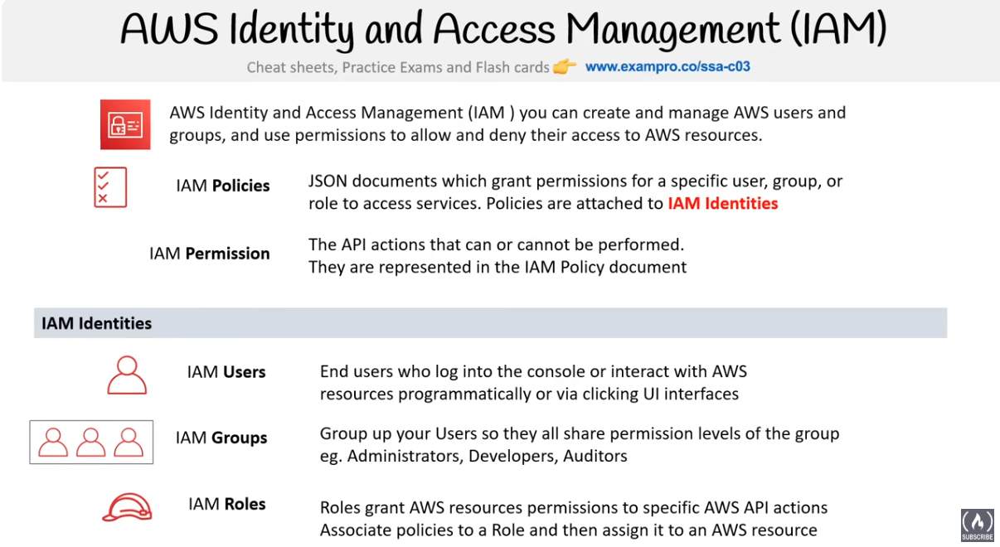

**AWS Identity and Access Management (IAM)** giúp tạo và quản lý AWS users và groups, và sử dụng permissions để cho phép hoặc từ chối quyền truy cập của một ai đó đến AWS resources.

**IAM Policies**
Tài liệu JSON cấp quyền cho một user, group, hoặc role cụ thể để truy cập services. Policies được gắn với IAM Identities.

**IAM Permission**
Các hành động API có thể hoặc không thể được thực hiện.
Chúng được thể hiện trong IAM Policy document.

**IAM Identities**

- IAM Users: Người dùng cuối đăng nhập vào console hoặc tương tác với AWS resources - bằng lập trình hoặc thông qua giao diện UI.
- IAM Groups: Nhóm các Users có cùng mức permission của group (Administrators, Developers, Auditors).
- IAM Roles: Roles cấp quyền AWS resources cho các hành động API cụ thể của AWS. Gắn policies với một Role rồi gán nó cho một AWS resource.

### Managed vs Customer vs inline Policy

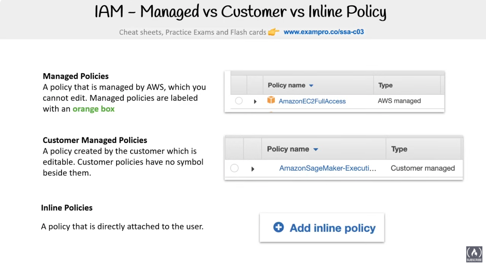

**Managed Policies**: Một policy được quản lý bởi AWS, mà bạn không thể chỉnh sửa. Managed policies được đánh dấu bằng một ô màu cam.

**Customer Managed Policies**: Một policy được tạo bởi customer và có thể chỉnh sửa. Customer policies không có ký hiệu nào bên cạnh.

**Inline Policies**: Một policy được gắn trực tiếp vào user.

### Anatomy of an IAM Policy

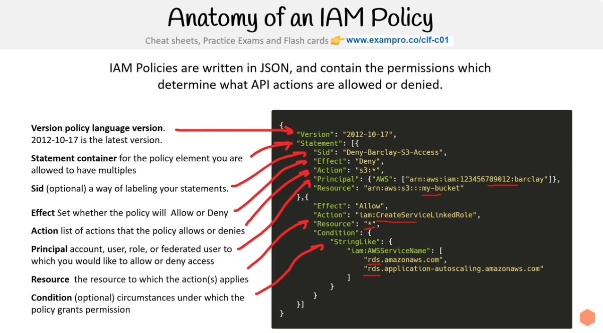

IAM Policies được viết bằng JSON, và chứa permissions để xác định những API actions nào được phép hoặc bị từ chối.

- **Version**: ngôn ngữ của policy version.
- **Statement container**: danh sách policy element, có thể tạo nhiều.
- **Sid** (tùy chọn): gắn nhãn cho statements.
- **Effect**: thiết lập policy sẽ Allow hoặc Deny.
- **Action**: danh sách các actions mà policy cho phép hoặc từ chối.
- **Principal**: danh sách account, user, role, hoặc federated user mà bạn muốn cho phép hoặc từ chối truy cập.
- **Resource**: resource mà action(s) được áp dụng.
- **Condition**: (tùy chọn) giúp bổ sung thêm điều kiện để xác định khi nào một policy được áp dụng.

### Principle of Least Privilege (PoLP)

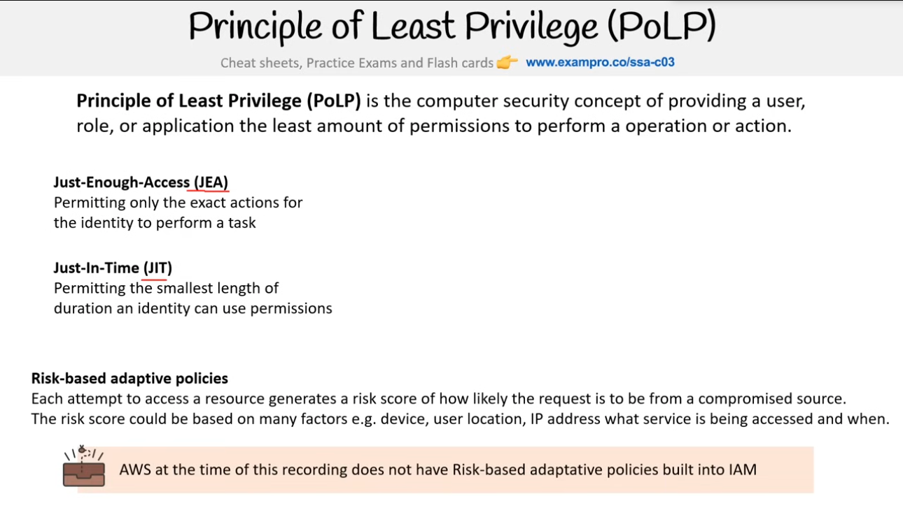

**Principle of Least Privilege (PoLP)** là khái niệm bảo mật máy tính về việc cung cấp cho một user, role, hoặc application lượng permission ít nhất để thực hiện một thao tác hoặc hành động.

**Just-Enough-Access (JEA)**: Chỉ cho phép các hành động chính xác cần thiết để identity thực hiện một tác vụ.

**Just-In-Time (JIT)**: Chỉ cho phép thời lượng ngắn nhất mà một identity có thể sử dụng permissions.

**Risk-based adaptive policies**: Mỗi lần cố gắng truy cập vào một resource sẽ tạo ra một điểm số rủi ro về khả năng request đến từ một nguồn đã bị xâm phạm. Điểm số rủi ro có thể dựa trên nhiều yếu tố, ví dụ: thiết bị, vị trí user, địa chỉ IP, service nào đang được truy cập và thời điểm nào.

> ⚠️ AWS tại thời điểm này chưa có Risk-based adaptive policies tích hợp trong IAM.

### IAM Account Root User

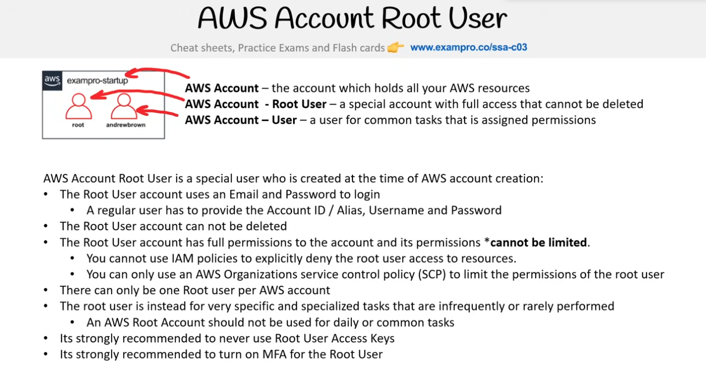

- **AWS Account**: tài khoản chứa tất cả AWS resources của bạn.
- **AWS Account – Root User**: một tài khoản đặc biệt có toàn quyền truy cập và không thể bị xóa.
- **AWS Account – User**: một user cho các tác vụ thông thường, được gán permissions.

AWS Account Root User là một user đặc biệt được tạo ra khi khởi tạo tài khoản AWS:

- Root User sử dụng Email và Password để đăng nhập.
  - Một regular user phải cung cấp Account ID / Alias, Username và Password.
- Root User không thể bị xóa.
- Root User có toàn quyền với tài khoản và các quyền này _không thể bị giới hạn_.
  - Bạn không thể dùng IAM policies để từ chối rõ ràng quyền truy cập resource của Root User.
  - Bạn chỉ có thể dùng AWS Organizations service control policy (SCP) để giới hạn quyền của Root User.
- Mỗi tài khoản AWS chỉ có một Root User.
- Root User chỉ nên dùng cho những tác vụ đặc biệt, hiếm khi cần.
  - Một AWS Root Account không nên dùng cho các tác vụ hằng ngày hoặc phổ biến.
- Rất khuyến nghị không bao giờ sử dụng Root User Access Keys.
- Rất khuyến nghị bật Multi-Factor Authentication (MFA) cho Root User.

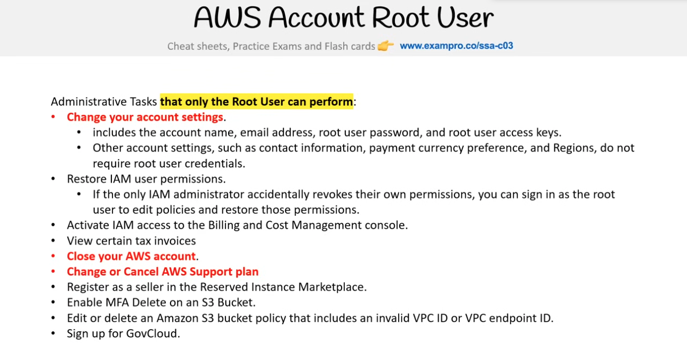

- Administrative Tasks là loại task duy nhất Root User có thể thực hiện:
- Thay đổi cài đặt tài khoản:
  - Bao gồm: account name, email address, root user password, root user access keys.
  - Các cài đặt khác như contact info, payment currency, Regions thì không cần root.
- Khôi phục quyền của IAM user
  - Nếu IAM administrator lỡ tay thu hồi hết quyền của mình → chỉ root user mới có thể đăng nhập và - khôi phục.
- Kích hoạt quyền truy cập IAM cho phép vào bảng điều khiển Billing and Cost Management.
- Xem một số hóa đơn thuế đặc biệt.
- Đđóng tài khoản AWS.
- Thay đổi hoặc hủy gói AWS Support.
- Đăng ký làm người bán trên Reserved Instance Marketplace (một chợ giao dịch nơi bạn có thể bán hoặc mua lại Reserved Instances (RI) của Amazon EC2 từ những người dùng AWS khác).
- Bật MFA Delete trên S3.
- Edit or delete an Amazon S3 bucket policy nếu policy chứa invalid VPC ID hoặc VPC endpoint ID.
- Sign up for GovCloud.

<details>

<summary>Reserved Instance (RI) và RI Market</summary>

Bình thường bạn chạy EC2 On-Demand = trả tiền theo giờ/giây, giá cao.

Với Reserved Instance => bạn cam kết dùng trong 1 hoặc 3 năm → đổi lại giá rẻ hơn (tiết kiệm tới ~70%).

Nhưng vấn đề là nếu bạn không còn nhu cầu dùng nữa (ví dụ scale down, đổi region, đổi loại instance), RI sẽ “nằm chờ” rất lãng phí.

=> Bạn có thể bán lại RI chưa dùng hết thời hạn cho người dùng khác. Người khác có thể mua lại RI với giá rẻ hơn so với AWS bán trực tiếp.

AWS thu phí 12% trên số tiền bán được.

RI phải có thời hạn còn lại ít nhất 1 tháng mới được list lên Marketplace.

Khi bạn bán lại một Reserved Instance (RI), bạn không chuyển giao toàn bộ hợp đồng gốc của mình cho người mua, AWS sẽ tạo ra một hợp đồng RI mới dành cho người mua, có thời hạn đúng bằng thời gian còn lại của RI bạn đã bán.

</details>

### IAM Password Policy

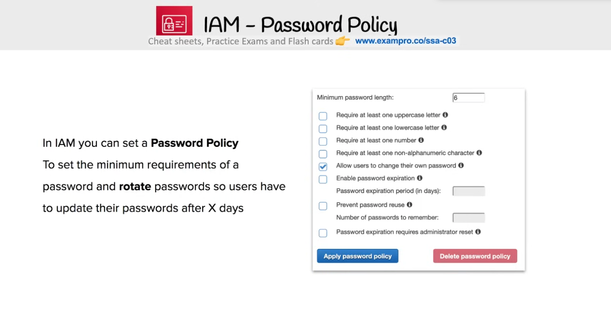

Trong IAM, có thể set Password Policy nhằm xác định yêu cầu tối thiểu của password và yêu cầu user phải lặp lại việc update mật khẩu sau X ngày.

- Độ dài mật khẩu tối thiểu.
- Bắt buộc ít nhất một chữ hoa.
- Bắt buộc ít nhất một chữ thường.
- Bắt buộc ít nhất một chữ số.
- Bắt buộc ít nhất một ký tự đặc biệt (ví dụ: !@#$%).
- Cho phép người dùng tự đổi mật khẩu.
- Bật tính năng hết hạn mật khẩu.
  - Thời gian hiệu lực của mật khẩu (tính theo ngày).
- Ngăn tái sử dụng mật khẩu cũ.
  - Số lượng mật khẩu gần nhất không được dùng lại.
- Khi mật khẩu hết hạn thì bắt buộc admin reset thay vì người dùng tự đổi.

IAM > Account Settings > Password Policy > Edit

### IAM - Access Keys

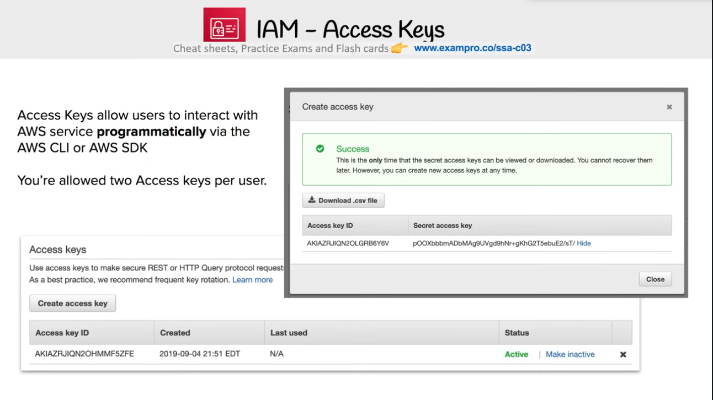

Access Key cho phép người dùng tương tác với dịch vụ AWS theo cách lập trình thông qua AWS CLI hoặc AWS SDK.

Mỗi user được phép có tối đa 2 Access Keys.

Lưu ý khi sử dụng Access Keys:

- Access Keys được dùng để gửi các request bảo mật qua REST hoặc HTTP Query protocol.
- Theo best practice, nên làm mới Access Keys thường xuyên để tăng tính bảo mật.
- Khi tạo mới, Secret Access Key chỉ hiển thị một lần duy nhất nên nếu mất phải tạo Access Key mới.
- Có thể tải Access Key dưới dạng file `.csv` để lưu trữ an toàn.
- Trạng thái Access Key có thể là Active (đang hoạt động) hoặc chuyển sang Inactive khi không dùng nữa để tăng tính bảo mật.

### IAM Multi-factor Authentication (MFA)

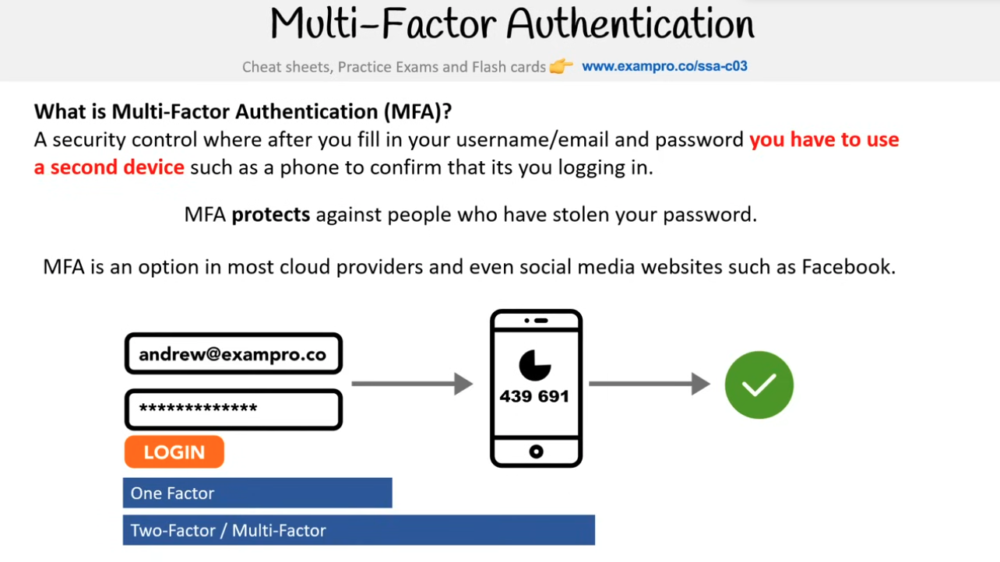

MFA là một cơ chế bảo mật: sau khi nhập username/email và password, bạn phải dùng một thiết bị thứ hai (ví dụ điện thoại) để xác nhận rằng chính bạn đang đăng nhập.

MFA giúp bảo vệ khỏi việc kẻ xấu đánh cắp password của bạn.

MFA được hỗ trợ bởi hầu hết các cloud provider và thậm chí cả các trang mạng xã hội như Facebook.

Phân biệt:

- One Factor: chỉ cần username + password.
- Two-Factor / Multi-Factor: thêm một hoặc nhiều lớp bảo mật nữa (ví dụ: mã xác thực từ điện thoại, hoặc nhận OTP qua Email).

### Temporary Security Credentials

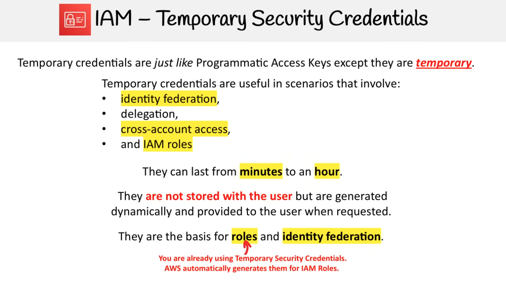

Temporary credentials (chứng nhận tạm thời) giống như Access Keys thông thường ngoại trừ việc chúng là tạm thời.

Temporary credentials hữu ích trong các tình huống bao gồm:

- **Identity federation**: Liên kết danh tính (một bộ thông tin đăng nhập duy nhất nhưng có thể truy cập nhiều hệ thống, dịch vụ)
- **Delegation**: Ủy quyền
- **Cross-account access**: Truy cập liên tài khoản
- **IAM roles**: phân quyền trong IAM

Temporary credentials có thể tồn tại từ vài phút đến một giờ.

Temporary credentials không được lưu cùng với user mà được sinh ra một cách động và cung cấp cho user khi cần.

Temporary credentials là nền tảng cho roles và identity federation. AWS tự động sinh ra Temporary credentials cho IAM Roles.

### Identity Federation

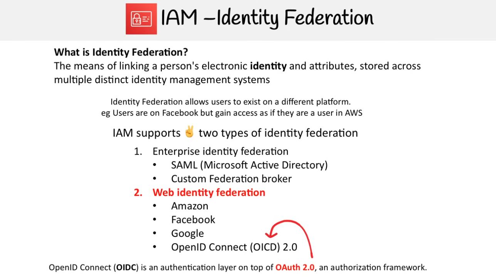

Identity Federation là phương tiện liên kết danh tính điện tử và thuộc tính, được lưu trữ trên nhiều hệ thống quản lý danh tính riêng biệt và cho phép người dùng tồn tại trên nhiều nền tảng khác nhau với cùng một bộ thông tin.

Ví dụ: Người dùng trên Facebook nhưng lại có quyền truy cập như thể họ là người dùng trong AWS.

IAM hỗ trợ hai loại liên kết danh tính

1. Liên kết danh tính doanh nghiệp (Enterprise identity federation)

- SAML (Microsoft Active Directory)
- Custom Federation broker: Nhà môi giới liên kết tùy chỉnh

2. Liên kết danh tính Web (Web identity federation)

- Amazon
- Facebook
- Google
- OpenID Connect (OIDC) 2.0

OpenID Connect (OIDC) là một lớp xác thực nằm trên OAuth 2.0, một khuôn khổ ủy quyền (authorization framework).

### Security Token Service (STS)

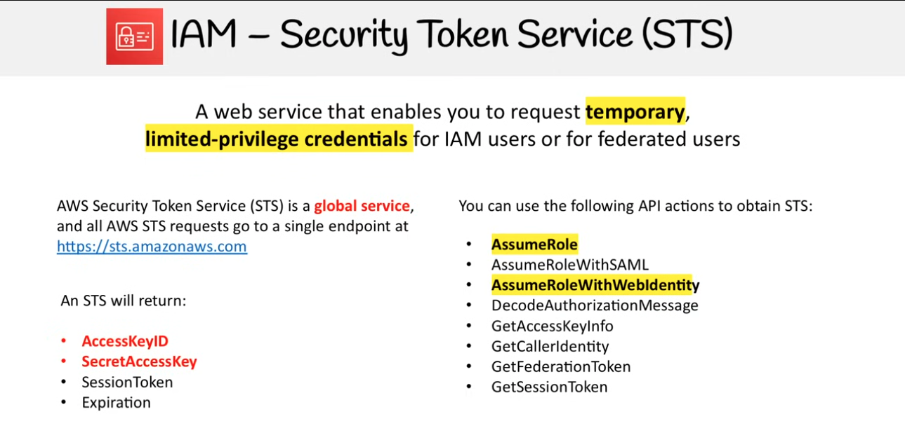

STS là dịch vụ web cho phép bạn yêu cầu thông tin xác thực tạm thời, có đặc quyền giới hạn cho người dùng IAM hoặc cho người dùng liên kết (federated users).

AWS Security Token Service (STS) là một dịch vụ toàn cầu (global service), và tất cả các yêu cầu AWS STS đều đến một điểm cuối duy nhất tại https://sts.amazonaws.com.

Một STS sẽ trả về:

- AccessKeyID
- SecretAccessKey
- SessionToken
- Expiration

Bạn có thể sử dụng các hành động API sau để lấy STS:

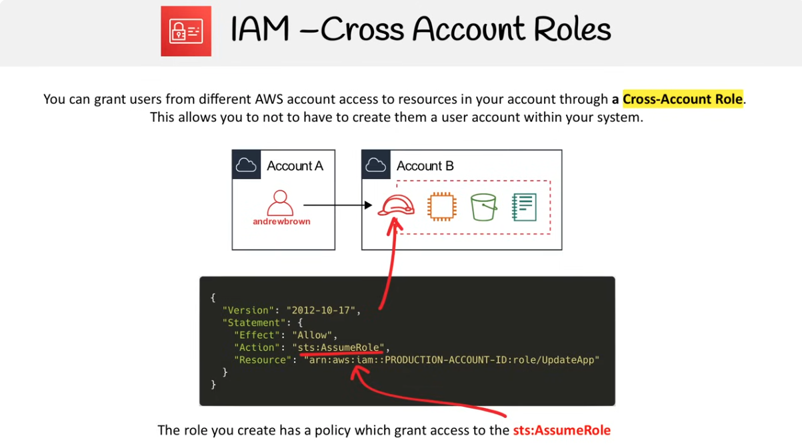

- **AssumeRole**: Cho phép một IAM user hoặc AWS service tạm thời nhận một IAM Role (có quyền khác với quyền gốc)

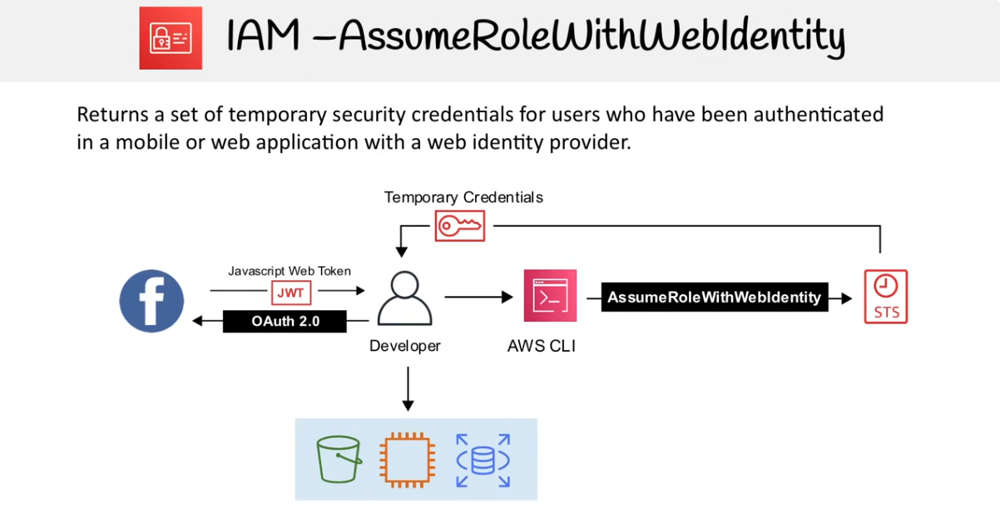

- **AssumeRoleWithSAML**: Giống AssumeRole, nhưng thay vì IAM user gọi trực tiếp, thì người dùng bên ngoài (đăng nhập qua Identity Provider hỗ trợ SAML, ví dụ: Microsoft AD FS) sẽ nhận được quyền Role.
- **AssumeRoleWithWebIdentity**: Giống AssumeRole, nhưng dành cho ứng dụng mobile/web xác thực bằng Identity Provider công cộng (Google, Facebook, Amazon Cognito…)
- **DecodeAuthorizationMessage**: Giải mã thông điệp lỗi “encoded authorization failure message” (thường gặp khi IAM bị từ chối quyền truy cập)
- **GetAccessKeyInfo**: Lấy thông tin account thông qua Access Key ID
- **GetCallerIdentity**: Trả về thông tin của người đang call API
- **GetFederationToken**: Cấp temporary credentials cho một user liên bang
- **GetSessionToken**: Cấp temporary credentials cho IAM user hoặc root user.

### AWS Single-Sign on

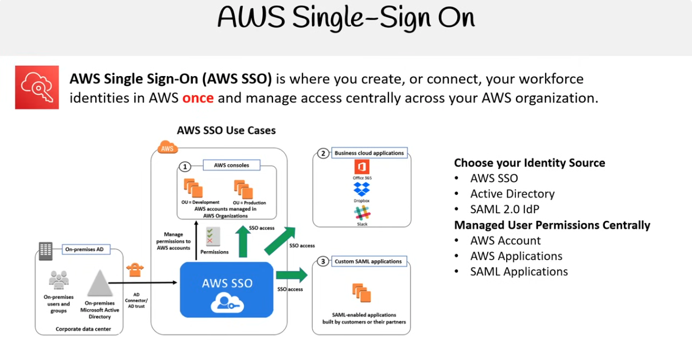

Cơ chế Single Sign-On là đăng nhập một lần, dùng nhiều nơi.

AWS Single Sign-On (AWS SSO) giúp không cần tạo user trong từng AWS account, chỉ cần định nghĩa 1 lần ở AWS SSO và cấp quyền, sau đó user có thể đăng nhập vào nhiều account hoặc ứng dụng mà không cần nhập lại mật khẩu.

- **On-premises AD** (Active Directory cài trong công ty) có thể được kết nối vào AWS SSO bằng AD Connector / AD trust.
- Người dùng ở công ty (On-premises users và groups) có thể dùng thông tin đăng nhập của họ để truy cập AWS SSO.
- Sau khi được cấp quyền AWS SSO, họ có thể truy cập đến:
  - AWS Consoles (các tài khoản AWS trong OU Development, OU Production được quản lý bởi AWS Organizations).
  - Business cloud applications như Office 365, Dropbox, Slack,...
  - Custom SAML applications (ứng dụng nội bộ hay từ đối tác, miễn là hỗ trợ SAML).
