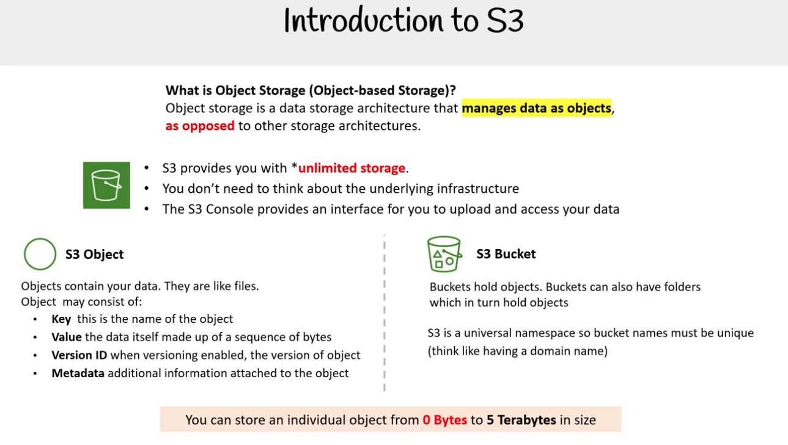

### Introduction to S3

#### Object Storage là gì?

Object storage là một kiến trúc lưu trữ dữ liệu mà quản lý dữ liệu dưới dạng các đối tượng (object),
khác với các kiến trúc lưu trữ khác.

- S3 cung cấp cho bạn lưu trữ không giới hạn
- Bạn không cần quan tâm đến hạ tầng phía dưới
- Giao diện S3 Console giúp bạn tải lên và truy cập dữ liệu

#### S3 Object và S3 Bucket

**S3 Object**
Các Object chứa dữ liệu của bạn. Chúng giống như các tệp (file).

Một object có thể bao gồm:  
Key: tên của object  
Value: chính dữ liệu, được tạo thành từ một chuỗi byte  
Version ID: mã phiên bản của object (nếu bật tính năng versioning)  
Metadata: thông tin bổ sung gắn liền với object

**Bucket S3**

Buckets chứa các object. Buckets cũng có thể chứa thư mục, mà trong đó chứa object.
S3 là không gian tên toàn cục, vì vậy tên bucket phải duy nhất (hãy nghĩ giống như tên miền, tức là không được trùng).

📌 Lưu ý:
Bạn có thể lưu một object riêng lẻ có kích thước từ 0 Byte đến 5 Terabyte (TB)  
Terabyte (TB) tương đương với 1000 Gigabyte (GB) hoặc một nghìn tỷ byte.
