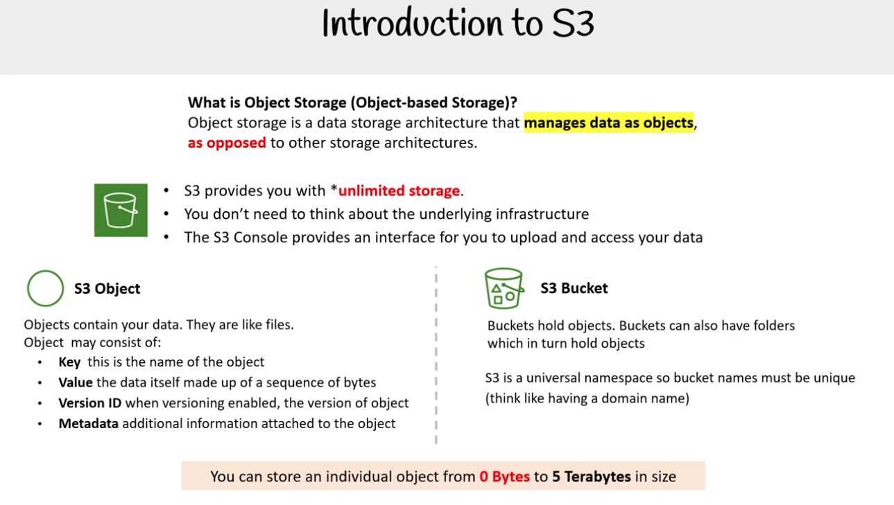
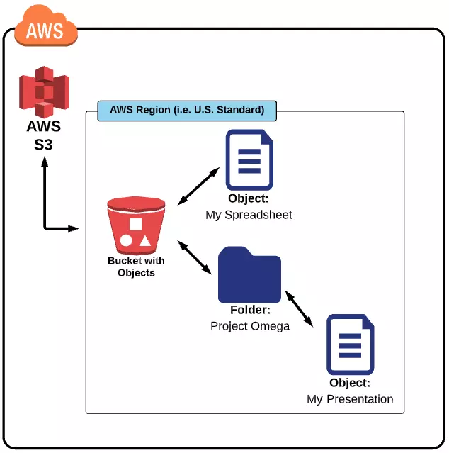

### Introduction to S3

#### Object Storage là gì?

Object storage là một kiến trúc lưu trữ dữ liệu mà quản lý dữ liệu dưới dạng các đối tượng (object),
khác với các kiến trúc lưu trữ khác.

- S3 cung cấp cho bạn lưu trữ không giới hạn
- Bạn không cần quan tâm đến hạ tầng phía dưới
- Giao diện S3 Console giúp bạn tải lên và truy cập dữ liệu

#### S3 Object và S3 Bucket

**S3 Object**
Các Object chứa dữ liệu của bạn. Chúng giống như các tệp (file).

Một object có thể bao gồm:  
Key: tên của object  
Value: chính dữ liệu, được tạo thành từ một chuỗi byte  
Version ID: mã phiên bản của object (nếu bật tính năng versioning)  
Metadata: thông tin bổ sung gắn liền với object

**Bucket S3**

Buckets chứa các object. Buckets cũng có thể chứa thư mục, mà trong đó chứa object.
S3 là không gian tên toàn cục, vì vậy tên bucket phải duy nhất (hãy nghĩ giống như tên miền, tức là không được trùng).

📌 Lưu ý:
Bạn có thể lưu một object riêng lẻ có kích thước từ 0 Byte đến 5 Terabyte (TB)  
Terabyte (TB) tương đương với 1000 Gigabyte (GB) hoặc một nghìn tỷ byte.

### Regions

Khi tạo một bucket, bạn cần phải chọn một region nào đó cho nó. Điều này có nghĩa rằng bất cứ dữ liệu nào bạn upload lên bucket S3 sẽ nằm trong data center ở region đó.

Best practice: chọn region gần với bạn nhất (hoặc gần end user nhất) để giảm tối đa độ trễ.

### Chi phí

AWS sẽ tính phí sử dụng S3 của bạn như sau:

Phí lưu trữ:

- Áp dụng với các dữ liệu lưu trong S3
- TÍnh phí theo số GB đã sử dụng
- Đơn giá theo từng GB sẽ tùy thuộc vào region và loại storage (storage class)

Phí request - di chuyển dữ liệu ra/vào S3:

- LIST
- GET
- POST
- PUT
- COPY
- Request chuyển đổi lifecycle
- Truy xuất dữ liệu
- Lưu kho dữ liệu
- Khôi phục dữ liệu
- DELETE: miễn phí (nhưng nếu xóa object trước thời gian lưu trữ tối thiểu của storage class (ví dụ Standard-IA là 30 ngày, Glacier Deep Archive là 180 ngày) → vẫn bị tính phí như thể đã lưu đủ thời gian tối thiểu.)

Nếu bạn sử dụng AWS Free Tier, bạn có thể sử dụng miễn phí S3 ở một mức nhất định. Cụ thể :

- 5GB S3 storage class standard
- 20.000 GET request, 2.000 PUT, COPY, POST hoặc LIST request
- Transfer 15GB dữ liệu ra ngoài mỗi tháng trong vòng 1 năm.

Sau 12 tháng, các dịch vụ Free Tier dạng "12-months Free" sẽ tự động chuyển sang tính phí theo mức chuẩn. Các dịch vụ "Always Free" thì vẫn miễn phí, nhưng chỉ trong hạn mức, nếu vượt hạn mức Free Tier → AWS sẽ tính phí như bình thường.
