## S3 Bucket overview

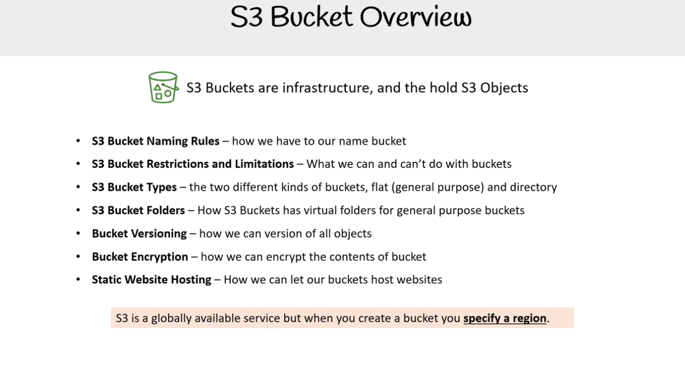

**S3 Buckets là hạ tầng (Infrastructure), và chúng chứa các S3 Objects**

- **Quy tắc đặt tên S3 Bucket** – cách chúng ta phải đặt tên bucket
- **Hạn chế và giới hạn của S3 Bucket** – những gì chúng ta có thể và không thể làm với bucket
- **Các loại S3 Bucket** – hai loại bucket khác nhau: phẳng (dùng chung) và dạng thư mục
- **Thư mục trong S3 Bucket** – cách S3 Buckets có các thư mục ảo cho bucket dùng chung
- **Phiên bản hoá Bucket (Bucket Versioning)** – cách chúng ta có thể quản lý phiên bản cho tất cả đối tượng
- **Mã hoá Bucket (Bucket Encryption)** – cách chúng ta có thể mã hoá nội dung của bucket
- **Lưu trữ Website Tĩnh (Static Website Hosting)** – cách chúng ta cho phép bucket lưu trữ website

> ⚠️ **S3 là một dịch vụ khả dụng toàn cầu, nhưng khi bạn tạo bucket bạn phải chỉ định vùng (region).**

### Cách đặt tên Bucket

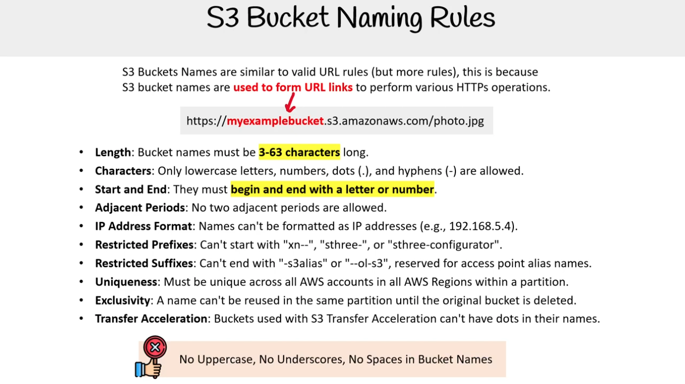

Tên S3 Bucket tương tự như quy tắc URL hợp lệ (nhưng có nhiều quy tắc hơn), bởi vì  
tên S3 bucket được **dùng để tạo liên kết URL** nhằm thực hiện các thao tác HTTPs khác nhau.

Ví dụ:  
`https://myexamplebucket.s3.amazonaws.com/photo.jpg`

- **Độ dài (Length):** Tên bucket phải dài từ **3–63 ký tự**.
- **Ký tự hợp lệ (Characters):** Chỉ cho phép chữ cái thường, số, dấu chấm (.) và dấu gạch ngang (-).
- **Bắt đầu và kết thúc (Start and End):** Tên phải **bắt đầu và kết thúc bằng chữ cái hoặc số**.
- **Dấu chấm liền nhau (Adjacent Periods):** Không được có hai dấu chấm liền nhau.
- **Định dạng IP (IP Address Format):** Không được đặt tên theo dạng địa chỉ IP (ví dụ: 192.168.5.4).
- **Tiền tố hạn chế (Restricted Prefixes):** Không được bắt đầu bằng `xn--`, `sthree-`, hoặc `sthree-configurator`.
- **Hậu tố hạn chế (Restricted Suffixes):** Không được kết thúc bằng `-s3alias` hoặc `--ol-s3`, các hậu tố này dành riêng cho tên bí danh của Access Point.
- **Tính duy nhất (Uniqueness):** Tên bucket phải duy nhất trong tất cả các tài khoản AWS và các vùng (Region) trong cùng một phân vùng.
- **Tính độc quyền (Exclusivity):** Một tên không thể được tái sử dụng trong cùng phân vùng cho đến khi bucket gốc bị xóa.
- **Tăng tốc truyền tải (Transfer Acceleration):** Các bucket sử dụng S3 Transfer Acceleration không được có dấu chấm trong tên.

> ❌ **Không viết hoa, không dùng dấu gạch dưới (\_), không có khoảng trắng trong tên bucket**

#### Ví dụ

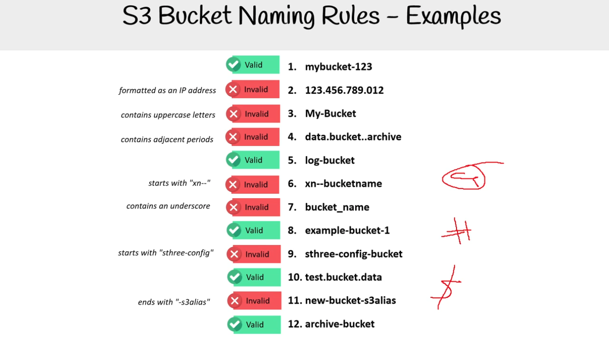

## Hạn chế và Giới hạn của Bucket

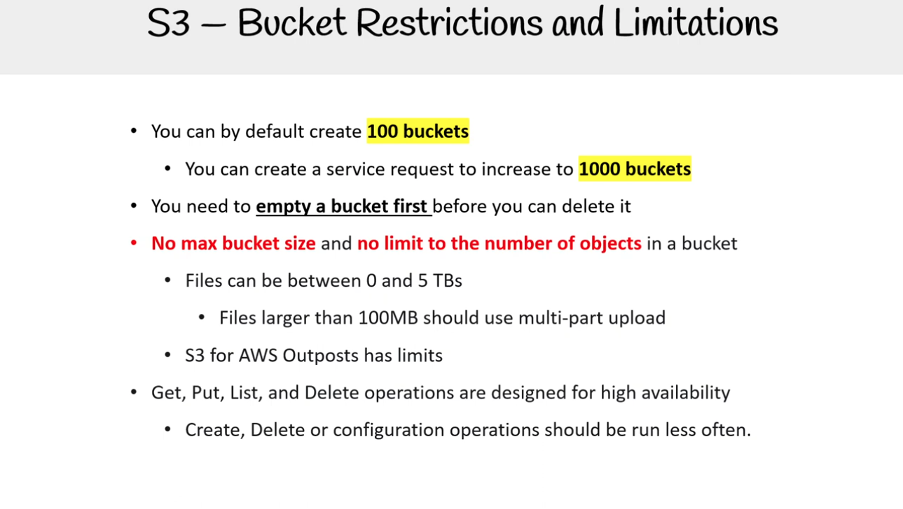

Mặc định, bạn có thể tạo **100 buckets**

- Có thể gửi yêu cầu dịch vụ để tăng giới hạn lên **1000 buckets**
- Trước khi xóa bucket, bạn cần **làm trống bucket trước**

**Không có giới hạn dung lượng bucket** và **không giới hạn số lượng đối tượng** trong một bucket

- Kích thước tệp có thể từ 0 đến 5 TB
- Tệp lớn hơn 100 MB nên sử dụng tải lên nhiều phần (multi-part upload)
- S3 cho **AWS Outposts** có giới hạn riêng

Các thao tác **Get, Put, List, Delete** được thiết kế cho khả năng sẵn sàng cao

- Các thao tác **Tạo (Create), Xóa (Delete) hoặc Cấu hình (Configuration)** nên được thực hiện ít thường xuyên hơn.

<details>
<summary>AWS Outposts</summary>

_AWS Outposts is a family of fully managed solutions delivering AWS infrastructure and services to virtually any on-premises or edge location for a truly consistent hybrid experience. Outposts solutions allow you to extend and run native AWS services on premises, and is available in a variety of form factors, from 1U and 2U Outposts servers to 42U Outposts racks, and multiple rack deployments._

</details>

## Bucket Types

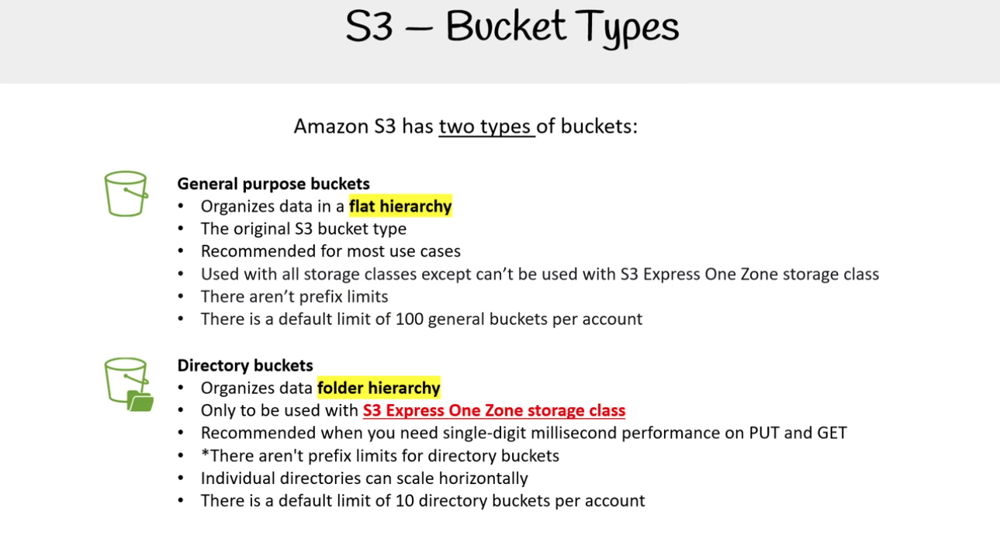

Amazon S3 có **hai loại bucket**:

#### 1. General purpose buckets (Bucket mục đích chung)

- Tổ chức dữ liệu theo **cấu trúc phẳng (flat hierarchy)**
- Đây là loại bucket gốc của S3
- Được khuyến nghị cho hầu hết các trường hợp sử dụng
- Có thể sử dụng với tất cả các lớp lưu trữ, **ngoại trừ** không thể dùng với lớp lưu trữ **S3 Express One Zone**
- Không có giới hạn về tiền tố (prefix)
- Mặc định mỗi tài khoản có thể tạo tối đa **100 general buckets**

#### 2. Directory buckets (Bucket dạng thư mục)

- Tổ chức dữ liệu theo **cấu trúc thư mục (folder hierarchy)**
- Chỉ được sử dụng với lớp lưu trữ **S3 Express One Zone**
- Được khuyến nghị khi bạn cần hiệu năng cực thấp (chỉ vài mili-giây) cho thao tác **PUT** và **GET**
- Không có giới hạn về tiền tố (prefix) đối với directory buckets
- Các thư mục riêng lẻ có thể mở rộng theo chiều ngang (scale horizontally)
- Mặc định mỗi tài khoản có thể tạo tối đa **10 directory buckets**

<details>
<summary>AWS Outposts</summary>

_Amazon S3 Express One Zone is a high-performance, single-Availability Zone storage class purpose-built to deliver consistent single-digit millisecond data access for your most frequently accessed data and latency-sensitive applications. S3 Express One Zone delivers data access speed up to 10x faster and request costs up to 80% lower than S3 Standard._

</details>

## Bucket folder

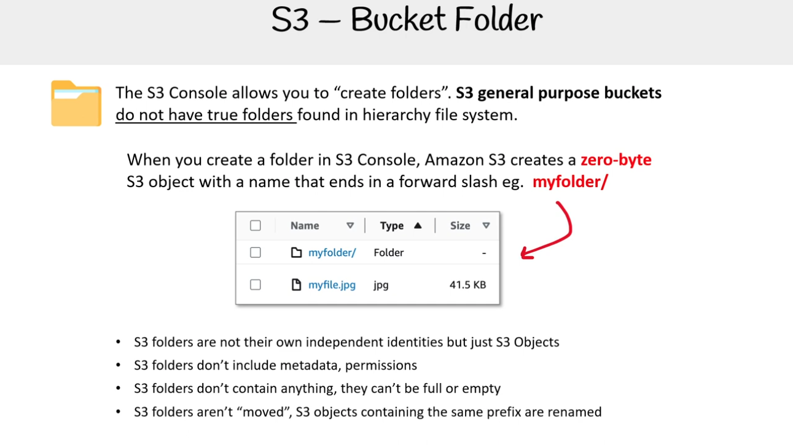

Bảng điều khiển S3 (S3 Console) cho phép bạn "tạo thư mục".

Bucket S3 loại general purpose không có thư mục thật giống như hệ thống tệp phân cấp (hierarchy file system).

Khi bạn tạo một folder trong S3 Console, Amazon S3 sẽ tạo ra một đối tượng 0 byte (zero-byte object) với tên kết thúc bằng dấu gạch chéo /.  
Ví dụ: `myfolder/`

- Folder S3 không có danh tính độc lập, chúng chỉ là đối tượng S3 (S3 Objects).
- Folder S3 không chứa metadata hay permissions.
- Folder S3 không chứa bất kỳ dữ liệu nào, nên chúng không thể đầy hoặc rỗng.
- Folder S3 không thực sự được “moved”, thay vào đó các đối tượng S3 có cùng prefix sẽ được đổi tên.

### Ví dụ

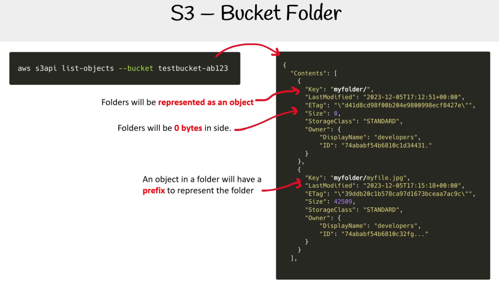

## Bucket Versioning

Versioning là tính năng của S3 cho phép lưu nhiều phiên bản của cùng một object trong cùng một bucket.

Khi bật versioning, mỗi lần ghi đè (PUT) hoặc xóa (DELETE) object, S3 không xóa hẳn phiên bản cũ, mà giữ lại với một version ID.

Có tốn phí sử dụng.

## Bucket URI

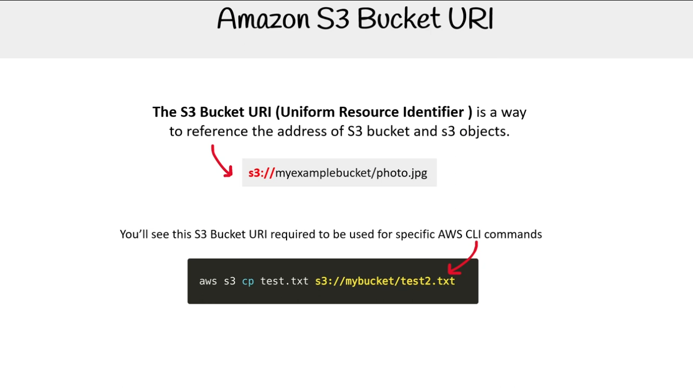

**S3 Bucket URI (Uniform Resource Identifier)** là một cách để tham chiếu địa chỉ của các S3 bucket và các đối tượng S3.

Bạn sẽ thấy S3 Bucket URI này được yêu cầu sử dụng cho các lệnh AWS CLI cụ thể.

```
aws s3 cp test.txt s3://<bucket_uri>/<file_name>
```

## Bucket key

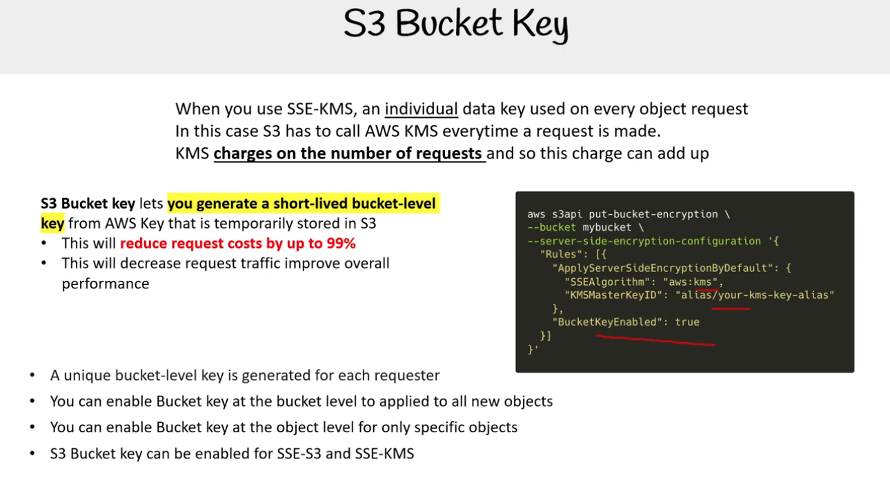

Khi bạn sử dụng SSE-KMS, một khóa dữ liệu riêng lẻ được sử dụng trên mỗi yêu cầu object. Trong trường hợp này, S3 phải gọi AWS KMS mỗi khi một yêu cầu được thực hiện. KMS tính phí dựa trên số lượng yêu cầu, do đó chi phí này có thể tăng lên.

S3 Bucket Key cho phép bạn tạo một khóa cấp bucket có thời hạn ngắn từ AWS Key (**short-lived bucket level key**) và được lưu trữ tạm thời trong S3.

- Điều này sẽ giảm chi phí lên đến 99%.
- Điều này sẽ giảm lưu lượng yêu cầu, cải thiện hiệu suất tổng thể.

Đặc điểm của Bucket key:

- Một khóa cấp bucket duy nhất được tạo cho mỗi người yêu cầu.
- Bạn có thể bật Bucket Key ở cấp độ bucket để áp dụng cho tất cả các object mới.
- Bạn có thể bật Bucket Key ở cấp độ object chỉ cho các object cụ thể.
- S3 Bucket Key có thể được bật cho cả SSE-S3 và SSE-KMS.

<details>
<summary>AWS KMS</summary>

_AWS KMS (Key Management Service) là một dịch vụ của Amazon Web Services cho phép bạn tạo và quản lý các khóa mã hóa một cách dễ dàng. KMS được tích hợp với nhiều dịch vụ AWS khác để mã hóa dữ liệu của bạn, giúp tăng cường bảo mật._

</details>

<details>
<summary>SSE-S3 và SSE-KMS</summary>

_SSE-S3 (Server-Side Encryption with Amazon S3-managed keys) là một phương thức mã hóa dữ liệu trên máy chủ nơi Amazon S3 xử lý toàn bộ quá trình mã hóa và giải mã._

Khi bạn tải dữ liệu lên S3, S3 sẽ tự động mã hóa dữ liệu đó bằng một khóa duy nhất.  
=> Không tốn chi phí vì mọi thứ là tự động.

_SSE-KMS (Server-Side Encryption with AWS Key Management Service) là một phương thức mã hóa sử dụng dịch vụ AWS KMS để quản lý các khóa mã hóa._

Khi bạn tải dữ liệu lên, S3 sử dụng một khóa được quản lý bởi KMS để mã hóa dữ liệu. Bạn có toàn quyền kiểm soát khóa này, bao gồm cả việc tạo, luân chuyển và theo dõi việc sử dụng khóa.  
=> Việc này đi kèm với chi phí cho mỗi yêu cầu KMS.

</details>

## Bucket Policies

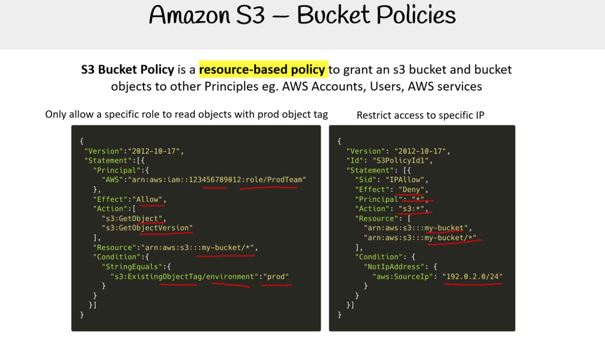

S3 Bucket Policy là một chính sách dựa trên tài nguyên (resource-based policy) để cấp quyền cho một S3 bucket và các đối tượng trong bucket đó cho các Principal khác, ví dụ như AWS Accounts, Users, AWS services.

Vd: Chỉ cho phép một specifiec role có thể đọc (GetObject, GetObjectVersion) các đối tượng có tag "prod"

```
{
  "Version": "2012-10-17",
  "Statement": [
    {
      "Sid": "...",
      "Effect": "Allow",
      "Principal": {
        "AWS": "arn:aws:iam::123456789012:role/ProdTeam"
      },
      "Action": [
        "s3:GetObject",
        "s3:GetObjectVersion"
      ],
      "Resource": "arn:aws:s3:::my-bucket/*",
      "Condition": {
        "StringEquals": {
          "s3:ExistingObjectTag/environment": "prod"
        }
      }
    }
  ]
}
```

Vd2: Hạn chế truy cập vào `my-bucket` và các đối tượng bên trong nó trừ dãy IP `192.0.2.0/24` (tức là từ `192.0.2.1` đến `192.0.2.255`)

```
{
  "Version": "2012-10-17",
  "Statement": [
    {
      "Sid": "S3PolicyId1",
      "Effect": "Deny",
      "Principal": "*",
      "Action": "s3:*",
      "Resource": [
        "arn:aws:s3:::my-bucket",
        "arn:aws:s3:::my-bucket/*"
      ],
      "Condition": {
        "NotIpAddress": {
          "aws:SourceIp": "192.0.2.0/24"
        }
      }
    }
  ]
}
```

## Bucket Policies vs IAM Policies

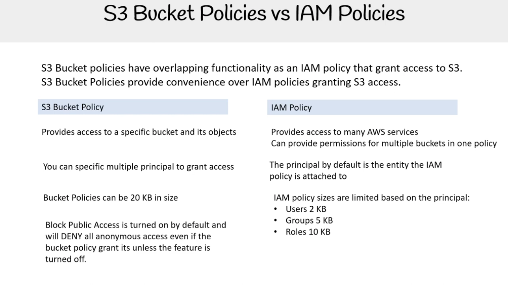

**S3 Bucket Policy** và **IAM Policy** có chức năng tương tự nhau trong việc cấp quyền truy cập vào S3, nhưng chúng có những khác biệt cơ bản. S3 Bucket Policy mang lại sự tiện lợi hơn IAM Policy trong việc cấp quyền truy cập S3.

| S3 Bucket Policy                                                                                                                                      | IAM Policy                                                                                                            |
| :---------------------------------------------------------------------------------------------------------------------------------------------------- | :-------------------------------------------------------------------------------------------------------------------- |
| Cấp quyền truy cập cho một bucket cụ thể và các đối tượng của nó.                                                                                     | Cấp quyền truy cập cho nhiều dịch vụ AWS.                                                                             |
| Có thể cấp quyền cho nhiều **principal** (tài khoản, người dùng, dịch vụ) khác nhau.                                                                  | **Principal** mặc định là thực thể mà IAM policy được gắn vào (ví dụ: người dùng, nhóm hoặc vai trò).                 |
| Kích thước policy có thể lên tới 20 KB.                                                                                                               | Kích thước policy bị giới hạn tùy thuộc vào **principal**: <br> • Users: 2 KB <br> • Groups: 5 KB <br> • Roles: 10 KB |
| **Block Public Access** được bật mặc định và sẽ từ chối tất cả các truy cập ẩn danh ngay cả khi bucket policy cho phép, trừ khi tính năng này bị tắt. |                                                                                                                       |
