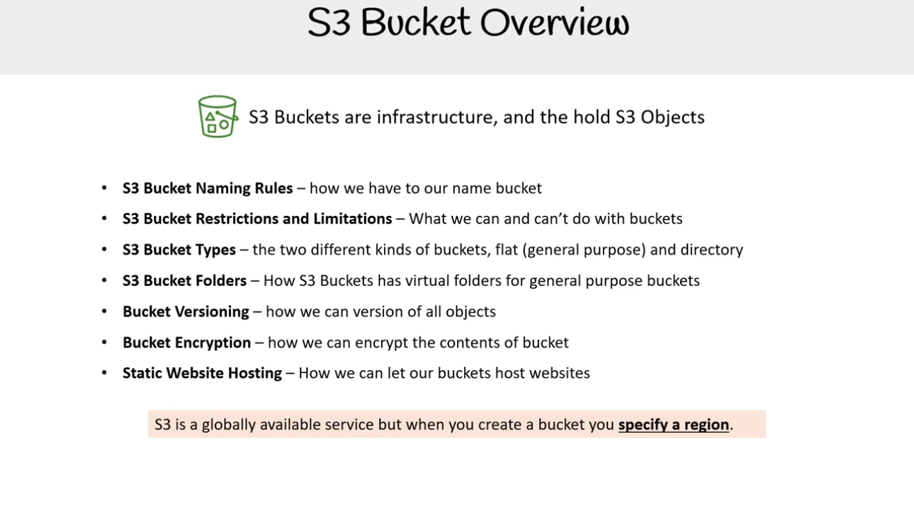
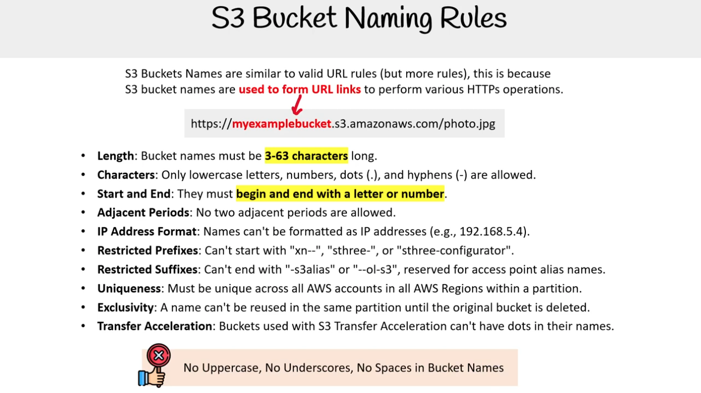
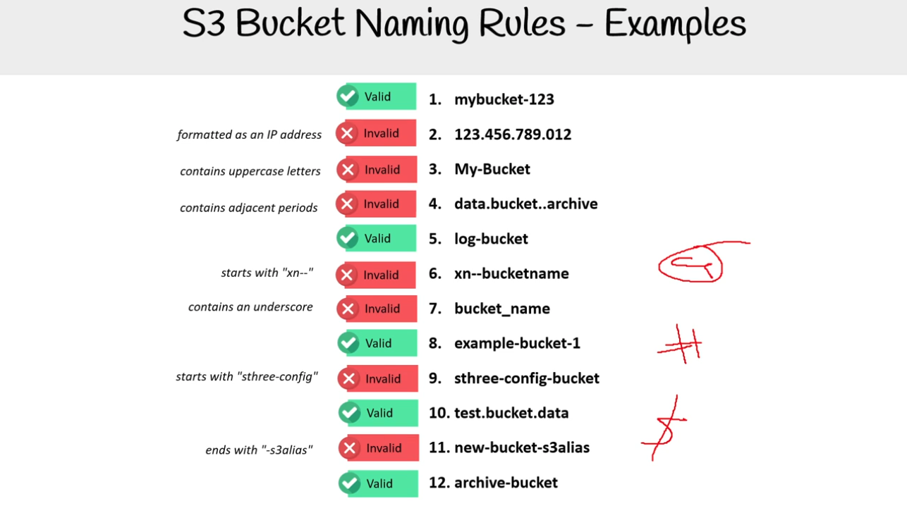
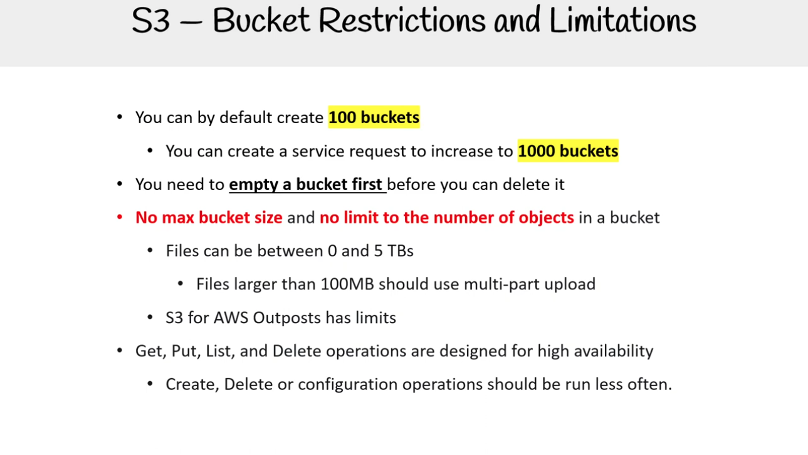
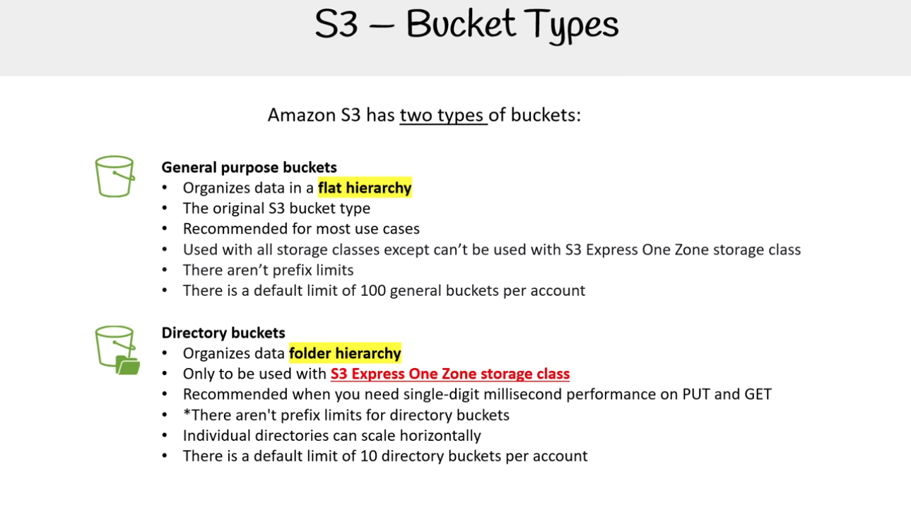
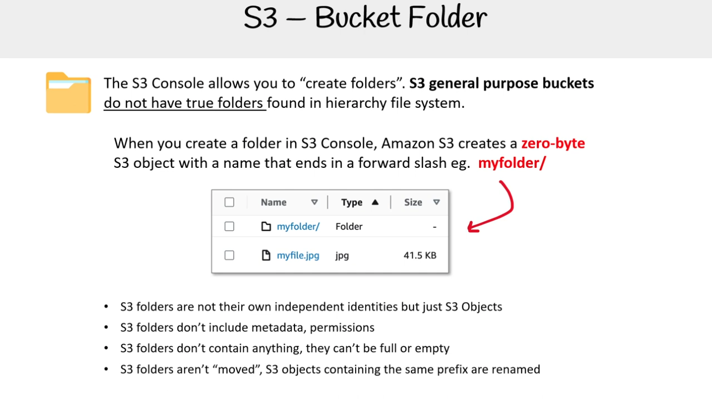
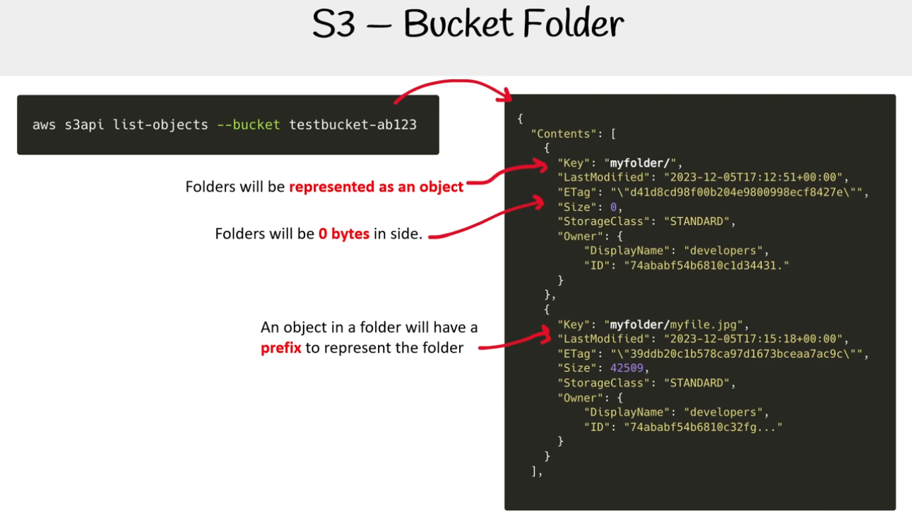

## S3 Bucket overview

**S3 Buckets là hạ tầng (Infrastructure), và chúng chứa các S3 Objects**

- **Quy tắc đặt tên S3 Bucket** – cách chúng ta phải đặt tên bucket
- **Hạn chế và giới hạn của S3 Bucket** – những gì chúng ta có thể và không thể làm với bucket
- **Các loại S3 Bucket** – hai loại bucket khác nhau: phẳng (dùng chung) và dạng thư mục
- **Thư mục trong S3 Bucket** – cách S3 Buckets có các thư mục ảo cho bucket dùng chung
- **Phiên bản hoá Bucket (Bucket Versioning)** – cách chúng ta có thể quản lý phiên bản cho tất cả đối tượng
- **Mã hoá Bucket (Bucket Encryption)** – cách chúng ta có thể mã hoá nội dung của bucket
- **Lưu trữ Website Tĩnh (Static Website Hosting)** – cách chúng ta cho phép bucket lưu trữ website

> ⚠️ **S3 là một dịch vụ khả dụng toàn cầu, nhưng khi bạn tạo bucket bạn phải chỉ định vùng (region).**

### Cách đặt tên Bucket

Tên S3 Bucket tương tự như quy tắc URL hợp lệ (nhưng có nhiều quy tắc hơn), bởi vì  
tên S3 bucket được **dùng để tạo liên kết URL** nhằm thực hiện các thao tác HTTPs khác nhau.

Ví dụ:  
`https://myexamplebucket.s3.amazonaws.com/photo.jpg`

- **Độ dài (Length):** Tên bucket phải dài từ **3–63 ký tự**.
- **Ký tự hợp lệ (Characters):** Chỉ cho phép chữ cái thường, số, dấu chấm (.) và dấu gạch ngang (-).
- **Bắt đầu và kết thúc (Start and End):** Tên phải **bắt đầu và kết thúc bằng chữ cái hoặc số**.
- **Dấu chấm liền nhau (Adjacent Periods):** Không được có hai dấu chấm liền nhau.
- **Định dạng IP (IP Address Format):** Không được đặt tên theo dạng địa chỉ IP (ví dụ: 192.168.5.4).
- **Tiền tố hạn chế (Restricted Prefixes):** Không được bắt đầu bằng `xn--`, `sthree-`, hoặc `sthree-configurator`.
- **Hậu tố hạn chế (Restricted Suffixes):** Không được kết thúc bằng `-s3alias` hoặc `--ol-s3`, các hậu tố này dành riêng cho tên bí danh của Access Point.
- **Tính duy nhất (Uniqueness):** Tên bucket phải duy nhất trong tất cả các tài khoản AWS và các vùng (Region) trong cùng một phân vùng.
- **Tính độc quyền (Exclusivity):** Một tên không thể được tái sử dụng trong cùng phân vùng cho đến khi bucket gốc bị xóa.
- **Tăng tốc truyền tải (Transfer Acceleration):** Các bucket sử dụng S3 Transfer Acceleration không được có dấu chấm trong tên.

❌ **Không viết hoa, không dùng dấu gạch dưới (\_), không có khoảng trắng trong tên bucket**

#### Ví dụ

## Hạn chế và Giới hạn của Bucket

Mặc định, bạn có thể tạo **100 buckets**

- Có thể gửi yêu cầu dịch vụ để tăng giới hạn lên **1000 buckets**
- Trước khi xóa bucket, bạn cần **làm trống bucket trước**

**Không có giới hạn dung lượng bucket** và **không giới hạn số lượng đối tượng** trong một bucket

- Kích thước tệp có thể từ 0 đến 5 TB
- Tệp lớn hơn 100 MB nên sử dụng tải lên nhiều phần (multi-part upload)
- S3 cho **AWS Outposts** có giới hạn riêng

Các thao tác **Get, Put, List, Delete** được thiết kế cho khả năng sẵn sàng cao

- Các thao tác **Tạo (Create), Xóa (Delete) hoặc Cấu hình (Configuration)** nên được thực hiện ít thường xuyên hơn.

AWS Outposts

_AWS Outposts is a family of fully managed solutions delivering AWS infrastructure and services to virtually any on-premises or edge location for a truly consistent hybrid experience. Outposts solutions allow you to extend and run native AWS services on premises, and is available in a variety of form factors, from 1U and 2U Outposts servers to 42U Outposts racks, and multiple rack deployments._

## Các loại Bucket

Amazon S3 có **hai loại bucket**:

#### 1. General purpose buckets (Bucket mục đích chung)

- Tổ chức dữ liệu theo **cấu trúc phẳng (flat hierarchy)**
- Đây là loại bucket gốc của S3
- Được khuyến nghị cho hầu hết các trường hợp sử dụng
- Có thể sử dụng với tất cả các lớp lưu trữ, **ngoại trừ** không thể dùng với lớp lưu trữ **S3 Express One Zone**
- Không có giới hạn về tiền tố (prefix)
- Mặc định mỗi tài khoản có thể tạo tối đa **100 general buckets**

#### 2. Directory buckets (Bucket dạng thư mục)

- Tổ chức dữ liệu theo **cấu trúc thư mục (folder hierarchy)**
- Chỉ được sử dụng với lớp lưu trữ **S3 Express One Zone**
- Được khuyến nghị khi bạn cần hiệu năng cực thấp (chỉ vài mili-giây) cho thao tác **PUT** và **GET**
- Không có giới hạn về tiền tố (prefix) đối với directory buckets
- Các thư mục riêng lẻ có thể mở rộng theo chiều ngang (scale horizontally)
- Mặc định mỗi tài khoản có thể tạo tối đa **10 directory buckets**

AWS Outposts

_Amazon S3 Express One Zone is a high-performance, single-Availability Zone storage class purpose-built to deliver consistent single-digit millisecond data access for your most frequently accessed data and latency-sensitive applications. S3 Express One Zone delivers data access speed up to 10x faster and request costs up to 80% lower than S3 Standard._

## Bucket folder

Bảng điều khiển S3 (S3 Console) cho phép bạn "tạo thư mục".

Bucket S3 loại general purpose không có thư mục thật giống như hệ thống tệp phân cấp (hierarchy file system).

Khi bạn tạo một folder trong S3 Console, Amazon S3 sẽ tạo ra một đối tượng 0 byte (zero-byte object) với tên kết thúc bằng dấu gạch chéo /.  
Ví dụ: `myfolder/`

- Folder S3 không có danh tính độc lập, chúng chỉ là đối tượng S3 (S3 Objects).
- Folder S3 không chứa metadata hay permissions.
- Folder S3 không chứa bất kỳ dữ liệu nào, nên chúng không thể đầy hoặc rỗng.
- Folder S3 không thực sự được “di chuyển”, thay vào đó các đối tượng S3 có cùng prefix sẽ được đổi tên.

### Ví dụ

