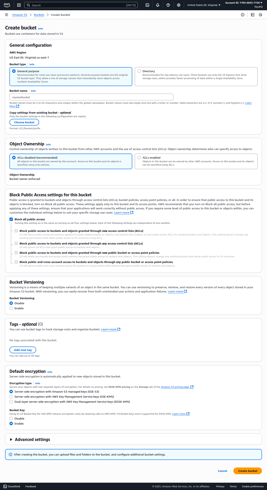
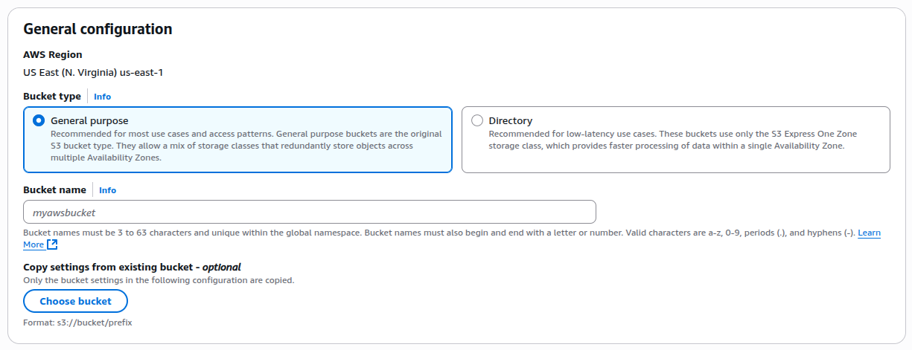
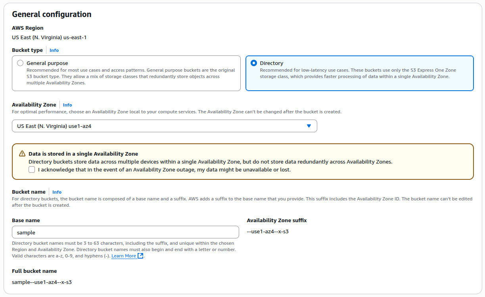
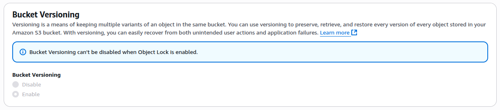
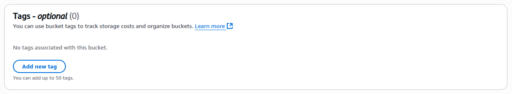

## Thực hành tạo Bucket

<!--  -->

Lưu ý: Giao diện của AWS update thường xuyên nên khi bạn thực hành có thể khác đôi chút, nhưng tổng thể các settings vẫn như cũ.

### 1. General configuration

**AWS Region**  
US East (N. Virginia) us-east-1  
(mặc định sẽ là khu vực đã chọn lúc bạn tạo account)

**Bucket type**

- General purpose: toàn diện, an toàn, phù hợp cho hầu hết nhu cầu. Lưu trữ trên nhiều Availability Zone (AZ).
- Directory: được tối ưu cho hiệu năng và độ trễ thấp, chỉ sử dụng S3 Express One Zone, phù hợp với latency-sensitive application. Chỉ sử dụng 1 Availability Zone.

**Bucket name**
Lưu ý là tên bucket là global name nên cần chú ý [các quy tắc đặc tên Bucket](./2.%20S3-Bucket.md#cách-đặt-tên-bucket).

**Copy settings from existing bucket**  
Chọn 1 bucket đã có sẵn để copy toàn bộ configuration

### 2. Object Ownership

Xác định ai có thể chỉ định quyền truy cập và ghi vào Bucket từ những account AWS khác và đồng thời kiểm soát việc có cho phép sử dụng ACLs (Access Control Lists) để quản lý quyền truy cập.

- **ACLs disabled (recommended)**: vì ACLs là cơ chế khá cũ, khuyến khích dùng IAM policies hoặc S3 bucket policies.
- **ACLs enabled**

**Object Ownership** (Bucket owner enforced)

- Tất cả các objects tải lên bucket đó đều được tự động thuộc quyền sở hữu của bucket owner.
- ACLs sẽ bị vô hiệu hóa hoàn toàn. Việc cấp quyền truy cập sẽ chỉ được quản lý qua Bucket policy hoặc IAM policy.

### 3. Block Public Access settings for this bucket

Tùy chọn `Block all public access` sẽ bao gồm:

- Chặn quyền public được cấp qua ACL (bucket hoặc object mới). NEW
- Chặn toàn bộ quyền public qua ACL (cả mới lẫn cũ). NEW & OLD
- Chặn quyền public từ bucket policy hoặc access point policy mới. NEW
- Chặn toàn bộ quyền public và cross-account qua policy (cũ hoặc mới). NEW & OLD

`Cross-account` là một tài khoản AWS được cấp quyền nhằm truy cập tài nguyên nằm trong tài khoản AWS khác.

### 4. Bucket Versioning

Bật lên là tính phí nhé.

### 5. Tags - optional

Gắn tag để kiểm tra chi phí lưu trữ và tổ chức bucket,... Tối đa 50 tags.

### 6. Default encryption

Tất cả object mới upload vào bucket sẽ tự động được mã hóa (server-side encryption). Có 3 loại sau:

- **SSE-S3 (Server-Side Encryption with Amazon S3 managed keys)**: AWS tự quản lý, free.
- **SSE-KMS (Server-Side Encryption with AWS KMS keys)**: Bạn tự quản lý thông qua KMS, tốn chi phí cho mỗi lần gọi KMS API.
- **DSSE-KMS (Dual-layer Server-Side Encryption with KMS keys)**: Mã hóa hai lớp (double encryption), mỗi lớp với một key khác nhau trong KMS, chi phí cao, dánh cho dữ liệu siêu nhạy cảm.

Bucket Key (chỉ dùng cho SSE-KMS) (Enabled) giúp giảm chi phí KMS bằng cách hạn chế số lần gọi đến AWS KMS API. Không hỗ trợ DSSE-KMS.

### 7. Advanced setting - Object Lock

Cho phép lưu object theo mô hình WORM (Write Once, Read Many), object một khi đã ghi thì không thể bị xóa hoặc ghi đè trong một khoảng thời gian nhất định, hoặc vĩnh viễn.

Bật Object Lock => Tự động bật Versioning.
