## S3 Object Overview

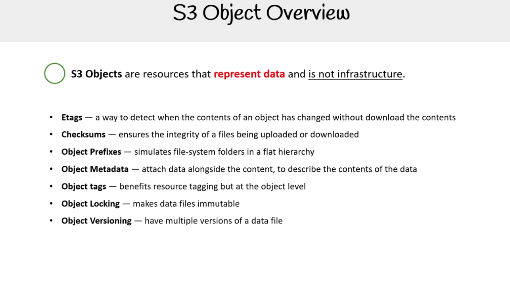

S3 Objects là các tài nguyên đại diện cho dữ liệu chứ không phải hạ tầng.

Các đặc tính chính của S3 Object:

- **Etags** — chuỗi hash dùng để kiểm tra khi nội dung của một object bị thay đổi mà không cần tải nội dung xuống.
- **Checksums** — đảm bảo tính toàn vẹn của tệp khi được tải lên hoặc tải xuống.
- **Object Prefixes** — mô phỏng thư mục hệ thống tệp trong cấu trúc phân cấp phẳng (flat -hierarchy).
- **Object Metadata** — đính kèm dữ liệu cùng với nội dung, giúp mô tả nội dung dữ liệu.
- **Object Tags** — hỗ trợ gắn nhãn tài nguyên nhưng ở cấp độ object.
- **Object Locking** — giúp tệp dữ liệu không thể bị thay đổi (immutable).
- **Object Versioning** — cho phép có nhiều phiên bản của một tệp dữ liệu.

## Etags

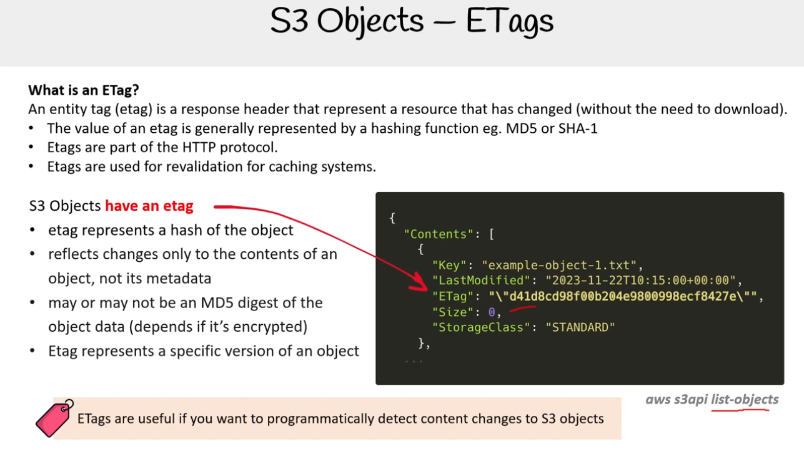

Entity tag (etag) là một response header đại diện cho một tài nguyên đã thay đổi (mà không cần phải tải xuống).

- Giá trị của etag thường được biểu diễn bằng hàm băm <br/> ví dụ: MD5 hoặc SHA-1.
- Etags là một phần của HTTP protocol.
- Etags được dùng để tái xác thực (revalidation) cho các hệ thống cache.

S3 Objects có etag:

- Etag đại diện cho một hash của object.
- Nó chỉ phản ánh thay đổi nội dung của object, không phải metadata.
- Có thể là hoặc không phải là MD5 digest của dữ liệu object (phụ thuộc vào việc object có bị mã hóa hay không).
- Etag đại diện cho một phiên bản cụ thể của object.

<details>
<summary>Metadata</summary>

Là tập hợp dữ liệu mô tả thông tin về một đối tượng (object/file) được lưu trữ, dùng để tìm kiếm, phân loại, hiển thị thông tin.

Metadata có thể bao gồm:

- **System metadata**: Content-Length, Last-Modified, ETag, Content-Type,...
- **User-defined metadata**: do bạn gán thêm khi upload file, ví dụ: x-amz-meta-author: QuyenNC,...

</details>

## Checksums

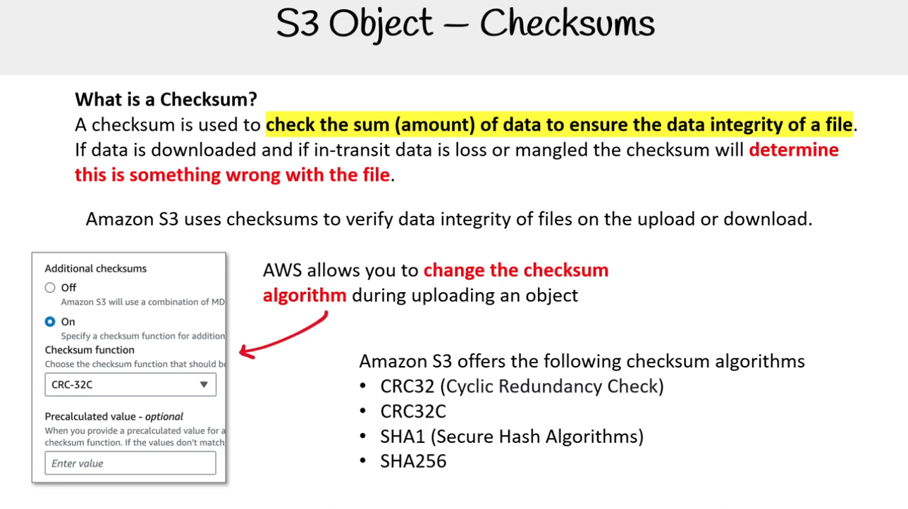

Checksum được dùng để kiểm tra tổng (lượng) dữ liệu nhằm đảm bảo tính toàn vẹn của file.  
Nếu dữ liệu được tải xuống và trong quá trình truyền tải bị mất mát hoặc sai lệch, checksum sẽ xác định có lỗi xảy ra với file.

Amazon S3 sử dụng checksums để xác minh tính toàn vẹn dữ liệu của file khi upload hoặc download.

AWS cho phép bạn thay đổi thuật toán checksum trong quá trình upload một object.

Amazon S3 cung cấp các thuật toán checksum sau:

- CRC32 (Cyclic Redundancy Check)
- CRC32C
- SHA1 (Secure Hash Algorithm)
- SHA256

**So sánh Etag và Checksums**

| Tiêu chí              | **ETag**                                              | **Checksums**                                           |
| --------------------- | ----------------------------------------------------- | ------------------------------------------------------- |
| Mục đích ban đầu      | Xác định phiên bản object, hỗ trợ cache (HTTP header) | Xác minh tính toàn vẹn dữ liệu                          |
| Thuật toán            | Thường là MD5 (chỉ đúng với single-part upload)       | Hỗ trợ nhiều thuật toán (CRC32, CRC32C, SHA-1, SHA-256) |
| Multipart upload      | Không phản ánh chính xác nội dung file                | Hỗ trợ đầy đủ, chính xác                                |
| Tự động hay tùy chọn  | Luôn được gán khi upload object                       | Tùy chọn (phải bật hoặc chỉ định khi upload)            |
| Độ tin cậy khi verify | Không đáng tin với multipart                          | Đáng tin cậy, được AWS chính thức xác nhận              |

## Object Prefixes

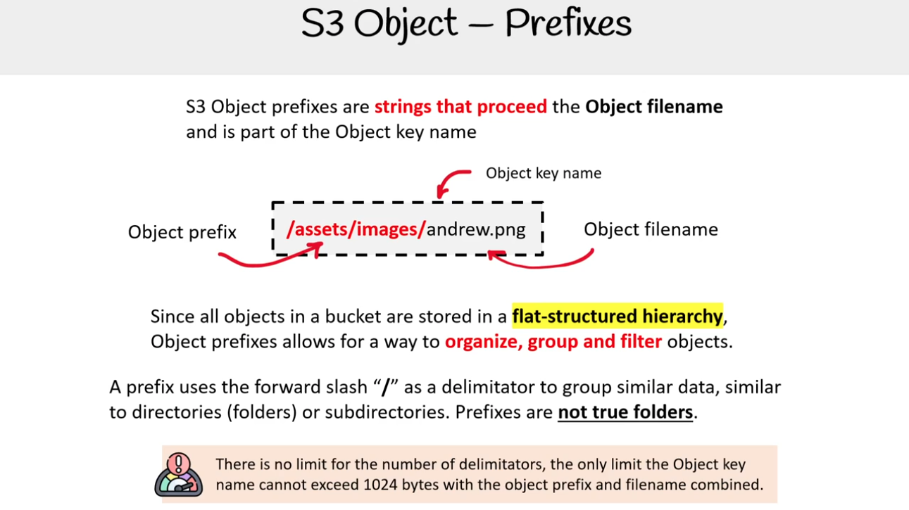

Tiền tố (prefix) của S3 Object là các chuỗi đứng trước tên tệp (Object filename)
và là một phần của tên khóa (Object key name).

```
Object key name: /assets/images/s3/quyennc.png
Object prefix: /assets/images/s3/
Object filename: quyennc.png
```

Vì tất cả các đối tượng trong bucket được lưu trữ trong một cấu trúc phẳng (flat-structured hierarchy), tiền tố đối tượng cho phép sắp xếp, nhóm và lọc các đối tượng.

Một tiền tố sử dụng dấu gạch chéo `/` làm dấu phân tách để nhóm dữ liệu tương tự, giống như thư mục (folders) hoặc thư mục con (subdirectories).

Tiền tố **không phải là thư mục thật sự**.

> ⚠️ Không có giới hạn về số lượng dấu phân tách, giới hạn duy nhất là tên khóa đối tượng (Object key name) không được vượt quá 1024 byte khi bao gồm cả tiền tố và tên tệp.

## Object Metadata

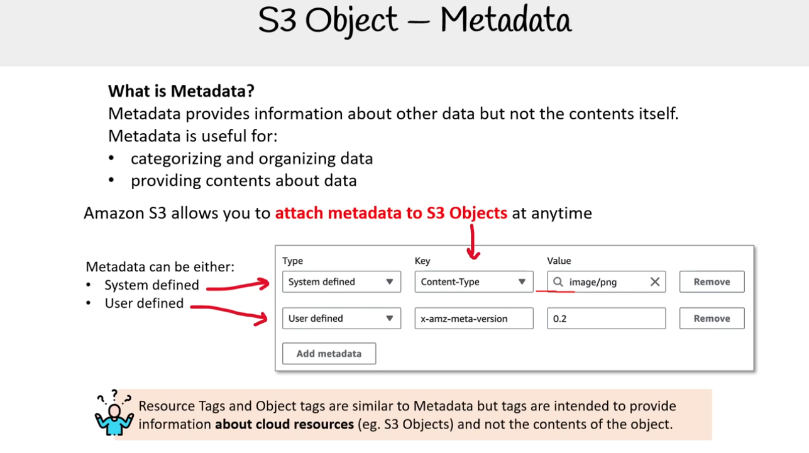

Metadata cung cấp thông tin về dữ liệu khác nhưng không phải là nội dung của chính nó.

Metadata hữu ích cho việc:

- phân loại và tổ chức dữ liệu
- cung cấp thông tin về dữ liệu

Amazon S3 cho phép bạn đính kèm metadata vào S3 Objects bất kỳ lúc nào.

Metadata có thể là:

- Do hệ thống định nghĩa (System defined)
- Do người dùng định nghĩa (User defined)

> ⚠️ Resource Tags và Object tags cũng tương tự như Metadata nhưng tags được dùng để cung cấp thông tin về cloud resource (ví dụ: S3 Objects) chứ không phải nội dung của đối tượng.

### System defined metadata

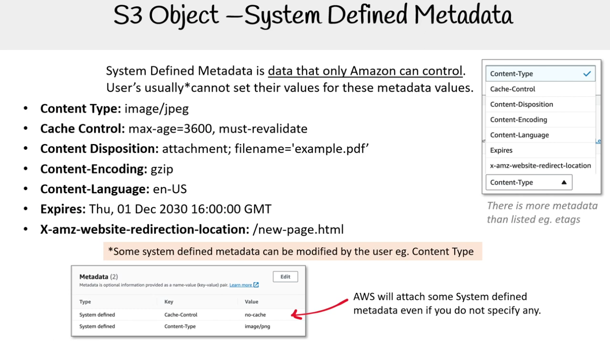

**System Defined Metadata** là dữ liệu mà chỉ Amazon có thể kiểm soát. User không thể tự đặt giá trị cho các metadata này.

- **Content Type:** image/jpeg
- **Cache Control:** max-age=3600, must-revalidate
- **Content Disposition:** attachment; filename='example.pdf'
- **Content-Encoding:** gzip
- **Content-Language:** en-US
- **Expires:** Thu, 01 Dec 2030 16:00:00 GMT
- **X-amz-website-redirection-location:** /new-page.html

\*Một số metadata do hệ thống định nghĩa có thể được người dùng chỉnh sửa, ví dụ: Content Type

> AWS sẽ tự động gắn một số metadata do hệ thống định nghĩa ngay cả khi bạn không chỉ định. (Còn nhiều metadata khác không được liệt kê, ví dụ: etags)

### User defined metadata

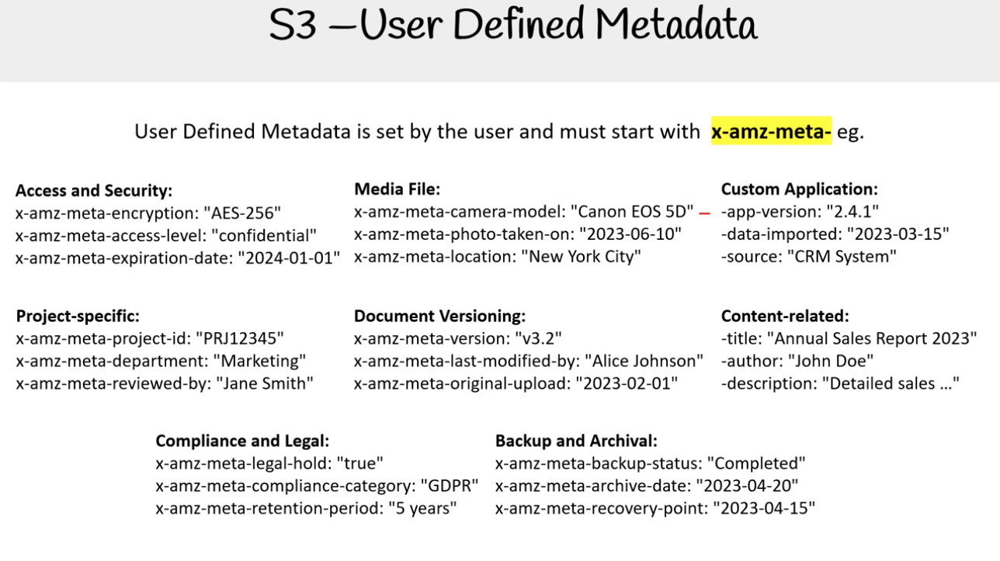

Metadata do người dùng định nghĩa và phải bắt đầu bằng tiền tố `x-amz-meta-`  
Ví dụ:

- **x-amz-meta-encryption**: "AES-256"
- **x-amz-meta-project-id**: "PRJ12345"
- **x-amz-meta-archive-date**: "2023-04-20"

## Object Lock

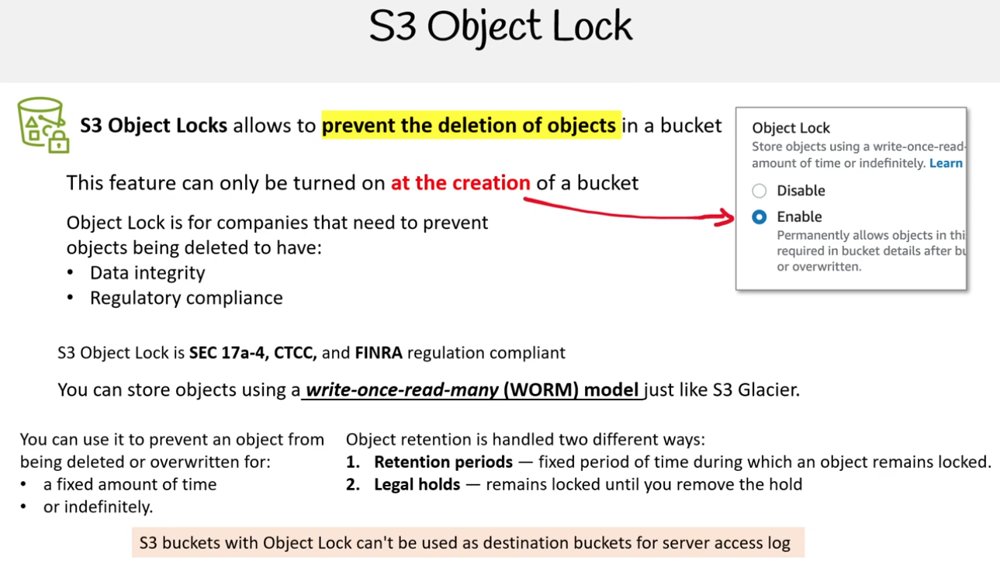

S3 Object Locks cho phép ngăn chặn việc xóa các đối tượng trong một bucket.

Tính năng này chỉ có thể được bật khi tạo một bucket.

Object Lock dành cho các công ty cần ngăn chặn việc xóa các đối tượng để có:

- Data integrity
- Regulatory compliance

S3 Object Lock tuân thủ quy định SEC 17a-4, CTCC và FINRA.

Bạn có thể lưu trữ các đối tượng bằng mô hình write-once-read-many (WORM) giống như S3 Glacier.

Bạn có thể sử dụng Object Lock để ngăn một đối tượng bị xóa hoặc ghi đè trong:

- Một khoảng thời gian cố định
- Vô thời hạn.

Việc lưu giữ đối tượng (object retention) được xử lý theo hai cách khác nhau:

- **Retention periods** – khoảng thời gian cố định mà trong đó một đối tượng vẫn bị khóa.
- **Legal holds** – vẫn bị khóa cho đến khi bạn gỡ bỏ trạng thái giữ.

> Các S3 bucket có Object Lock không thể được sử dụng làm destination bucket cho server access log.

### Cấu hình Object Lock thông qua API

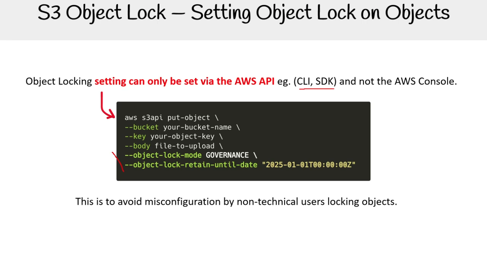

Thiết lập Object Locking chỉ có thể được cài đặt thông qua AWS API ví dụ như (CLI, SDK) chứ không phải trên AWS Console.

Điều này nhằm tránh việc người dùng không chuyên cài đặt sai khi khóa các đối tượng.

## Object Versioning

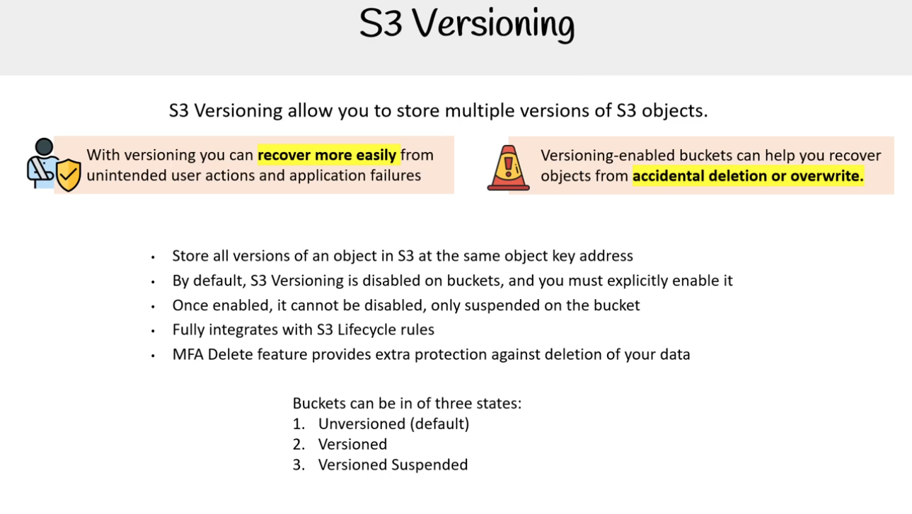

S3 Versioning cho phép bạn lưu trữ nhiều phiên bản của các đối tượng S3.

Với tính năng lập phiên bản (versioning), bạn có thể khôi phục dễ dàng hơn sau các hành động người dùng không mong muốn và lỗi ứng dụng. Các bucket được bật tính năng lập phiên bản có thể giúp bạn khôi phục các đối tượng sau khi bị xóa hoặc ghi đè do nhầm lẫn.

Đặc điểm của Versioning:

- Lưu trữ tất cả các phiên bản của một đối tượng trong S3 tại cùng một địa chỉ khóa đối tượng.
- Theo mặc định, S3 Versioning bị vô hiệu hóa trên các bucket, và bạn phải bật nó một cách rõ ràng.
- Khi đã bật, nó không thể bị vô hiệu hóa, chỉ có thể bị tạm ngưng trên bucket.
- Tích hợp hoàn toàn với các quy tắc S3 Lifecycle.
- Tính năng MFA Delete cung cấp thêm lớp bảo vệ chống lại việc xóa dữ liệu của bạn.

Các bucket có thể ở trong ba trạng thái:

- Unversioned (mặc định)
- Versioned
- Versioned Suspended

<details>
<summary>S3 Lifecycle</summary>

_S3 Lifecycle là một tập hợp các quy tắc bạn có thể áp dụng cho các đối tượng trong bucket Amazon S3 để quản lý vòng đời của chúng. Mục tiêu chính của S3 Lifecycle là giúp bạn tự động tiết kiệm chi phí lưu trữ bằng cách di chuyển các đối tượng sang các lớp lưu trữ ít tốn kém hơn hoặc xóa chúng khi chúng không còn cần thiết nữa._

Các quy tắc S3 Lifecycle hoạt động dựa trên hai loại hành động:

**Chuyển đổi (Transitions)**: Di chuyển các đối tượng từ một lớp lưu trữ sang một lớp khác. Ví dụ:

- Chuyển các đối tượng từ S3 Standard sang S3 Standard-Infrequent Access (IA) sau 30 ngày.
- Chuyển các đối tượng từ S3 Standard-IA sang S3 Glacier Flexible Retrieval sau 90 ngày.

**Hết hạn (Expirations)**: Xóa các đối tượng hoặc các phiên bản cũ của chúng khi chúng đạt đến một khoảng thời gian nhất định. Ví dụ:

- Xóa các đối tượng sau 365 ngày.
- Xóa các phiên bản cũ của một đối tượng sau 7 ngày kể từ khi có phiên bản mới hơn.

</details>

<details>
<summary>MFA Delete</summary>

_MFA Delete (Multi-Factor Authentication Delete) là một tính năng bảo mật trong Amazon S3 yêu cầu người dùng phải xác thực bằng nhiều yếu tố để thực hiện các thao tác quan trọng trên một bucket S3._

</details>

## Object Replication Overview

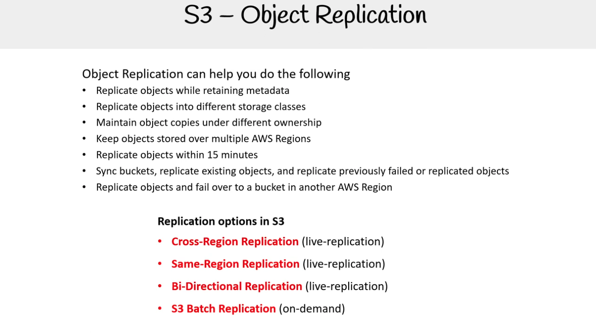

Object Replication có thể giúp bạn làm những việc sau:

- Sao chép các đối tượng trong khi vẫn giữ lại metadata.
- Sao chép các đối tượng vào các storage class khác nhau.
- Duy trì các bản sao đối tượng dưới quyền sở hữu khác nhau.
- Lưu giữ các đối tượng trên nhiều AWS Region.
- Sao chép các đối tượng trong vòng 15 phút.
- Đồng bộ hóa các bucket, sao chép các đối tượng đã tồn tại, và sao chép lại các đối tượng bị lỗi hoặc đã sao chép trước đó.
- Sao chép các đối tượng và chuyển đổi dự phòng (fail over) sang một bucket ở AWS Region khác.

Các tùy chọn Replication trong S3:

- **Cross-Region Replication (live-replication)**: sao chép đối tượng S3 giữa các bucket nằm ở hai AWS Region khác nhau theo thời gian thực.
- **Same-Region Replication (live-replication)**: sao chép các đối tượng trong cùng một AWS Region theo thời gian thực.
- **Bi-Directional Replication (live-replication)**: sao chép 2 chiều, thường được triển khai bằng cách thiết lập hai quy tắc sao chép (replication rules) riêng biệt: một quy tắc từ Bucket A -> Bucket B, và một quy tắc khác từ Bucket B -> Bucket A.
- **S3 Batch Replication (on-demand)**: sao chép dữ liệu theo yêu cầu (on-demand) thay vì theo thời gian thực, cho phép sao chép một số lượng lớn object đã tồn tại.

## Archived Object

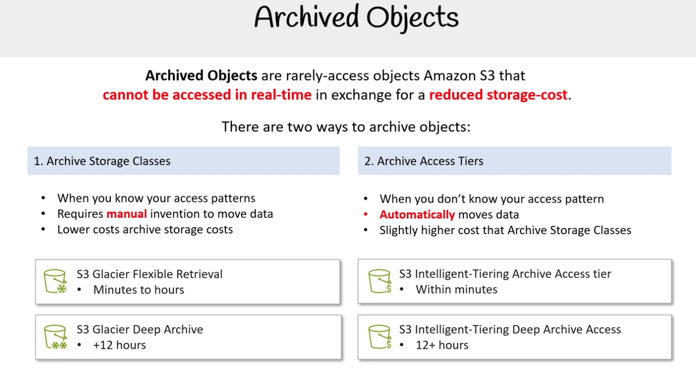

Archived Objects là các đối tượng Amazon S3 hiếm khi được truy cập, không thể truy cập theo thời gian thực để đổi lấy chi phí lưu trữ thấp hơn.

Có hai cách để lưu trữ các đối tượng:

**1. Archive Storage Classes**

- Khi bạn biết mô hình truy cập của mình.
- Yêu cầu can thiệp thủ công để di chuyển dữ liệu.
- Chi phí thấp hơn so với Archive Access Tiers.

**S3 Glacier Flexible Retrieval**: Từ vài phút đến vài giờ  
**S3 Glacier Deep Archive**: Hơn 12 giờ

**2. Archive Access Tiers**

- Khi bạn không biết mô hình truy cập của mình.
- Tự động di chuyển dữ liệu.
- Chi phí cao hơn một chút so với Archive Storage Classes.

**S3 Intelligent-Tiering Archive Access tier**: Trong vài phút  
**S3 Intelligent-Tiering Deep Archive Access**: 12+ giờ
