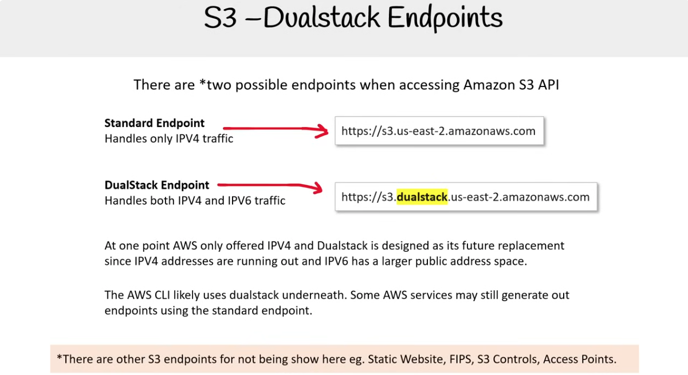
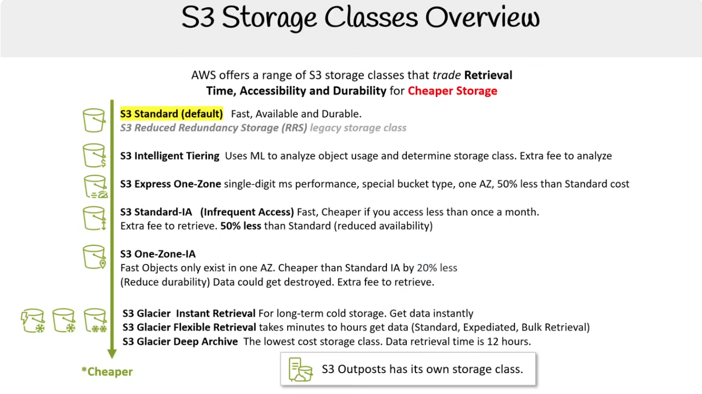
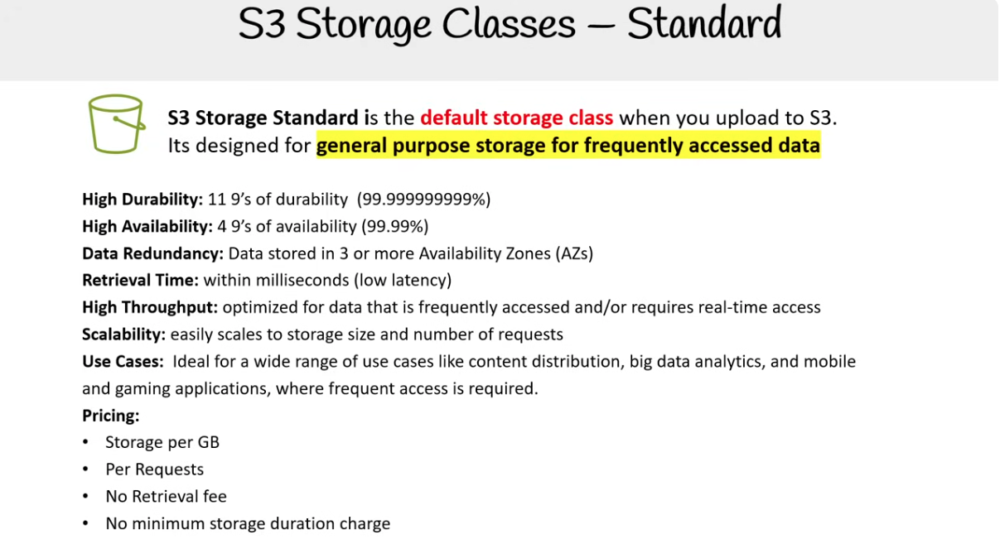
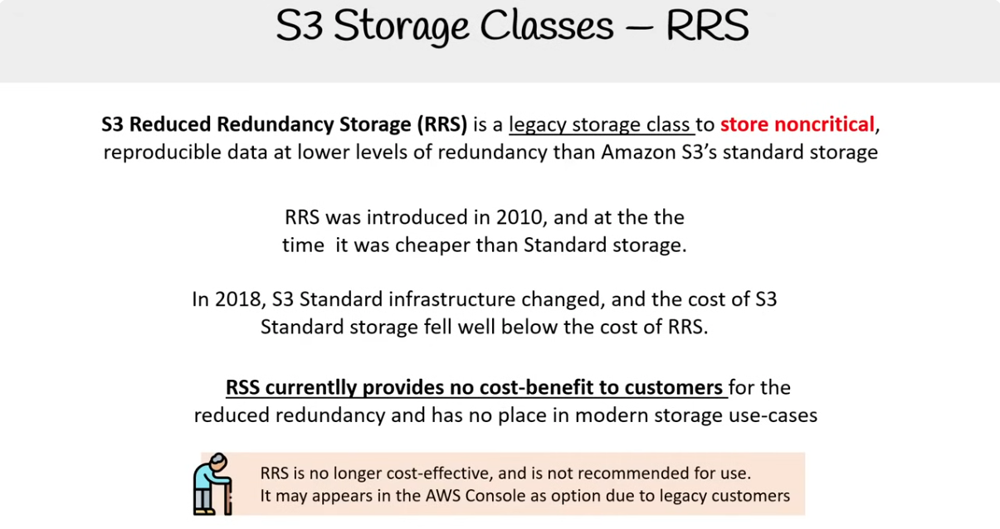
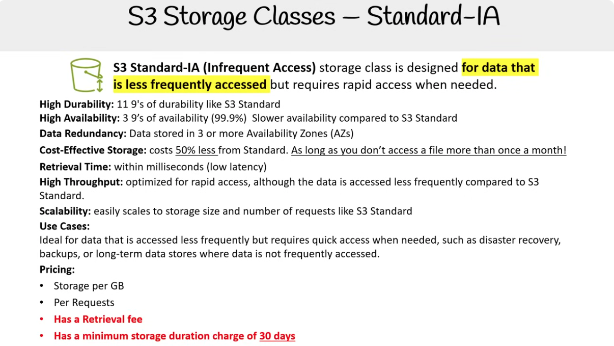

## S3 Storage Classes

### S3 Dualstack Endpoints

Có hai endpoint khả dụng khi truy cập Amazon S3 API

1. Standard Endpoint

   - Xử lý chỉ lưu lượng IPV4
   - https://s3.us-east-2.amazonaws.com

2. DualStack Endpoint
   - Xử lý cả lưu lượng IPV4 và IPV6
   - https://s3.dualstack.us-east-2.amazonaws.com

Trước đây AWS chỉ cung cấp IPV4 và Dualstack được thiết kế như sự thay thế trong tương lai, vì địa chỉ IPV4 đang dần cạn kiệt và IPV6 có không gian địa chỉ công cộng lớn hơn.

AWS CLI có khả năng sử dụng dualstack bên dưới. Một số dịch vụ AWS có thể vẫn tạo endpoint sử dụng standard endpoint.

Ngoài Standard Endpoint và Dualstack, S3 còn có nhiều loại endpoint đặc thù như: Static Website, FIPS, S3 Controls, Access Points.

### Storage Classes Overview

AWS cung cấp nhiều loại S3 storage class khác nhau, cân bằng giữa thời gian truy xuất (Retrieval Time), khả năng truy cập (Accessibility) và độ bền của dữ liệu (Durability) để có một Storage rẻ hơn.

Available Zone (AZ) là một trung tâm dữ liệu vật lý riêng biệt (hoặc cụm trung tâm dữ liệu) trong một Region của AWS.

Đặc điểm của AZ:

- Các AZ trong cùng Region được cách ly vật lý với nhau (có nguồn điện, mạng, hệ thống làm mát riêng).
- Nếu một AZ gặp sự cố, các AZ khác trong cùng Region vẫn hoạt động → tăng tính sẵn sàng cho ứng dụng.

Danh sách sau xếp theo thứ tự từ đắt nhất đến rẻ nhất:

- S3 Standard (default): Nhanh, khả dụng và bền (3 AZ).

  - S3 Reduced Redundancy Storage (RRS) legacy storage class

- S3 Intelligent Tiering: Sử dụng Machine Learning để phân tích việc sử dụng object và xác định storage class. Tốn thêm phí để phân tích.

- S3 Express One-Zone: Hiệu năng tính theo mili-giây loại bucket đặc biệt, một AZ, chi phí thấp hơn 50% so với Standard.

- S3 Standard-IA (Infrequent Access): Nhanh, rẻ hơn nếu truy cập ít hơn một lần mỗi tháng. Phí bổ sung để truy xuất. Chi phí thấp hơn 50% so với Standard (giảm khả dụng).

- S3 One-Zone-IA: Object chỉ tồn tại trong một AZ. Rẻ hơn Standard IA 20%.
  (Giảm durability) Dữ liệu có thể bị mất. Phí bổ sung để truy xuất.

- S3 Glacier Instant Retrieval: Dành cho lưu trữ lạnh dài hạn. Truy xuất dữ liệu ngay lập tức.

- S3 Glacier Flexible Retrieval: Mất vài phút đến vài giờ để lấy dữ liệu (Standard, Expediated, Bulk Retrieval).

- S3 Glacier Deep Archive: Storage class có chi phí thấp nhất. Thời gian truy xuất dữ liệu là 12 giờ.

- S3 Outposts có storage class riêng.

### S3 Storage Classes - Standard

S3 Storage Standard là lớp lưu trữ mặc định khi bạn tải dữ liệu lên S3. Nó được thiết kế cho lưu trữ mục đích chung dành cho dữ liệu được truy cập thường xuyên.

- Độ bền cao: 11 số 9 về độ bền (99.999999999%)
- Khả năng sẵn sàng cao: 4 số 9 về khả năng sẵn sàng (99.99%)
- Dự phòng dữ liệu: Dữ liệu được lưu trong 3 hoặc nhiều Availability Zone (AZ)
- Thời gian truy xuất: trong vài mili giây (độ trễ thấp)
- Thông lượng cao: được tối ưu cho dữ liệu được truy cập thường xuyên và/hoặc cần truy cập theo thời gian thực
- Khả năng mở rộng: dễ dàng mở rộng theo kích thước lưu trữ và số lượng request
- Trường hợp sử dụng: Phù hợp cho nhiều tình huống như phân phối nội dung, phân tích dữ liệu lớn, ứng dụng di động và trò chơi — nơi cần truy cập dữ liệu thường xuyên.

Cách tính phí:

- Tính phí theo GB lưu trữ
- Theo số lượng request
- Không có retrieval fee
- Không có minimum storage duration charge

### S3 Storage Classes - Reduced Redundancy Storage (RRS)

S3 Reduced Redundancy Storage (RRS) là lớp lưu trữ kế thừa dùng để lưu trữ dữ liệu không quan trọng, có thể tái tạo, số lượng bản sao lưu trữ ít hơn so với Standard storage.

RRS được giới thiệu vào năm 2010, và vào thời điểm đó thì rẻ hơn Standard.

Năm 2018, cơ sở hạ tầng của S3 Standard thay đổi, và chi phí lưu trữ tiêu chuẩn S3 giảm xuống thấp hơn nhiều so với chi phí của RRS.

Hiện tại RRS không mang lại lợi ích chi phí nào cho khách hàng do mức độ lưu trữ thấp và không còn phù hợp trong các trường hợp sử dụng lưu trữ hiện đại.

RRS không còn hiệu quả về chi phí và không được khuyến nghị sử dụng. Nó có thể vẫn xuất hiện trong AWS Console như một tùy chọn cho những KH cũ (vẫn đang sử dụng nó).

### S3 Storage Classes - Standard-IA

S3 Standard-IA (Infrequent Access) là lớp lưu trữ được thiết kế cho dữ liệu được truy cập không thường xuyên, nhưng vẫn cần khả năng truy cập nhanh khi cần.

Độ bền cao: 11 số 9 (99.999999999%) như S3 Standard

Độ sẵn sàng cao: 3 số 9 (99.9%), chậm hơn một chút so với S3 Standard

Dư thừa dữ liệu: Dữ liệu được lưu trong 3 hoặc nhiều hơn các Vùng khả dụng (AZs)

Lưu trữ tiết kiệm chi phí: rẻ hơn 50% so với Standard — miễn là bạn không truy cập một tệp quá một lần mỗi tháng!

Thời gian truy xuất: trong vài mili-giây (độ trễ thấp)

Thông lượng cao: được tối ưu cho truy cập nhanh, dù dữ liệu được truy cập ít thường xuyên hơn so với S3 Standard

Khả năng mở rộng: dễ dàng mở rộng kích thước lưu trữ và số lượng yêu cầu như S3 Standard

Trường hợp sử dụng:
Phù hợp cho dữ liệu được truy cập ít thường xuyên nhưng cần truy cập nhanh khi cần, chẳng hạn như khôi phục thảm họa, sao lưu, hoặc lưu trữ dữ liệu dài hạn mà không được truy cập thường xuyên.

Giá:

- Tính theo dung lượng lưu trữ (GB)
- Tính theo số lượng yêu cầu
- Có phí truy xuất dữ liệu
- Có thời gian lưu trữ tối thiểu là 30 ngày
