## Cloudwatch

### Pillars of observability (Ba trụ cột của khả năng quan sát)

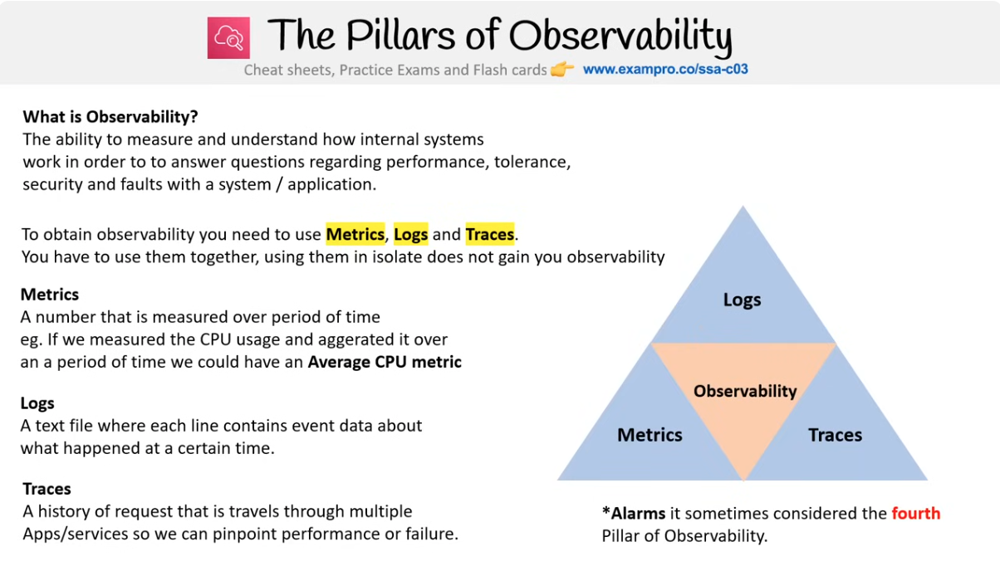

**Observability là gì?**  
Là khả năng đo lường và hiểu cách hệ thống nội bộ hoạt động nhằm trả lời các câu hỏi liên quan đến hiệu năng, khả năng chịu lỗi, bảo mật và lỗi của hệ thống / ứng dụng.

Để đạt được khả năng quan sát (observability), bạn cần sử dụng Metrics (chỉ số), Logs (nhật ký) và Traces (vết truy dấu). Bạn phải sử dụng chúng cùng nhau; nếu dùng riêng lẻ thì sẽ không đạt được khả năng quan sát thực sự.

**Metrics (Chỉ số)**  
Một giá trị được đo lường trong một khoảng thời gian.  
Ví dụ: Nếu chúng ta đo mức sử dụng CPU và tổng hợp nó theo thời gian, chúng ta có thể có một chỉ số CPU trung bình (Average CPU metric).

**Logs (Nhật ký)**  
Một tệp văn bản trong đó mỗi dòng chứa dữ liệu sự kiện về những gì đã xảy ra tại một thời điểm nhất định.

**Traces (Vết truy dấu)**
Lịch sử của một yêu cầu khi nó đi qua nhiều ứng dụng / dịch vụ khác nhau để chúng ta có thể xác định chính xác hiệu năng hoặc lỗi.

📌 **Alarm (Cảnh báo)** đôi khi được xem là trụ cột thứ tư của khả năng quan sát.

### Introduction to Cloudwatch

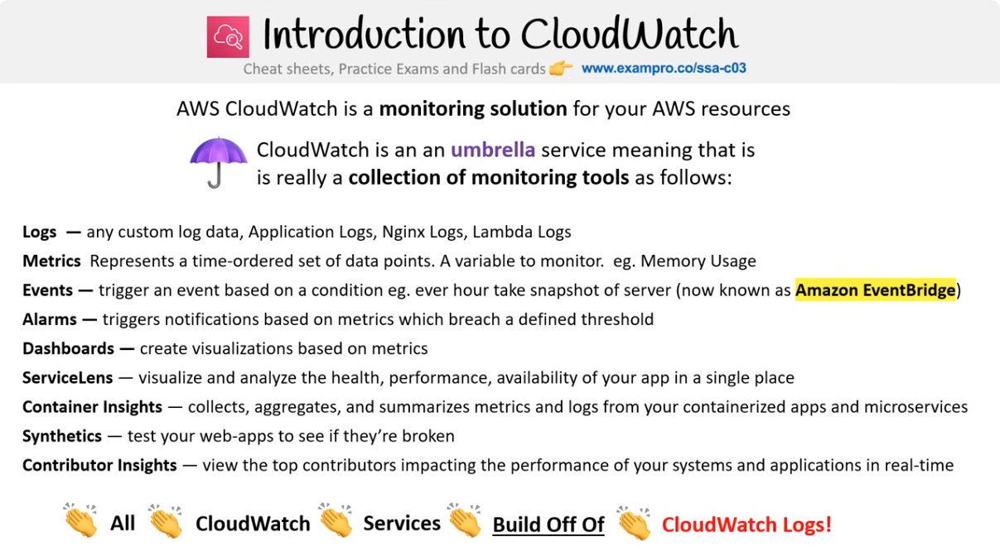

AWS CloudWatch là giải pháp giám sát (monitoring solution) cho các tài nguyên AWS của bạn.

CloudWatch là một dịch vụ “ô dù” (umbrella service), nghĩa là nó thực chất là tập hợp của nhiều công cụ giám sát, bao gồm:

- Logs — mọi loại dữ liệu log tùy chỉnh, log ứng dụng, log Nginx, log Lambda.
- Metrics — tập hợp dữ liệu được sắp xếp theo thời gian; một biến cần theo dõi (ví dụ: mức sử dụng bộ nhớ).
- Events — kích hoạt sự kiện dựa trên điều kiện (ví dụ: snapshot máy chủ mỗi giờ — hiện được gọi là Amazon EventBridge).
- Alarms — gửi thông báo khi các chỉ số (metrics) vượt ngưỡng đã định.
- Dashboards — tạo biểu đồ trực quan dựa trên các chỉ số.
- ServiceLens — trực quan hóa và phân tích tình trạng, hiệu năng, và khả năng sẵn sàng của ứng dụng trong một nơi duy nhất.
- Container Insights — thu thập, tổng hợp và tóm tắt các chỉ số và log từ ứng dụng container và microservice.
- Synthetics — kiểm tra ứng dụng web để xem có bị lỗi không.
- Contributor Insights — xem các yếu tố hàng đầu ảnh hưởng đến hiệu suất của hệ thống và ứng dụng trong thời gian thực.

### Cloudwatch Logs

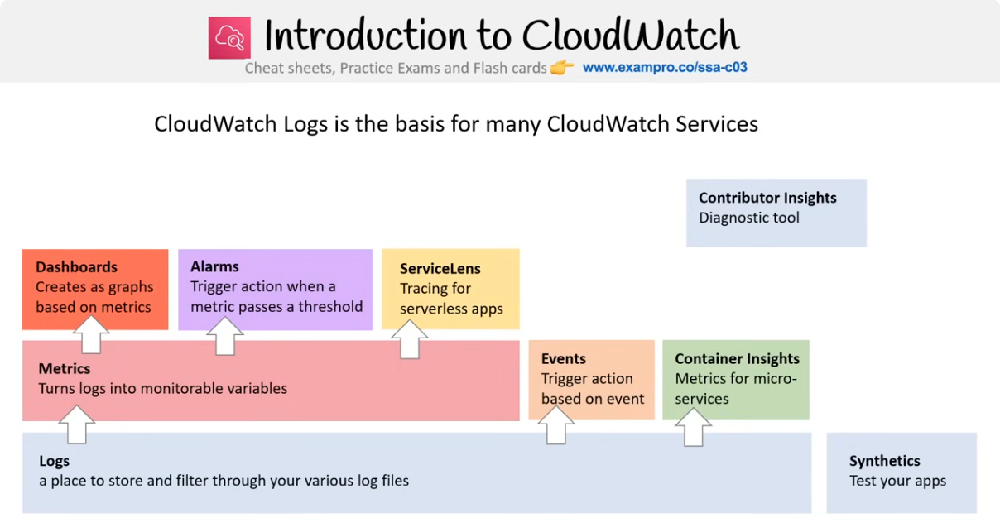

CloudWatch Logs là nền tảng cho hầu hết các dịch vụ CloudWatch khác.  
Tức là: dữ liệu log được thu thập trước → chuyển thành metric → từ đó các dịch vụ khác như dashboard, alarm, events... có thể hoạt động. Toàn bộ hệ thống CloudWatch đều xoay quanh Logs.

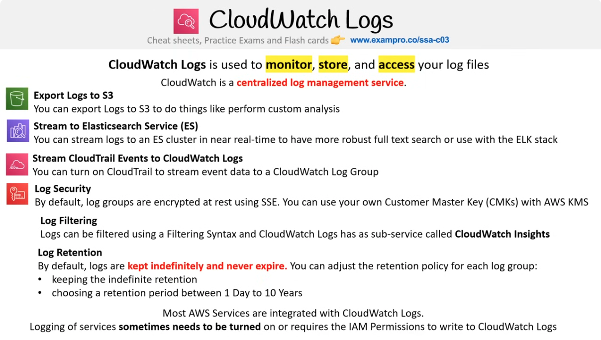

CloudWatch Logs được sử dụng để giám sát (monitor), lưu trữ (store) và truy cập (access) các tệp log của bạn.
CloudWatch là một dịch vụ quản lý log tập trung (centralized log management service).

**Export Logs to S3**  
Bạn có thể xuất log sang S3 để thực hiện các tác vụ như phân tích tùy chỉnh.

**Stream to Elasticsearch Service (ES)**  
Bạn có thể truyền log đến một cụm ES gần như theo thời gian thực để có khả năng tìm kiếm toàn văn mạnh mẽ hơn hoặc sử dụng với ELK stack.

**Stream CloudTrail Events to CloudWatch Logs**  
Bạn có thể bật CloudTrail để truyền dữ liệu sự kiện đến một Log Group của CloudWatch.

_AWS CloudTrail là dịch vụ ghi lại toàn bộ hoạt động (event logs) xảy ra trong tài khoản AWS của bạn (bạn đã làm gì, ở đâu và khi nào?)_

**Log Security**  
Theo mặc định, các Log Group được mã hóa khi lưu trữ bằng SSE (Server-Side Encryption). Bạn có thể sử dụng Customer Master Key (CMK) riêng của mình với AWS KMS.

**Log Filtering**  
Log có thể được lọc bằng cú pháp lọc (Filtering Syntax), và CloudWatch Logs có dịch vụ con là CloudWatch Insights.

_CloudWatch Logs Insights là công cụ truy vấn (query tool - tương tự SQL) mạnh mẽ trong AWS CloudWatch, được dùng để tìm kiếm, phân tích và trực quan hóa dữ liệu log một cách nhanh chóng._

**Log Retention**  
Theo mặc định, log được giữ vô thời hạn và không bao giờ hết hạn. Bạn có thể điều chỉnh chính sách lưu trữ cho từng Log Group :

- Giữ vô thời hạn
- Chọn thời gian lưu trữ từ 1 ngày đến 10 năm

### Cloudwatch Log Group

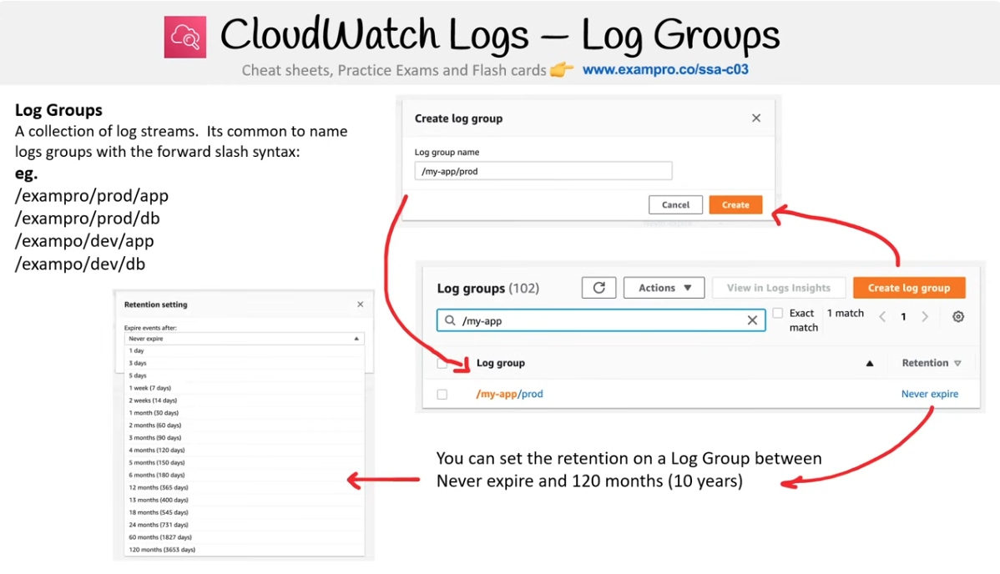

Một tập hợp các luồng nhật ký (log streams). Thông thường, các nhóm nhật ký được đặt tên bằng cú pháp dấu gạch chéo:

Ví dụ:

```
/exampro/prod/app
/exampro/prod/db
/exampro/dev/app
/exampro/dev/db
```

Bạn có thể đặt thời gian lưu trữ cho một Log Group trong khoảng từ _Không bao giờ hết hạn (Never expire)_ đến _120 tháng (10 năm)_.

### Cloudwatch Log Stream

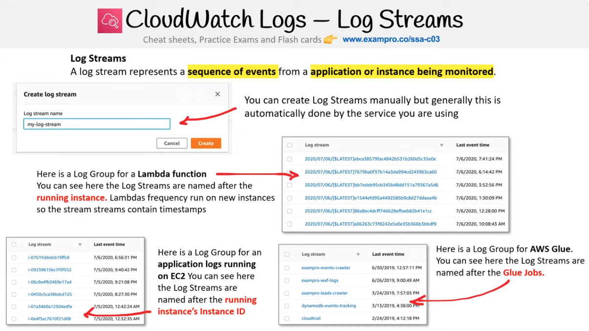

Một log stream đại diện cho một chuỗi các sự kiện (sequence of events) từ một ứng dụng hoặc instance đang được giám sát.

Bạn có thể tạo Log Stream thủ công, nhưng thông thường dịch vụ bạn đang sử dụng sẽ tự động tạo ra.

Ví dụ:

**Log Group cho hàm Lambda**  
Các Log Streams được đặt tên theo instance đang chạy.
Do Lambda thường chạy trên các instance mới, nên tên log stream sẽ chứa dấu thời gian (timestamp).

**Log Group cho ứng dụng chạy trên EC2**  
Các Log Streams được đặt tên theo ID của instance đang chạy (Instance ID).

**Log Group cho AWS Glue**  
Các Log Streams được đặt tên theo Glue Jobs.

### Cloudwatch Log Events

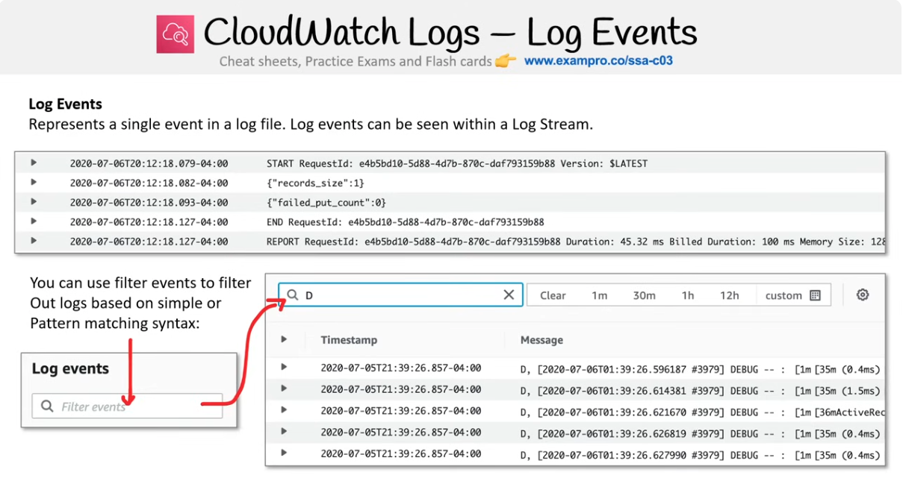

Log Events là đại diện cho một sự kiện riêng lẻ trong một tệp log. Các sự kiện log có thể được nhìn thấy trong một Log Stream.

Bạn có thể sử dụng bộ lọc sự kiện để lọc ra các log dựa trên Pattern matching syntax (đơn giản hoặc phức tạp)

### Cloudwatch Log Insights

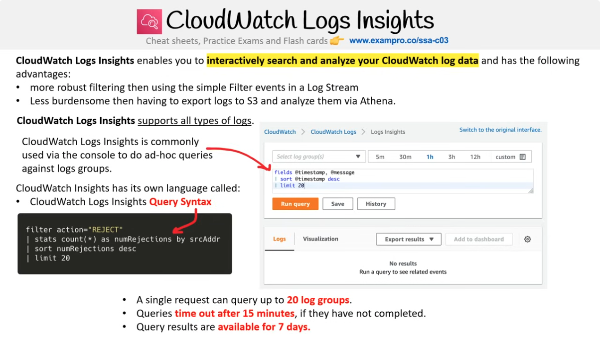

CloudWatch Logs Insights cho phép bạn tìm kiếm và phân tích dữ liệu log CloudWatch của mình một cách tương tác và có các ưu điểm sau:

- Lọc mạnh mẽ hơn so với việc sử dụng tính năng Sự kiện Lọc đơn giản trong Luồng Log (Log Stream).
- Ít gánh nặng hơn so với việc phải xuất log ra S3 và phân tích chúng qua Athena.

CloudWatch Logs Insights hỗ trợ tất cả các loại log.

CloudWatch Logs Insights thường được sử dụng qua console để thực hiện truy vấn ad-hoc (truy vấn tức thời) đối với các nhóm log (log groups).

CloudWatch Insights có ngôn ngữ riêng gọi là: Cú pháp Truy vấn CloudWatch Logs Insights

```
filter action="REJECT"
| stats count(*) as numRejections by srcAddr
| sort numRejections desc
| limit 20
```

Đặc điểm:

- Một yêu cầu truy vấn có thể truy vấn tối đa 20 nhóm log.
- Các truy vấn sẽ hết thời gian sau 15 phút, nếu chúng chưa hoàn thành.
- Kết quả truy vấn được lưu trong 7 ngày.

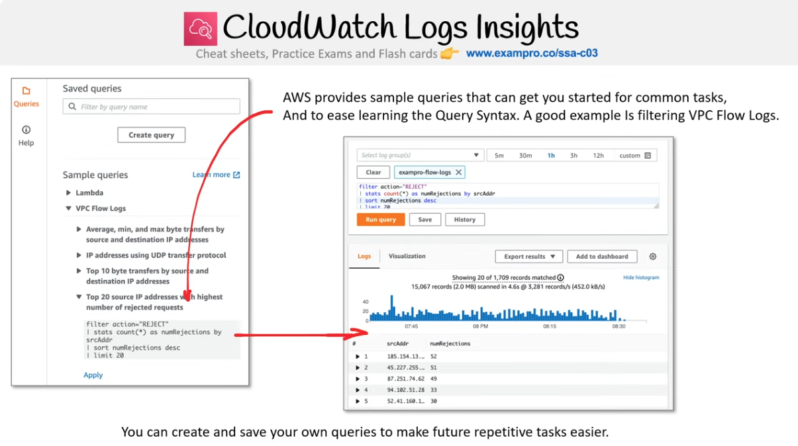

AWS cung cấp các truy vấn mẫu có thể giúp bạn bắt đầu với các tác vụ phổ biến, và giúp việc học Query Syntax dễ dàng hơn.

Bạn có thể tạo và lưu các truy vấn của riêng mình để giúp các công việc lặp đi lặp lại trong tương lai dễ dàng hơn.

### Cloudwatch Insights - Discovered Fields

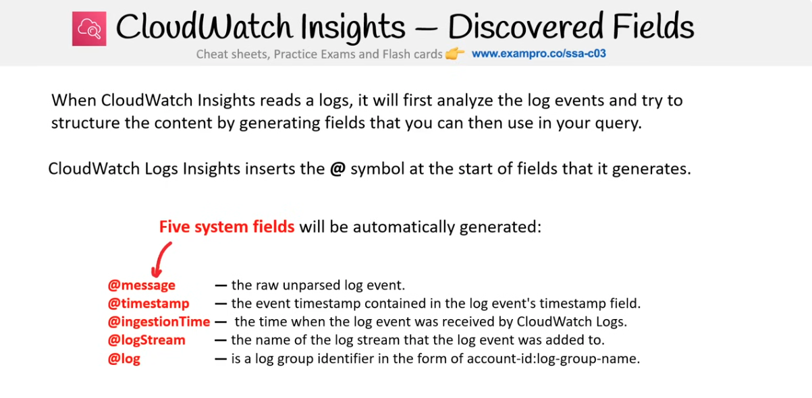

Khi CloudWatch Insights đọc log, nó sẽ phân tích các sự kiện log và cố gắng cấu trúc nội dung bằng cách tạo ra các trường (fields) mà sau đó bạn có thể sử dụng trong truy vấn của mình.

CloudWatch Logs Insights chèn ký hiệu @ vào đầu các trường mà nó tạo ra.

Năm trường hệ thống (Five system fields) sẽ được tự động tạo:

- **@message** — sự kiện log thô, chưa được phân tích cú pháp.
- **@timestamp** — dấu thời gian sự kiện có trong trường dấu thời gian của sự kiện log.
- **@ingestionTime** — thời gian mà sự kiện log được nhận bởi CloudWatch Logs.
- **@logStream** — tên của luồng log mà sự kiện log được thêm vào.
- **@log** — là một định danh nhóm log (log group identifier) dưới dạng `account-id:log-group-name`.

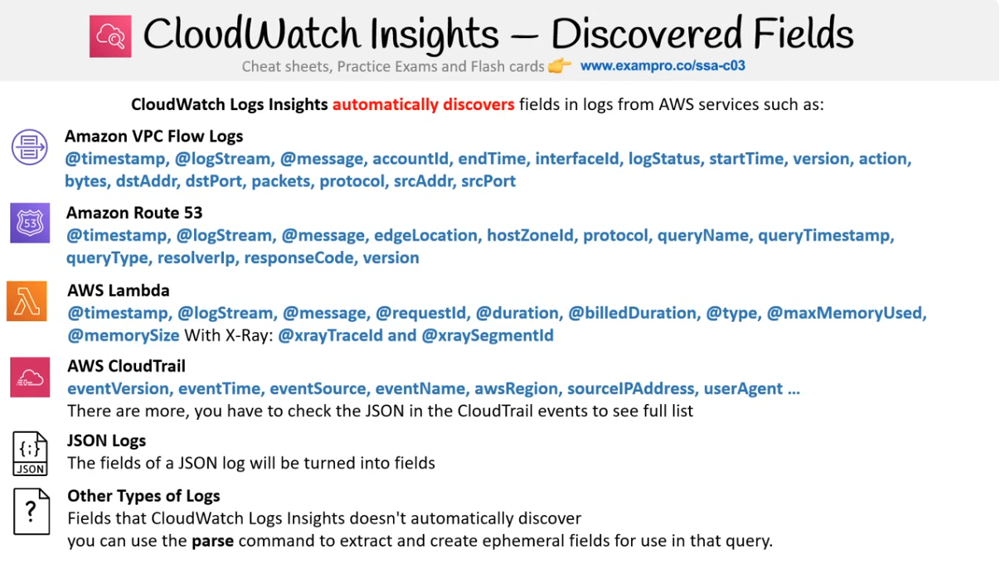

Logs Insights tự động khám phá các trường cho log từ các dịch vụ AWS phổ biến:

Amazon VPC Flow Logs  
`@timestamp, accountId, action, bytes, dstAddr, srcPort, v.v.`

Amazon Route 53  
`@timestamp, edgeLocation, queryName, responseCode, v.v.`

AWS Lambda  
`@requestId, @duration, @billedDuration, @maxMemoryUsed, @xrayTraceId, v.v.`

AWS CloudTrail  
`eventVersion, eventTime, eventName, sourceIPAddress, userAgent, v.v. `

JSON Logs  
`Các cặp key-value trong log JSON sẽ được chuyển thành các trường (fields).`

Xử lý Các Loại Log Khác  
Đối với các trường mà Logs Insights không tự động khám phá. Bạn có thể sử dụng lệnh `parse` để trích xuất và tạo các trường tạm thời (ephemeral fields) để sử dụng trong truy vấn đó.

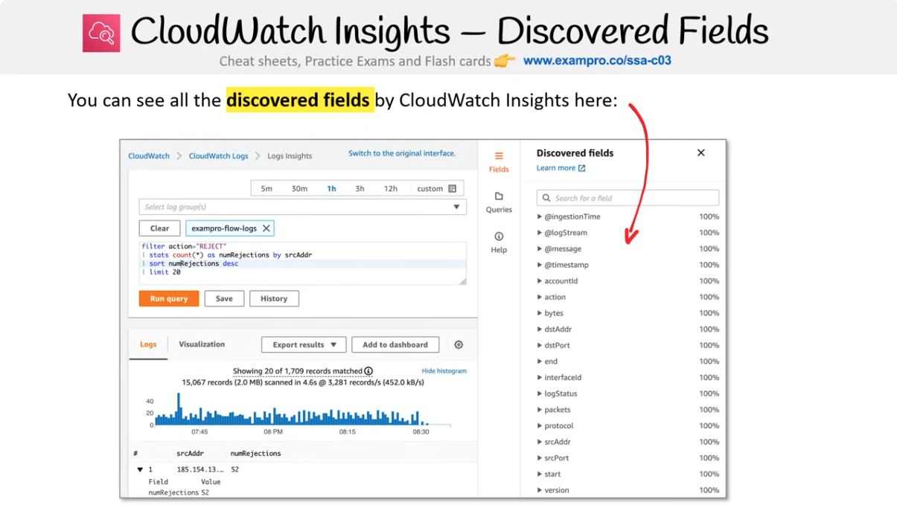

Thay vì gõ thì bạn có thể chọn field được liệt kê sẵn.

### Cloudwatch Metrics

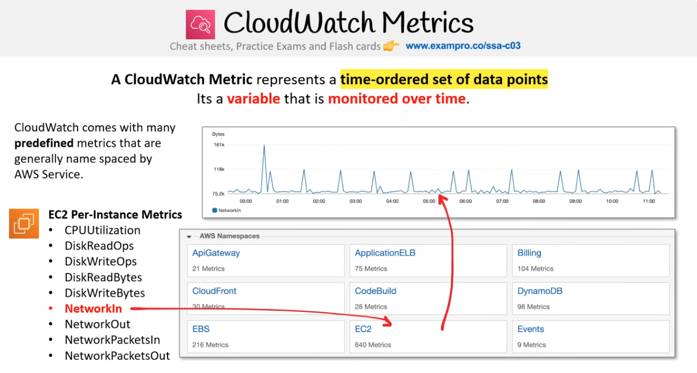

Một CloudWatch Metric đại diện cho một tập hợp các điểm dữ liệu được sắp xếp theo thời gian (time-ordered set of data points). Đó là một biến được theo dõi theo thời gian.

CloudWatch đi kèm với nhiều chỉ số được xác định trước mà thường được phân loại theo tên miền (Namespace) của Dịch vụ AWS.

### Cloudwatch - Custom Metrics and High Resolutions

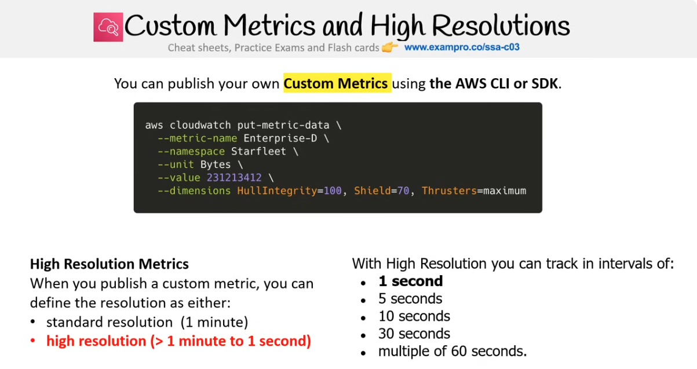

Bạn có thể tùy chỉnh metrics (publish Custom Metrics) của riêng mình bằng cách sử dụng AWS CLI hoặc SDK.

```
aws cloudwatch put-metric-data \
--metric-name Enterprise-D \
--namespace Starfleet \
--unit Bytes \
--value 231213412 \
--dimensions HullIntegrity=100,Shield=70,Thrusters=maximum
```

**Resolution**: Tần suất thu nhập hoặc gửi dữ liệu (thông qua API,...)

Khi bạn tùy chỉnh metrics, bạn có thể xác định Resolution là một trong hai:

- Standard resolution (1 phút)
- High resolution (> 1 phút đến 1 giây)

Với High Resolution, bạn có thể theo dõi trong các khoảng thời gian:

- 1 giây
- 5 giây
- 10 giây
- 30 giây
- bội số của 60 giây.

### Cloudwatch Availability of Data

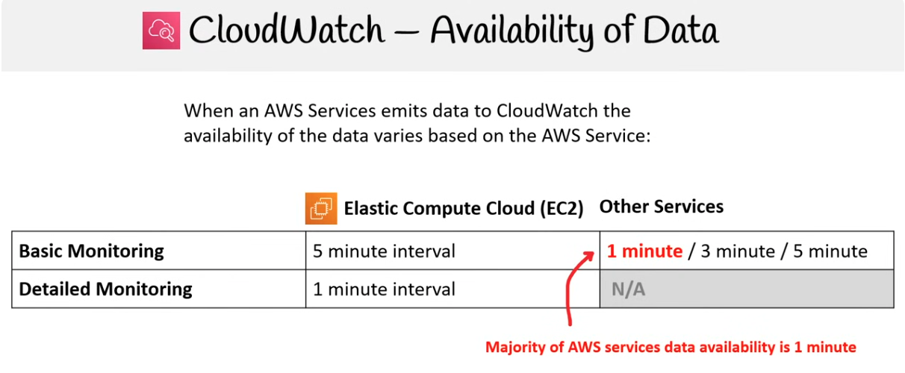

Khi một Dịch vụ AWS gửi dữ liệu đến CloudWatch, tần suất thu thập dữ liệu (Availability of data) sẽ khác nhau tùy thuộc vào Dịch vụ AWS đó:

|                       | Elastic Compute Cloud (EC2) | Các Dịch vụ Khác (Other Services) |
| :-------------------- | :-------------------------- | :-------------------------------- |
| **Giám sát Cơ bản**   | Khoảng thời gian 5 phút     | 1 phút / 3 phút / 5 phút          |
| **Giám sát Chi tiết** | Khoảng thời gian 1 phút     | Không áp dụng (N/A)               |

_Ghi chú: Phần lớn khả năng sẵn có của dữ liệu trong các dịch vụ AWS là 1 phút._

### Cloudwatch Log Collection - Agent and Host level metrics

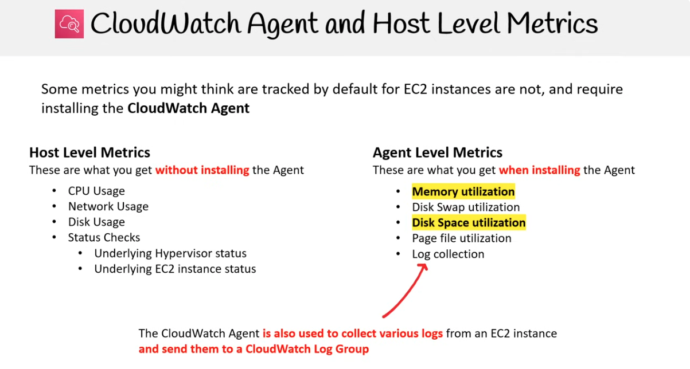

Một số chỉ số mà bạn có thể nghĩ rằng đã được theo dõi mặc định cho các phiên bản EC2 lại không phải như thế, nó đòi hỏi phải cài đặt CloudWatch Agent.

**Các Chỉ số Mức Máy chủ (Host Level Metrics)**

Đây là những chỉ số bạn nhận được mà không cần cài đặt Agent:

- CPU Usage (Mức sử dụng CPU)
- Network Usage (Mức sử dụng mạng)
- Disk Usage (Mức sử dụng Đĩa)
- Status Checks (Kiểm tra trạng thái)
  - Trạng thái của Hypervisor đang chạy bên dưới máy ảo.
  - Trạng thái phiên bản EC2 đang chạy bên dưới máy ảo.

**Các Chỉ số Mức Agent (Agent Level Metrics)**

Đây là những chỉ số bạn nhận được khi cài đặt Agent:

- Memory utilization (Mức sử dụng Bộ nhớ)
- Disk Swap utilization (Mức sử dụng Disk Swap - còn gọi là RAM ảo của Linux)
- Disk Space utilization (Mức sử dụng Dung lượng đĩa - còn gọi là RAM ảo của Windows)
- Page file utilization (xem chú thích bên dưới)
- Log collection (Thu thập log)

_**Page File (hoặc Swap trên Linux)** là vùng trên đĩa mà hệ điều hành dùng như bộ nhớ ảo (virtual memory) khi RAM vật lý đã đầy.  
**Page File Utilization (%)** là tỷ lệ phần trăm dung lượng của Page file hiện đang được sử dụng._

### Cloudwatch Agent

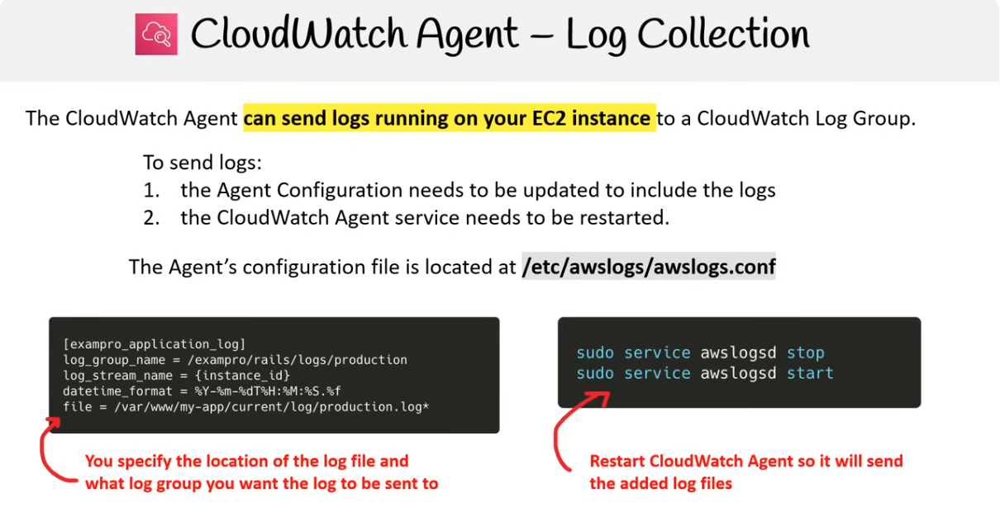

CloudWatch Agent có thể gửi các log đang chạy trên EC2 instance của bạn đến một CloudWatch Log Group.

Để gửi log thì cần:

- Cấu hình của Agent cần được cập nhật để bao gồm các log cần gửi.
- Dịch vụ CloudWatch Agent cần được khởi động lại.

Tệp cấu hình của Agent nằm tại: `/etc/awslogs/awslogs.conf`

Bạn chỉ định vị trí của tệp log và nhóm log (log group) mà bạn muốn gửi log đến. File cấu hình tương tự như sau:

```
[exampro_application_log]
log_group_name = /exampro/rails/logs/production
log_stream_name = {instance_id}
datetime_format = %Y-%m-%dT%H:%M:%S.%f
file = /var/www/my-app/current/log/production.log*
```

Lệnh khởi động lại CloudWatch Agent:

```
sudo service awslogsd stop
sudo service awslogsd start
```

### Installing the Cloudwatch Agent

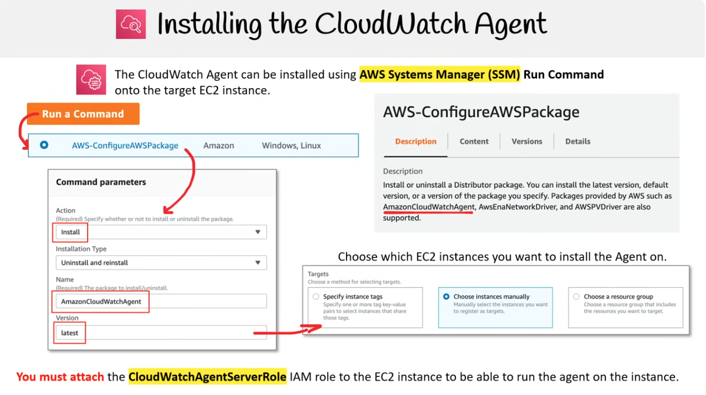

CloudWatch Agent có thể được cài đặt bằng AWS Systems Manager (SSM) thông qua Run Command trên EC2 instance mục tiêu.

**Lưu ý:** Bạn phải gán IAM role có tên `CloudWatchAgentServerRole` cho EC2 instance để có thể chạy được agent trên instance đó.

## Cloudwatch Alarms

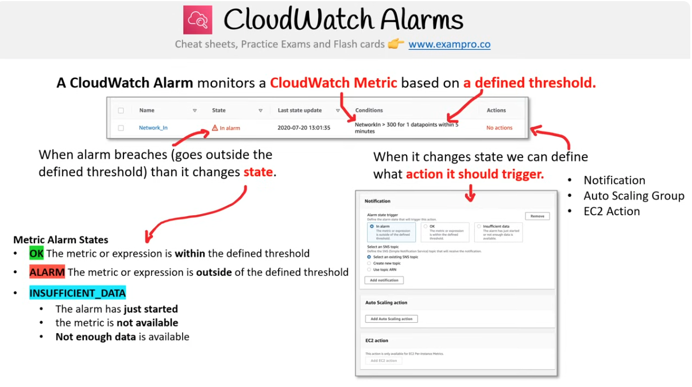

Một CloudWatch Alarm giám sát một CloudWatch Metric dựa trên một ngưỡng đã định nghĩa. Khi chỉ số vượt ngưỡng thì nó thay đổi trạng thái.

Khi nó thay đổi trạng thái, chúng ta có thể định nghĩa hành động nào nên được kích hoạt.

Trạng thái của Metric Alarm

- OK: Chỉ số hoặc biểu thức nằm trong ngưỡng đã định nghĩa.
- ALARM: Chỉ số hoặc biểu thức nằm ngoài ngưỡng đã định nghĩa.
- INSUFFICIENT_DATA:
  - Alarm vừa mới khởi động.
  - Chỉ số không khả dụng.
  - Không đủ dữ liệu khả dụng.

Các Hành động (Actions) có thể kích hoạt:

- Notification (Thông báo)
- Auto Scaling Group
- EC2 Action (Hành động EC2)

### Anatomy of Alarm

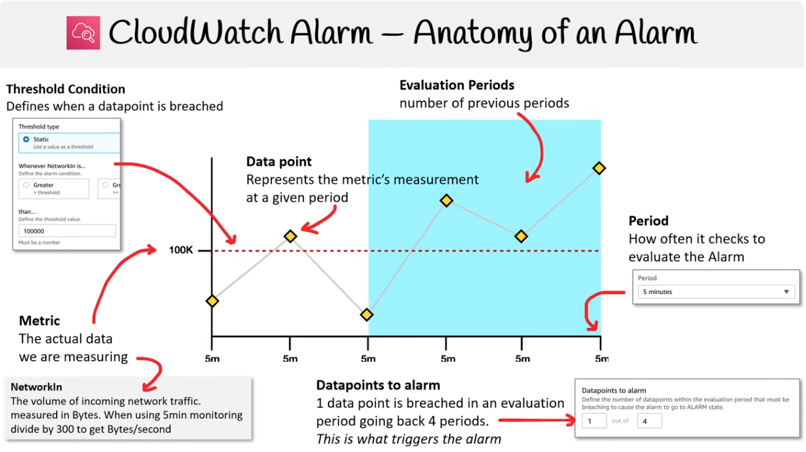

Metric: Dữ liệu thực tế chúng ta đang đo lường.

Threshold Condition (Điều kiện Ngưỡng): Xác định khi nào một điểm dữ liệu bị vi phạm.

Data point: Biểu thị giá trị đo lường của chỉ số tại một khoảng thời gian nhất định.

Period (Khoảng thời gian): Tần suất kiểm tra để đánh giá nhằm trigger Alarm.

Evaluation Periods (Khoảng thời gian đánh giá): Số lượng các khoảng thời gian trước đó.

Datapoints to alarm (Số điểm dữ liệu để kích hoạt báo thức):  
Vd: điểm dữ liệu bị vi phạm trong khoảng thời gian đánh giá kéo dài 4 khoảng thời gian trước đó. Đây là điều kích hoạt báo thức.

### Conditions

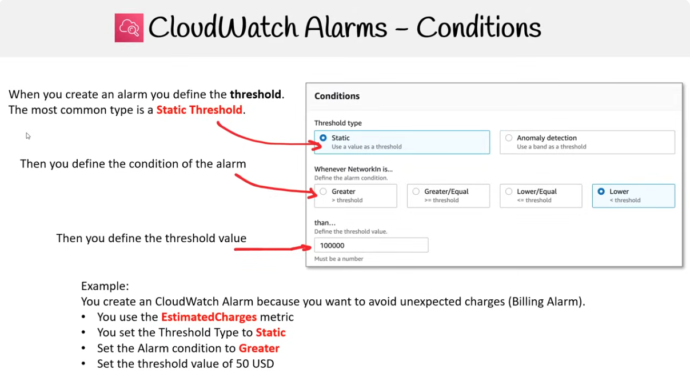

Khi tạo một Alarm, cần xác định ngưỡng (Threshold).

- Loại phổ biến nhất là Static Threshold.

Sau đó, Xác định điều kiện của Alarm.

Sau đó, Xác định giá trị của Threshold.

Vd: Tạo một CloudWatch Alarm vì bạn muốn tránh các khoản phí bất ngờ.

- Sử dụng chỉ số EstimatedCharges.
- Đặt Threshold Type thành Static.
- Đặt Alarm condition thành Greater.
- Đặt giá trị thành 50 USD.

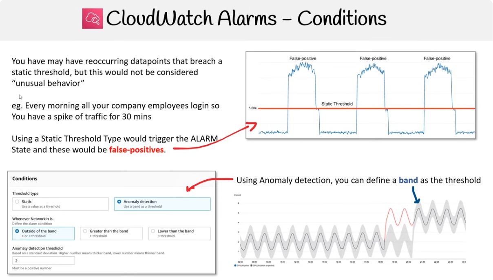

Có thể có các điểm dữ liệu lặp lại vượt quá ngưỡng cố định, nhưng điều này sẽ không được coi là "hành vi bất thường"

- Ví dụ: Mỗi sáng, tất cả nhân viên trong công ty của bạn đăng nhập nên bạn có một đợt tăng lưu lượng trong 30 phút.

Sử dụng loại Static Threshold sẽ kích hoạt Alarm và những trường hợp này sẽ là false-positive.

Sử dụng Anomaly detection để có thể định nghĩa một dải (band) làm ngưỡng.

### Composite Alarms

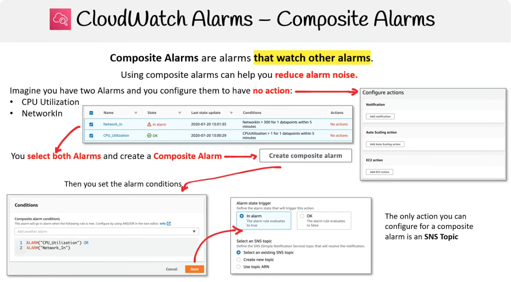

Composite Alarms là các alarm giám sát những alarm khác. Việc sử dụng composite alarms có thể giúp bạn giảm nhiễu cảnh báo.

Hãy tưởng tượng bạn có hai Alarm và bạn cấu hình chúng không có hành động:

- CPU Utilization
- NetworkIn

Bạn chọn cả hai Alarms và tạo một Composite Alarm. Sau đó bạn thiết lập các điều kiện Alarm:

```
ALARM("CPU_Utilization") OR
ALARM("Network_In")
```

Chọn Alarm state trigger là `In Alarm` và `Select an existing SNS Topic`

Giải thích:

Nếu từng Alarm tự nó chuyển sang trạng thái `In Alarm`, chúng sẽ không gửi thông báo, không chạy Auto Scaling, không làm gì cả, mục đích là không muốn bị spam quá nhiều cảnh báo.

Sau khi tạo một Composite Alarm, chỉ cần một trong hai alarm con chuyển sang `In Alarm`, CA sẽ kích hoạt và là Alarm duy nhất gửi thông báo theo mẫu SNS đã tạo từ trước.
