## Eventbridge

Origin: https://www.youtube.com/watch?v=c3Cn4xYfxJY (1:05:68:23)

### Eventbridge - The anatomy of Event

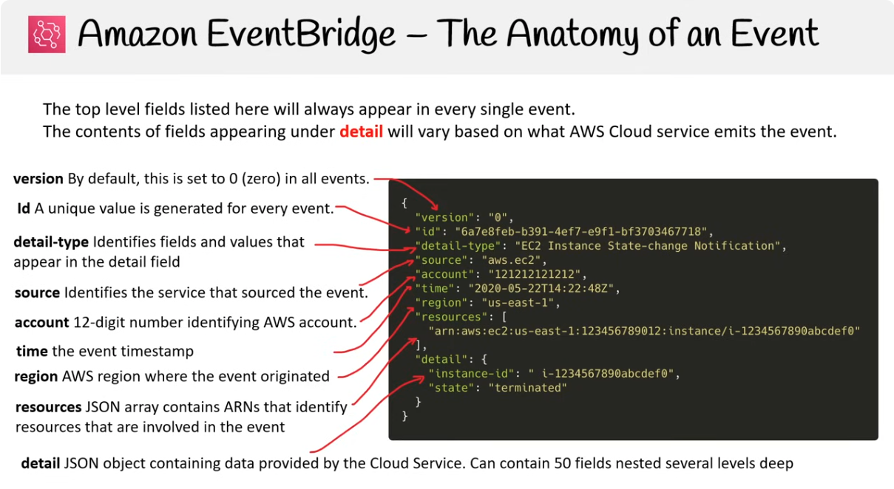

Các trường cấp cao (top-level field) liệt kê dưới đây sẽ luôn xuất hiện trong mọi event.  
Nội dung của các trường nằm trong detail sẽ thay đổi tùy thuộc vào dịch vụ AWS Cloud nào phát ra event.

- **version**: Mặc định đặt thành 0 trong tất cả event.
- **Id**: Một giá trị duy nhất được tạo cho mỗi event.
- **detail-type**: Xác định các trường và giá trị xuất hiện trong trường detail.
- **source**: Xác định dịch vụ đã phát ra event.
- **account**: Số 12 chữ số nhận dạng tài khoản AWS.
- **time**: timestamp của event.
- **region**: Khu vực AWS nơi event được tạo ra.
- **resources**: Mảng JSON chứa các ARN (Amazon Resource Name) xác định các tài nguyên liên quan đến event.
- **detail**: Đối tượng JSON chứa dữ liệu do dịch vụ Cloud cung cấp. Có thể chứa tới 50 trường lồng nhau nhiều cấp.

### Scheduled Expressions

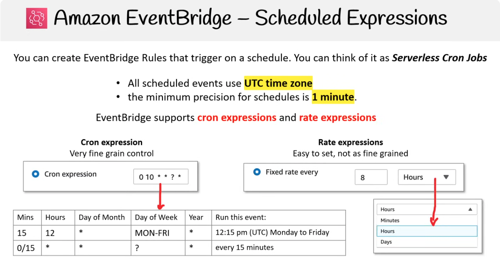

Có thể tạo các EventBridge Rules kích hoạt theo lịch và có thể xem nó như Serverless Cron Jobs.  
Tất cả các sự kiện theo lịch đều sử dụng múi giờ UTC. Thời gian đặt lịch tối thiểu là là 1 phút.

EventBridge hỗ trợ cron expressions và rate expressions.

- Cron expression: là một chuỗi 6 phần xác định thời điểm chạy event (`Minutes Hours Day-of-month Month Day-of-week Year`)

  - Vd: `15 12 * * MON-FRI *` → chạy lúc 12:15 UTC, từ thứ Hai đến thứ Sáu.

- Rate expressions: dùng để đặt lịch theo chu kỳ lặp lại cố định.
  - Vd: `rate(5 minutes)` → chạy sau mỗi 5 phút

### Cloudtrail Events

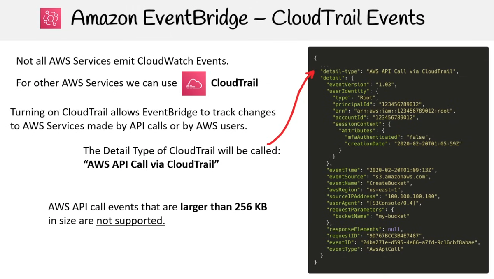

Không phải tất cả các dịch vụ AWS đều kích hoạt CloudWatch Events. Với các dịch vụ khác của AWS, chúng ta có thể dùng CloudTrail.

Bật CloudTrail cho phép EventBridge theo dõi thay đổi đối với các dịch vụ AWS được thực hiện bởi các lời gọi API hoặc AWS user.

Detail Type của CloudTrail sẽ là: `“AWS API Call via CloudTrail”`

Các sự kiện gọi API của AWS có kích thước lớn hơn 256 KB sẽ không được hỗ trợ.

#### Event Patterns

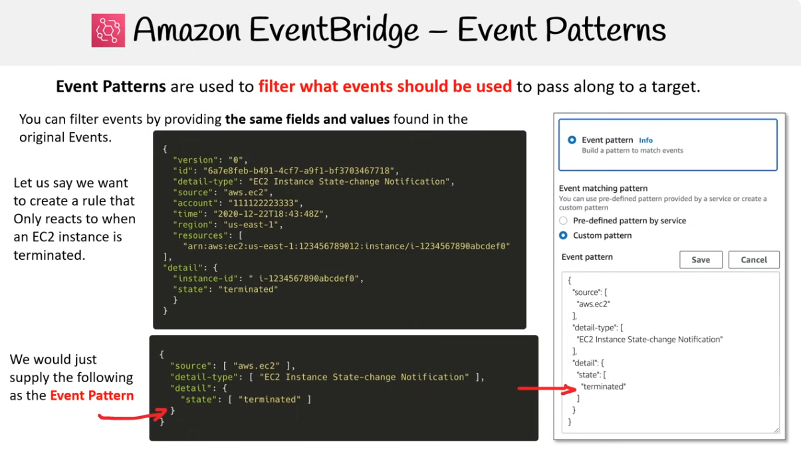

Event Patterns được dùng để lọc những sự kiện nào sẽ được dùng để chuyển tới target.

Có thể lọc sự kiện bằng cách cung cấp các trường và giá trị giống như trong các sự kiện gốc, **phải giống hoàn toàn mới kích hoạt**.

Giả sử chúng ta muốn tạo một rule chỉ phản ứng khi một EC2 instance bị terminated, chỉ cần cung cấp nội dung sau làm Event Pattern:

```json
{
  "source": ["aws.ec2"],
  "detail-type": ["EC2 Instance State-change Notification"],
  "detail": {
    "state": ["terminated"]
  }
}
```

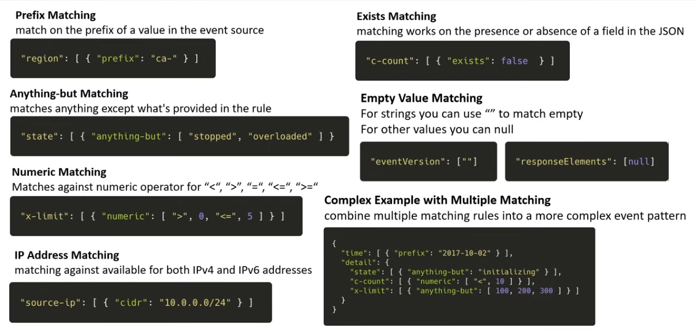

EventBridge hỗ trợ các loại matching như sau:

**Prefix Matching**: khớp theo tiền tố của một giá trị trong event source

```json
"region": [ { "prefix": "ca-" } ]
```

**Anything-but Matching**: khớp mọi thứ ngoại trừ những gì được cung cấp trong rule

```json
"state": [ { "anything-but": [ "stopped", "overloaded" ] } ]
```

**Numeric Matching**: khớp theo toán tử số học "<", ">", "=", "<=", ">="

```json
"x-limit": [ { "numeric": [ ">", 0, "<=", 5 ] } ]
```

**IP Address Matching**: khớp theo địa chỉ IP, hỗ trợ cả IPv4 và IPv6

```json
"source-ip": [ { "cidr": "10.0.0.0/24" } ]
```

**Exists Matching**: khớp dựa trên sự tồn tại hoặc không tồn tại của một trường trong JSON

```json
"c-count": [ { "exists": false } ]
```

**Empty Value Matching**: Với chuỗi có thể dùng "" để khớp empty, với các giá trị khác có thể dùng null

```json
"eventVersion": [ "" ]
"responseElements": [ null ]
```

**Complex Example with Multiple Matching**: kết hợp nhiều rule matching thành một event pattern phức tạp hơn

```json
{
  "time": [{ "prefix": "2017-10-02" }],
  "detail": {
    "state": [{ "anything-but": ["initializing"] }],
    "c-count": [{ "numeric": ["<", 10] }],
    "x-limit": [{ "anything-but": [100, 200, 300] }]
  }
}
```

### Rules

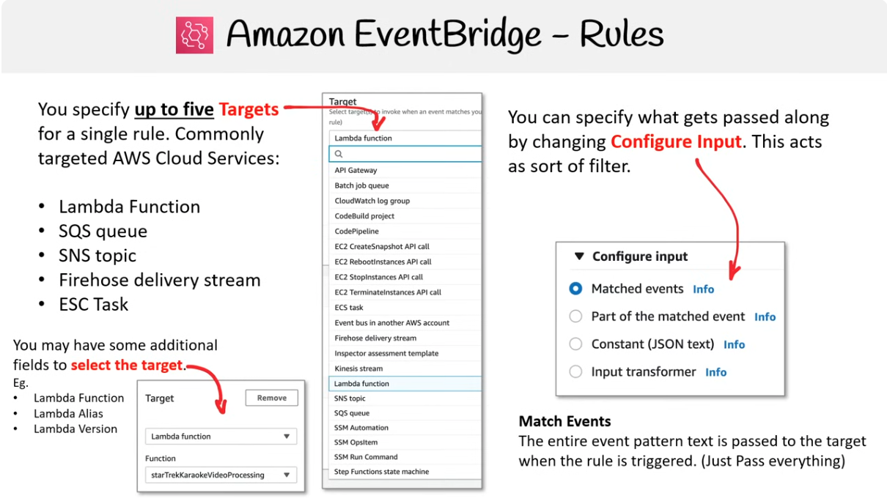

Bạn có thể chỉ định tối đa Targets cho một rule. Các AWS service thường được chọn làm đích bao gồm:

- Lambda Function
- SQS queue
- SNS topic
- Firehose delivery stream
- ECS Task

Bạn có thể thêm một số trường để chọn target cụ thể.
Bạn có thể kiểm soát những thông tin nào được truyền đi bằng cách thay đổi mục Configure Input. Mục này có vai trò như một bộ lọc, bao gồm 4 loại sẽ giải thích ở phần tiếp theo.

### Configure Input

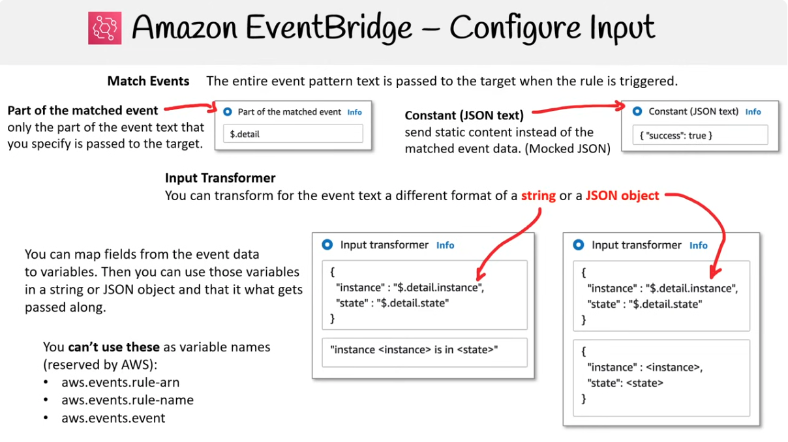

- **Matched events**: Toàn bộ văn bản event khớp với rule sẽ được gửi nguyên vẹn đến target
- **Part of the matched event**: Thay vì gửi toàn bộ event, bạn chỉ định các trường cụ thể bằng cách sử dụng JSONPath
  - Vd: Sử dụng `$.detail` có nghĩa là chỉ gửi nội dung nằm trong key `"detail"` của event gốc
- **Constant (JSON text)**: Bỏ qua dữ liệu event và thay vào đó gửi một JSON object cố định mà bạn tự định nghĩa
- **Input transformer**: Định hình lại dữ liệu trước khi gửi đi, bao gồm 2 bước chính:
  - Map Variables: Chọn các fields từ event data và gán chúng cho các variables tùy chỉnh.
    - Vd: `{ "instance": "$.detail.instance", "state": "$.detail.state" }`
  - Define Output: Sử dụng các variables đã định nghĩa ở bước 1 để tạo ra một string hoặc một JSON object đầu ra theo format mong muốn của target.
    - Vd: `"instance <instance> is in <state>"`

### Partner event sources

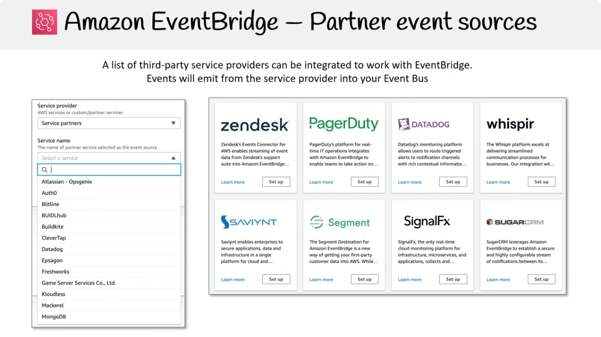

Có rất nhiều third-party service providers được tích hợp hoạt động với EventBridge, events sẽ emit từ service provider vào Event Bus của bạn.

### Schema Registry

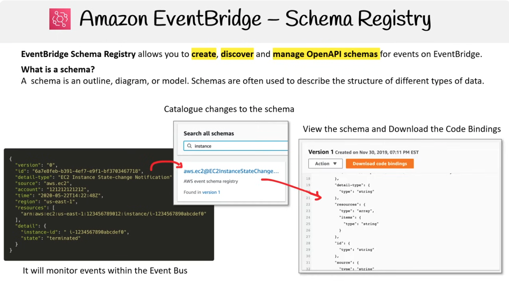

Schema Registry cho phép bạn tạo, xem và quản lý OpenAPI schemas cho events trên EventBridge.

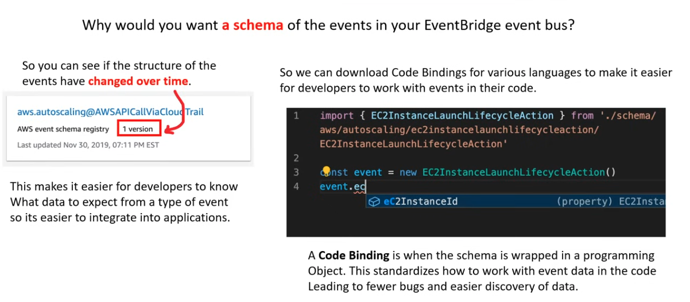

Sử dụng event schema trong Event Bus giúp bạn thấy cấu trúc của các event thay đổi theo thời gian, từ đó giúp Dev dễ dàng nắm bắt và tích hợp vào các ứng dụng.

Có thể download Code Bindings cho các ngôn ngữ khác nhau, giúp làm việc với events trong code dễ dàng hơn.

Code Binding là khi schema được gói trong một Object. Điều này chuẩn hóa cách làm việc với event data trong code dẫn đến ít bugs hơn và theo dõi dữ liệu dễ dàng hơn.

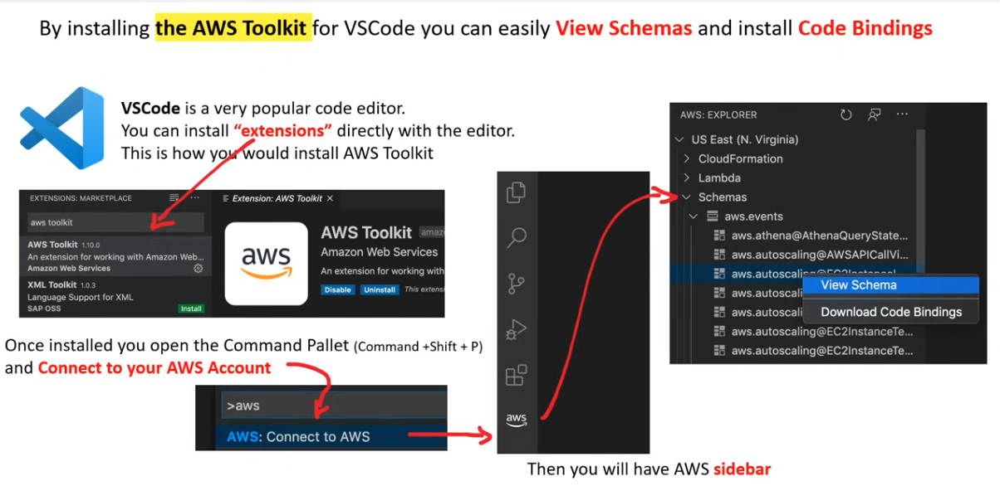

### Event Bus

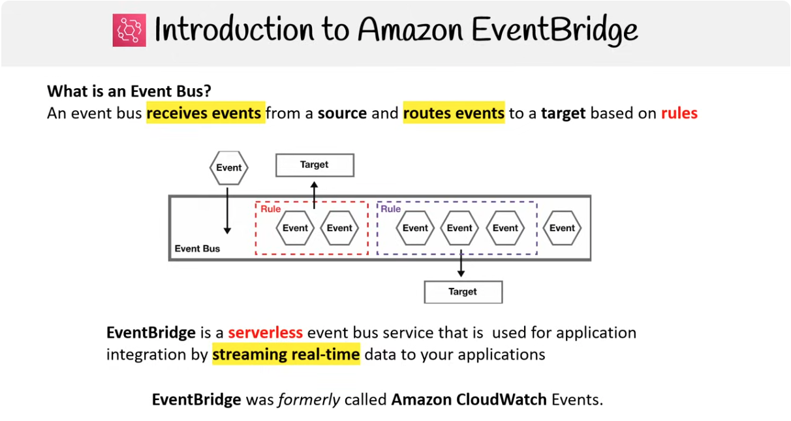

Event bus nhận các sự kiện từ một nguồn và định tuyến các sự kiện đó đến một target dựa trên các rules.

EventBridge là một dịch vụ Event bus serverless được sử dụng để tích hợp ứng dụng bằng cách truyền dữ liệu theo thời gian thực đến các ứng dụng của bạn.

EventBridge trước đây được gọi là Amazon CloudWatch Events.

### Event Bus Component

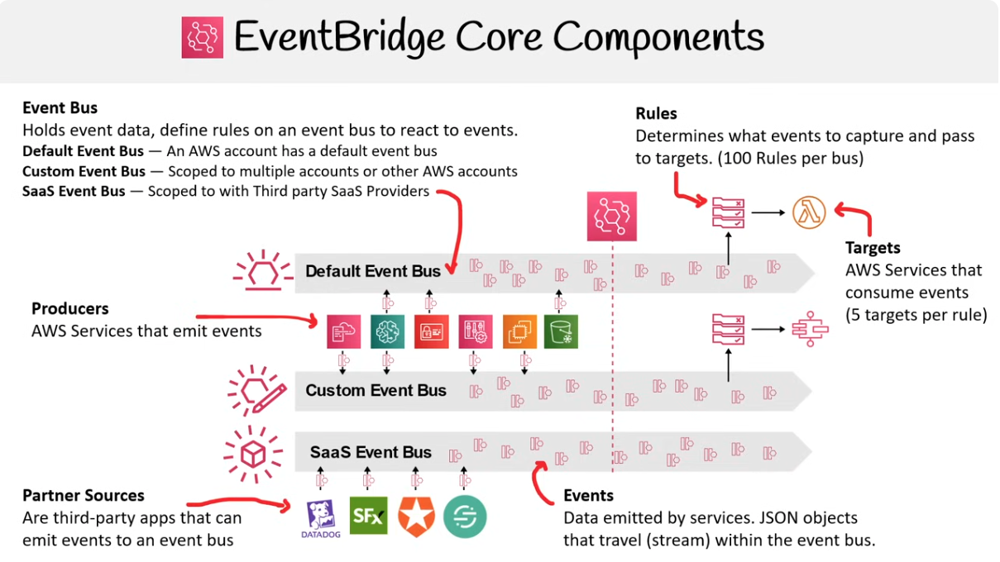

**Event Bus**

- Default Event Bus: Một AWS account có một default Event bus.
- Custom Event Bus: Được giới hạn cho nhiều accounts hoặc các AWS accounts khác.
- SaaS Event Bus: Được tạo để nhận events từ các third-party service providers được tích hợp, như Zendesk hoặc Datadog.

**Producers**

AWS Services phát ra các sự kiện.

**Partner Sources**

Là các ứng dụng bên thứ ba có thể phát ra các sự kiện đến một Event bus.

**Events**

Dữ liệu được phát ra bởi các services. Các Object JSON di chuyển (dưới dạng stream) bên trong Event bus.

**Rules**

Xác định sự kiện nào được thu thập và chuyển đến các targets. (Giới hạn 100 Rules trên mỗi bus).

**Targets**

Các AWS Services tiêu thụ các sự kiện. (Giới hạn 5 targets trên mỗi rule).
