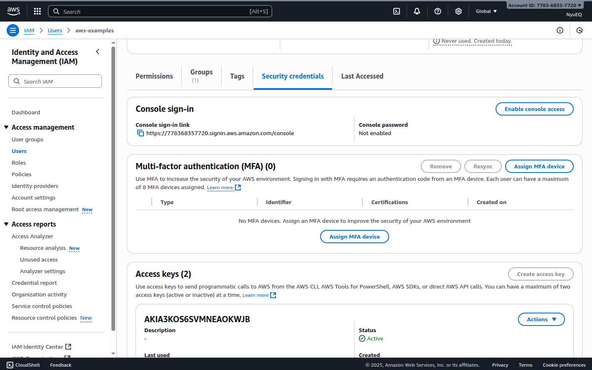
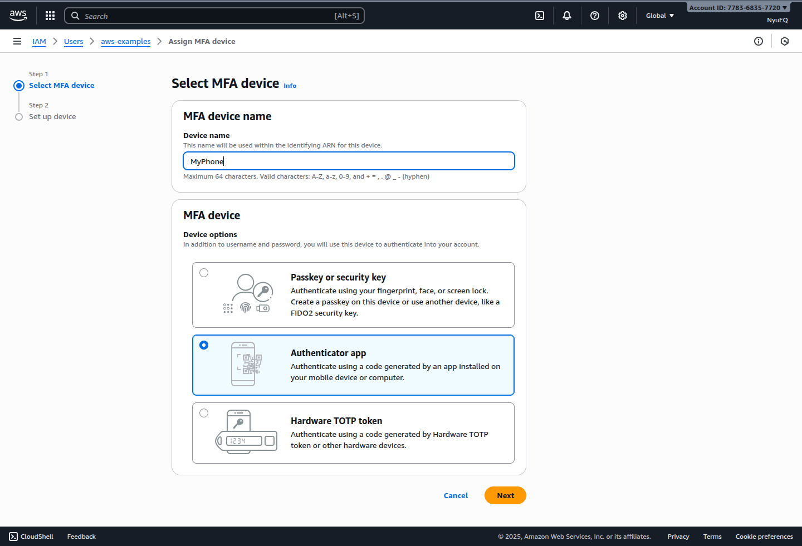
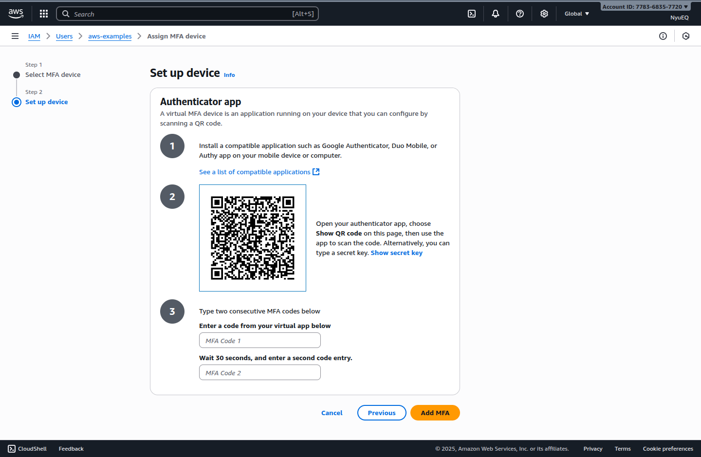

## Thực hành xác thực MFA

Truy cập vào: IAM > Users > aws-examples > Security credentials > MFA > Asign MFA device

Chọn device mà bạn muốn nhận mã xác thực, thông thường sẽ là dùng app điện thoại

Đối với điện thoại, cần cài đặt ứng dụng xác thực (Google Authenticator) để nhận mã

Mở ứng dụng Google Authenticator, chọn chế độ Quét QR để quét QR

Mã sẽ được làm mới sau một khoảng thời gian cố định, mã sau khi biến mất sẽ không còn hiệu lực xác thực

Ở bước này cần nhập 2 mã, nhập mã đầu tiên (MFA Code 1) sau đó chờ mã mới xuất hiện thì nhập mã thứ 2 (MFA Code 2)

Sau khi đăng ký MFA thành công thì từ lần đăng nhập sau sẽ cần thêm bước nhập mã xác thực từ Google Authenticator để login.
