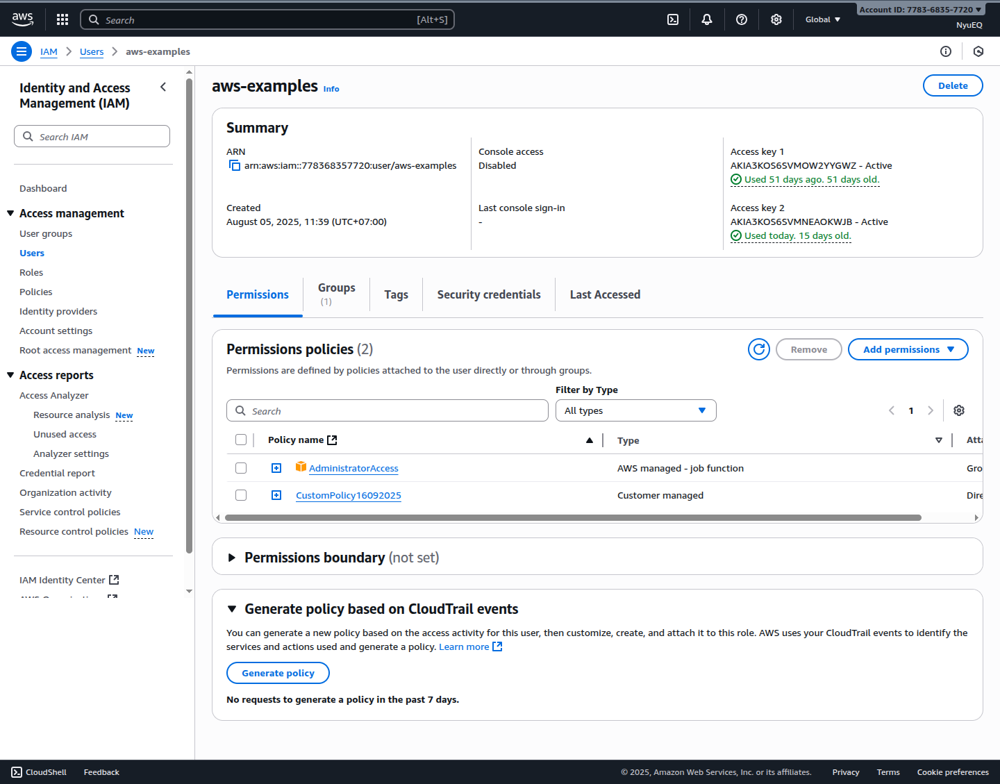
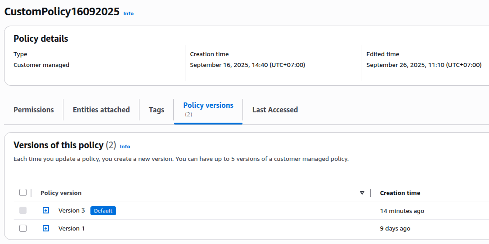

## Thực hành gắn / sửa / xóa policy trên một Policy bằng API

Cần thực hành bài `Types-of-IAM-policies.md` trước

Hoặc nếu không muốn dùng API thì tạo bằng GUI:  
https://us-east-1.console.aws.amazon.com/iam/home?region=us-east-1#/policies/create

### List existed policies

```sh
aws iam list-policies --scope Local
```

### Create policy from YML file

Policy ARN cần gắn quyền là: `arn:aws:iam::778368357720:policy/CustomPolicy16092025`

Ngoài file JSON cũng có thể dùng library `yq` để convert giữa các định dạng file

```sh
aws iam create-policy-version \
--policy-arn arn:aws:iam::778368357720:policy/CustomPolicy16092025 \
--policy-document "$(yq -o json policy.yml)" \
--set-as-default
```

Mỗi lần chạy script trên sẽ tạo một một version, result như sau:

```sh
{
    {
    "PolicyVersion": {
        "VersionId": "v1",
        "IsDefaultVersion": true,
        "CreateDate": "2025-09-26T04:10:09+00:00"
    }
}
```

### Attach Policy to user

```sh
aws iam attach-user-policy \
--policy-arn arn:aws:iam::778368357720:policy/CustomPolicy16092025 \
--user-name aws-examples
```

Kiểm tra lại trên console, user cần phải được gắn CustomPolicy16092025

> Cần F5 để load data mới nhất



### Deleteing Policies

```sh
aws iam delete-policy-version --policy-arn arn:aws:iam::778368357720:policy/CustomPolicy16092025 --version-id v1
aws iam delete-policy-version --policy-arn arn:aws:iam::778368357720:policy/CustomPolicy16092025 --version-id v2
aws iam delete-policy-version --policy-arn arn:aws:iam::778368357720:policy/CustomPolicy16092025 --version-id v3
```



Lưu ý: không thể xóa default version của Policy
