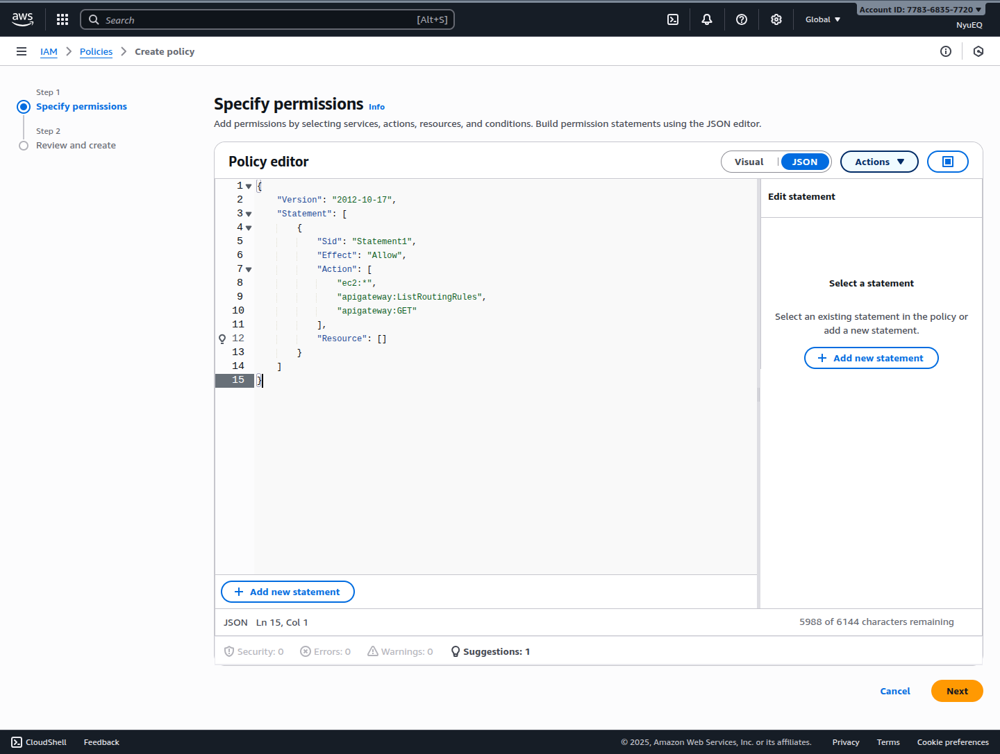

## Thực hành tạo custom policy thông qua GUI

### Xem policy của User

Vào service IAM -> Access management - Users -> chọn Username

```
https://us-east-1.console.aws.amazon.com/iam/home?region=us-east-1#/users/details/<username>?section=permissions
```

### Specify permissions

Vào service IAM -> Access management - Policy -> Create policy


Có thể chỉ định từng loại Resource, service tương ứng với role mà bạn muốn cấp quyền, sau đó đặt tên và tạo.



Tại màn hình Dashboard, có thể filter policy vừa tạo theo mục **Customer managed**.


## Thực hành tạo CloudFormation template thông qua file .yml

**CloudFormation AWS** là một dịch vụ giúp triển khai và quản lý hạ tầng dưới dạng mã (Infrastructure as Code – IaC).

Thay vì phải tự tay tạo từng dịch vụ (EC2, S3, RDS, VPC, IAM,...) trên AWS Console, chỉ cần viết một file cấu hình (JSON hoặc YAML) mô tả toàn bộ hạ tầng mong muốn và triển khai nó, CloudFormation sẽ tự động thao tác giúp.

**CloudFormation Stack** là tập hợp các resource được CloudFormation tạo ra từ một template và quản lý như một đơn vị duy nhất giúp quản lý hạ tầng gọn gàng, dễ triển khai tương tự cho nhiều môi trường (dev, staging, production) và có hỗ trợ rollback.

Xem chi tiết file: `./cloudformation-template.yml`

Truy cập vào `CloudFormation -> Stacks -> Create stack (With new resources (standards)) -> Upload a template file`


Sau khi nhấn Next, tại bước 3 - Configuration stack options, tại mục `Capabilities - The following resource(s) require capabilities: [AWS::IAM::User]` nhấn chọn checkbox -> Next -> Submit


