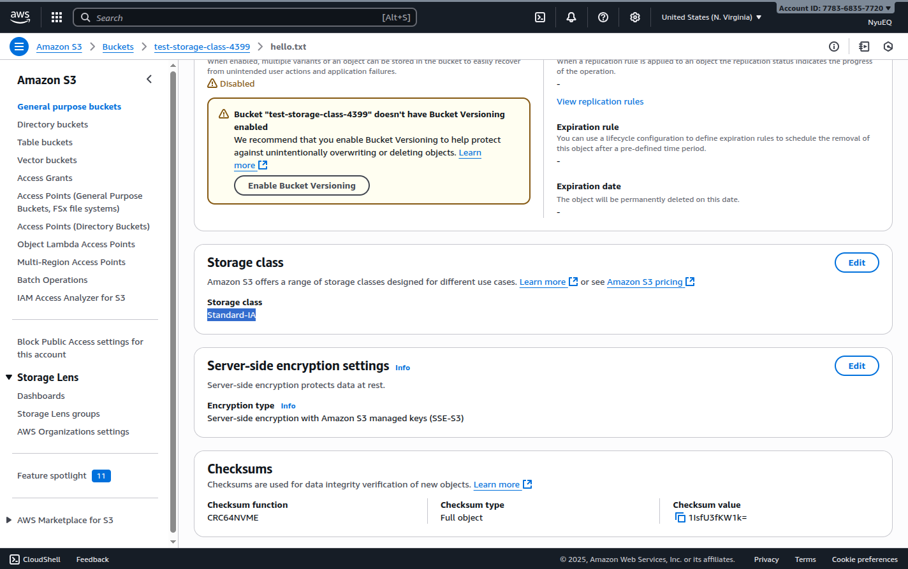

## Thực hành đổi Storage Class sử dụng CLI

### Create a bucket

```sh
aws s3 mb s3://test-storage-class-4399
```

### Create sample file and upload to S3

```sh
echo "Hello World" > hello.txt
aws s3 cp hello.txt s3://test-storage-class-4399 --storage-class STANDARD_IA
```

--storage-class (string) The type of storage to use for the object. Valid choices are: _STANDARD | REDUCED_REDUNDANCY | STANDARD_IA | ONEZONE_IA | INTELLIGENT_TIERING | GLACIER | DEEP_ARCHIVE | GLACIER_IR_

Defaults to ‘STANDARD’



### Cleanup

```sh
aws s3 rm s3://test-storage-class-4399/hello.txt
aws s3 rb s3://test-storage-class-4399
```
