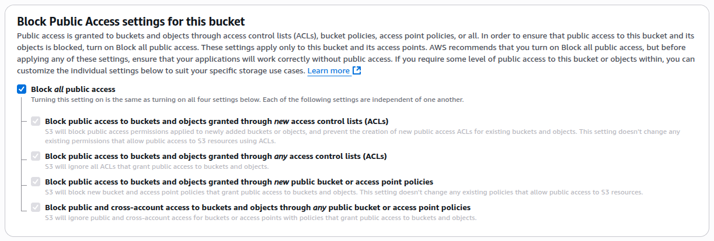
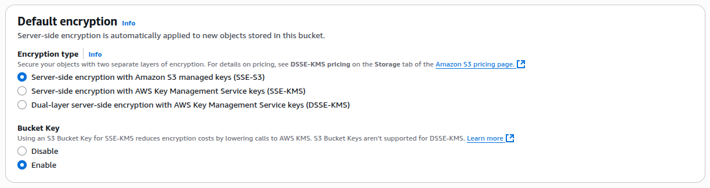
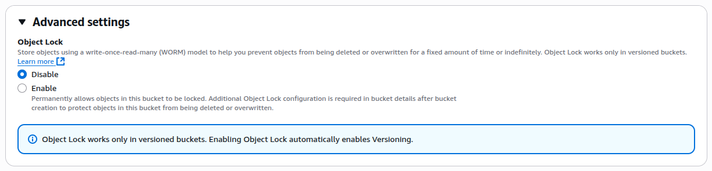
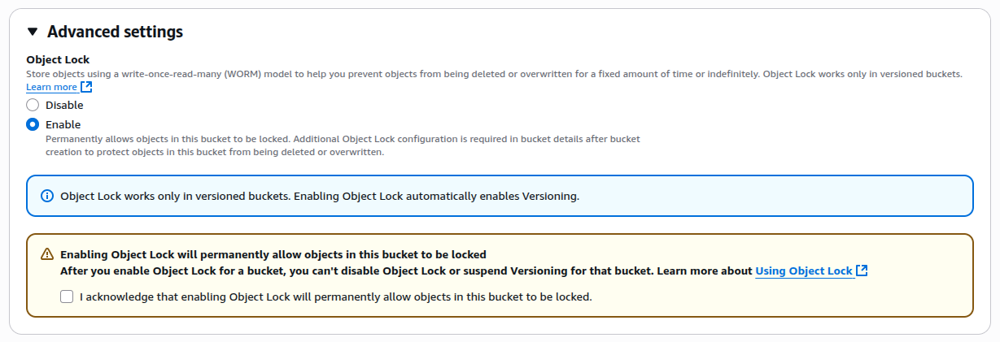
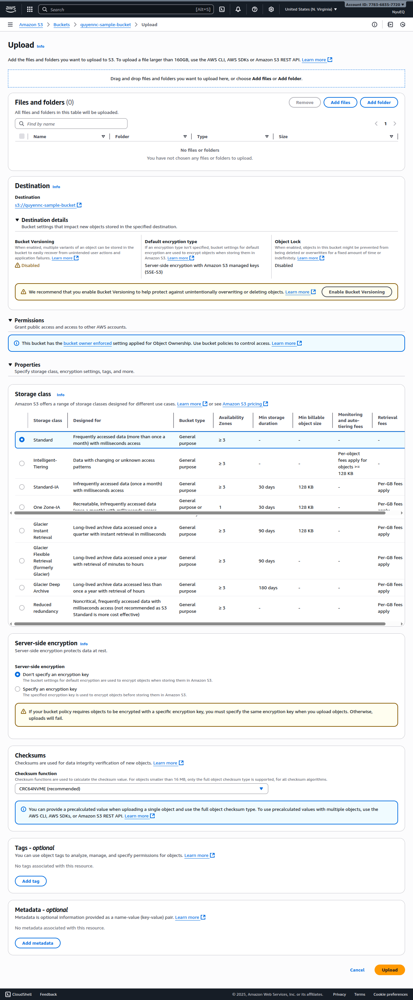

## Thực hành tạo Bucket bằng GUI

<!--  -->

Lưu ý: Giao diện của AWS update thường xuyên nên khi bạn thực hành có thể khác đôi chút, nhưng tổng thể các settings vẫn như cũ.

### 1. General configuration

**AWS Region**  
US East (N. Virginia) us-east-1  
(mặc định sẽ là khu vực đã chọn lúc bạn tạo account)

**Bucket type**

- General purpose: toàn diện, an toàn, phù hợp cho hầu hết nhu cầu. Lưu trữ trên nhiều Availability Zone (AZ).
- Directory: được tối ưu cho hiệu năng và độ trễ thấp, chỉ sử dụng S3 Express One Zone, phù hợp với latency-sensitive application. Chỉ sử dụng 1 Availability Zone.

**Bucket name**
Lưu ý là tên bucket là global name nên cần chú ý [các quy tắc đặc tên Bucket](./2.%20S3-Bucket.md#cách-đặt-tên-bucket).

**Copy settings from existing bucket**  
Chọn 1 bucket đã có sẵn để copy toàn bộ configuration

### 2. Object Ownership

Xác định ai có thể chỉ định quyền truy cập và ghi vào Bucket từ những account AWS khác và đồng thời kiểm soát việc có cho phép sử dụng ACLs (Access Control Lists) để quản lý quyền truy cập.

- **ACLs disabled (recommended)**: vì ACLs là cơ chế khá cũ, khuyến khích dùng IAM policies hoặc S3 bucket policies.
- **ACLs enabled**

**Object Ownership** (Bucket owner enforced)

- Tất cả các objects tải lên bucket đó đều được tự động thuộc quyền sở hữu của bucket owner.
- ACLs sẽ bị vô hiệu hóa hoàn toàn. Việc cấp quyền truy cập sẽ chỉ được quản lý qua Bucket policy hoặc IAM policy.

### 3. Block Public Access settings for this bucket

Tùy chọn `Block all public access` sẽ bao gồm:

- Chặn quyền public được cấp qua ACL (bucket hoặc object mới). NEW
- Chặn toàn bộ quyền public qua ACL (cả mới lẫn cũ). NEW & OLD
- Chặn quyền public từ bucket policy hoặc access point policy mới. NEW
- Chặn toàn bộ quyền public và cross-account qua policy (cũ hoặc mới). NEW & OLD

`Cross-account` là một tài khoản AWS được cấp quyền nhằm truy cập tài nguyên nằm trong tài khoản AWS khác.

### 4. Bucket Versioning

Bật lên là tính phí nhé.

### 5. Tags - optional

Gắn tag để kiểm tra chi phí lưu trữ và tổ chức bucket,... Tối đa 50 tags.

### 6. Default encryption

Tất cả object mới upload vào bucket sẽ tự động được mã hóa (server-side encryption). Có 3 loại sau:

- **SSE-S3 (Server-Side Encryption with Amazon S3 managed keys)**: AWS tự quản lý, free.
- **SSE-KMS (Server-Side Encryption with AWS KMS keys)**: Bạn tự quản lý thông qua KMS, tốn chi phí cho mỗi lần gọi KMS API.
- **DSSE-KMS (Dual-layer Server-Side Encryption with KMS keys)**: Mã hóa hai lớp (double encryption), mỗi lớp với một key khác nhau trong KMS, chi phí cao, dánh cho dữ liệu siêu nhạy cảm.

Bucket Key (chỉ dùng cho SSE-KMS) (Enabled) giúp giảm chi phí KMS bằng cách hạn chế số lần gọi đến AWS KMS API. Không hỗ trợ DSSE-KMS.

### 7. Advanced setting - Object Lock

Cho phép lưu object theo mô hình WORM (Write Once, Read Many), object một khi đã ghi thì không thể bị xóa hoặc ghi đè trong một khoảng thời gian nhất định, hoặc vĩnh viễn.

Bật Object Lock => Tự động bật Versioning.

## Thực hành CRUD Object

Để tải lên một tệp có kích thước lớn hơn 160GB, phải sử dụng AWS CLI, AWS SDKs hoặc Amazon S3 REST API.

### 1. Properties - Storage class

Storage class thể hiện sự phân loại của từng object trong S3. Các storage class hiện có bao gồm:

- Standard
- Intelligent-Tiering
- Standard-Infrequent Access (Standard-IA)
- One Zone-Infrequent Access (One Zone-IA)
- Glacier
- Glacier Deep Archive
- Outposts

Mỗi storage class lại có các thuộc tính khác nhau quy định các mặt như:

- Chi phí storage
- Độ khả dụng của object (Khả năng truy cập vào dữ liệu bất cứ khi nào cần)
- Độ bền của object (Khả năng giữ dữ liệu không bị mất mát hoặc hỏng theo thời gian)
- Mức độ truy cập thường xuyên tới object

Tất cả các storage class đều được lưu trữ trên >= 3 Availability Zones, ngoại trừ One Zone-IA

**S3 Standard**

- Là class thông dụng nhất, được lựa chọn mặc định (khi upload Object chẳng hạn)
- Có chi phí đắt nhất
- Được thiết kế cho tất cả các mục đích lưu trữ
- Dành cho dữ liệu (Object) truy cập thường xuyên (truy cập nhiều hơn 1 lần/tháng) với độ trễ thấp (mili-giây).
- 99.999999999% độ bền object (11 số 9) (trong một năm, thời gian downtime tối đa khoảng 52 phút)
- 99.99% độ khả dụng object (gần như không bao giờ mất file)

**S3 Intelligent-Tiering**

- Được thiết kế cho các object chưa xác định mức độ truy cập hoặc có mức độ truy cập không cố định
- Tự động chuyển object giữa nhiều lớp (frequent, infrequent, archive) dựa vào tần suất truy cập.
- Rẻ hơn storage class standard
- Thời gian lưu trữ tối thiểu: 30 ngày, kích thước object tối thiểu 128kb (file dưới 128kb vẫn bị tính phí giống 128kb, file lớn hơn thì tính theo dung lượng).
- 99.999999999% độ bền object.
- 99.9% độ khả dụng object.

**S3 Standard-IA (Infrequent Access)**

- Được thiết kế cho các object không được truy cập thường xuyên (truy cập 1 lần mỗi tháng) nhưng cần phải khả dụng ngay lập tức khi được truy cập.
- Rẻ hơn storage class standard
- Thời gian lưu trữ tối thiểu: 30 ngày, kích thước object tối thiểu 128kb.
- Có phí lấy dữ liệu (retrieval fees per GB).
- 99.999999999% độ bền object
- 99.9% độ khả dụng object

**S3 One Zone-IA**

- Được thiết kế cho các object không quan trọng (truy cập 1 lần mỗi tháng), có thể tái tạo nếu bị mất.
- Lưu trữ chỉ trong 1 AZ (nguy cơ mất dữ liệu cao hơn).
- Rẻ hơn storage class Standard-IA
- Thời gian lưu trữ tối thiểu: 30 ngày, kích thước object tối thiểu 128kb.
- Có phí lấy dữ liệu.
- 99.999999999% độ bền object
- 99.95% độ khả dụng object

**S3 Glacier Instant Retrieval**

- Được thiết kế cho việc lưu trữ dài hạn (truy cập một lần mỗi 3 tháng), nhưng cần truy cập ngay lập tức (mili-giây)
- Thời gian lưu trữ tối thiểu: 90 ngày, kích thước object tối thiểu 128kb.
- Có phí lấy dữ liệu.

**S3 Glacier Flexible Retrieval (trước đây là Glacier)**

- Được thiết kế cho việc lưu trữ dài hạn (truy cập một lần mỗi năm), truy cập mất từ vài phút đến vài giờ.
- Thời gian lưu trữ tối thiểu: 90 ngày.
- Có phí lấy dữ liệu.

**S3 Glacier Deep Archive**

- Được thiết kế cho việc lưu trữ cực kỳ lâu dài, truy cập rất hiếm (dưới 1 lần mỗi năm), và truy cập mất đến vài giờ
- Thời gian lưu trữ tối thiểu: 180 ngày.
- Rẻ nhất trong tất cả storage class.
- Có phí lấy dữ liệu.

**S3 Reduced Redundancy Storage (RRS)**

- Được thiết kế cho việc lưu trữ dữ liệu không quan trọng, có thể mất mà không sao, nhưng cần truy cập ngay lập tức (mili-giây)
- Độ bền thấp
- Không khuyến nghị vì S3 Standard hiện rẻ hơn & an toàn hơn.
- Có phí lấy dữ liệu.

### 2. Properties - Server-side encryption (SSE)

Là cơ chế mã hóa dữ liệu khi lưu trữ (data at rest) trong Amazon S3.

Khi upload object, S3 sẽ tự động mã hóa object trước khi lưu trên đĩa và giải mã khi tải xuống. Nhằm đáp ứng yêu cầu bảo mật & compliance, đảm bảo cho dữ liệu nhạy cảm được an toàn và hạn chế rò rỉ dữ liệu.

- **Don't specify an encryption key**: không chỉ định key cụ thể khi upload, S3 sẽ sử dụng default encryption settings của bucket để mã hóa.

- **Specify an encryption key**: chỉ định rõ key khi upload object. Nếu bucket policy yêu cầu object phải mã hóa bằng một KMS key cụ thể, bạn bắt buộc phải chỉ định đúng key đó khi upload.

có các loại key sau:

- SSE-S3 → AWS quản lý key.
- SSE-KMS → Chọn KMS key (do bạn hoặc AWS quản lý).
- SSE-C → Cung cấp key riêng cho mỗi request (ít dùng).

### 3. Properties - Checksums

Checksum là giá trị hash được tính toán từ dữ liệu nhằm đảm bảo tính toàn vẹn dữ liệu (dữ liệu không bị thay đổi trong quá trình truyền tải, lưu trữ).

Amazon S3 hỗ trợ 5 thuật toán checksum chính:

- **CRC64NVME** (mặc định): Chỉ hỗ trợ kiểu checksum toàn bộ object, tối ưu cho môi trường lưu trữ SSD NVMe mà AWS dùng.
- **CRC32**: Hỗ trợ cả kiểu checksum toàn bộ object (<=16MB) và composite checksum cho object lớn hơn 16 MB (checksum theo từng phần (multipart) rồi ghép lại).
- **CRC32C**: Biến thể CRC32, chính xác hơn, dùng nhiều trong hệ thống phân tán.
- **SHA1**: Chỉ hỗ trợ kiểu composite checksum cho object lớn hơn 16 MB, mạnh hơn CRC nhưng chậm hơn.
- **SHA256**: Chỉ hỗ trợ kiểu composite checksum cho object lớn hơn 16 MB, độ bảo mật cao hơn SHA1, được dùng nhiều trong bảo mật và blockchain.

## Thực hành CRUD bucket, object thông qua AWS CLI

Các lệnh thao tác với S3

https://docs.aws.amazon.com/cli/latest/reference/s3/

Các lệnh thao tác với S3API

https://docs.aws.amazon.com/cli/latest/reference/s3api/

Nội dung thực hành quan trọng:

- Create / get / list / put / remove / copy / sync Bucket, Object
- Query Bucket, Object theo điều kiện (vd LIST Object có ngày tạo lớn hơn 01/01/2025)
- Xuất kết GET, LIST quả dưới dạng string, array, JSON, yaml

## Automating S3 task with bash scripting

Xem thêm cho biết :v

https://www.youtube.com/watch?v=71cuUqNQAEI&list=PLBfufR7vyJJ6FhBhJJSaMkI-m2wyoPy-G&index=7&pp=iAQB
